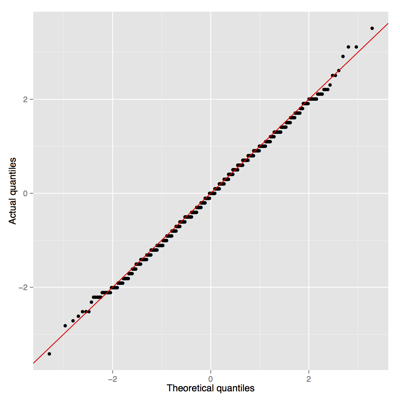

# Bios301 Final Exam

***2013-12-12***

Please answer **any three** of the four questions below (if you submit answers to all four, only the first three will be graded). You may use any static reference materials you wish, but **no collaboration or consultation with any individual or service is permitted**. The instructor will answer any clarifying or technical questions you may have (email to chris.fonnesbeck@vanderbilt.edu or call/text to 615-955-0380). This exam is subject to the [Vanderbilt University honor code](http://www.vanderbilt.edu/student_handbook/the-honor-system#honorcode).

The completed exam is due **Friday, Dec. 13 by Noon CST**. Your exam should be pushed to the private GitHub repository that you have been using to submit homework assignments. Please create a separate folder called `exam` to contain all exam materials. No content outside this directory will be considered when grading the exam. Content checked in after Noon on Dec. 13 will not be graded.

To obtain full marks, you must:

1. Submit working code to generate answers to all questions. Please test your code before submitting to ensure that it runs cleanly.
2. Completely annotate your code and your results in order to fully explain what you have done, and what the output means. It should be readable by a non-R user.
3. Submit a knitr file in either `.rnw` or `.rmd` format, along with its output (LaTeX or Markdown, respectively).

## Question 1

**25 points**

a. Write a function `eval_poly` which will evaluate and return polynomials of the form:

$$P(x) = c_n x^{n−1} + c_{n−1} x^{n−2} + \ldots + c_2 x + c_1$$

The arguments of the function should include $x$ and the vector of polynomial coefficients $c = [c_1, \ldots, c_n]$.

b. For moderate to large values of n, evaluation of a polynomial at x can be done more efficiently using Horner’s Rule:

1. Set $a_n \leftarrow c_n$.
2. For $i=n−1,\ldots,1$ set $a_i = a_{i+1} x+c_i$.
3. Return $a_1$. (This is the computed value of $P(x)$).

Write an R function with arguments x and a vector of polynomial coefficients and which returns the value of the polynomial evaluated at x. Ensure that your function returns an appropriate vector of values when x is a vector.

c. Do some timings to compare the algorithms used in the previous two questions. In particular, try the following code:

```r
system.time(eval_poly(x=seq(-10, 10, length=500000), c(1,-2,2,3,4,6,7)))
```

and compare it to a similar call to the function in part (b).

d. What happens to the comparison when the number of polynomial coefficients is smaller? Try the polynomial:

$$P(x) = 2x^{2} +17x−3$$

## Question 2

**25 points**

Estimate the coverage probability of 95% bootstrap percentile intervals for the binomial probability `p` in the following model:

$$x \sim \text{Binomial}(n=20, p=0.3)$$

Is this interval conservative, unbiased, or liberal?

## Question 3

**25 points**

The central limit theorem claims that if X is a Poisson random variable with parameter λ, and

$$Z = \frac{X-\lambda}{\sqrt{\lambda}}$$

then Z is approximately standard normal (*i.e.* $N(0,1)$), and the approximation improves as λ gets large.

a. Write code to simulate a large number of Z values for values of λ in the set $\\{1,3,5,\ldots,99\\}$. Execute the code and describe how the distribution of Z changes as λ increases.

b. Write a function in ggplot2 that generates a series of QQ-plots, which plots the *calculated* values of Z against their *theoretical* values under a true standard normal, along with a diagonal that represents perfect correspondence between the actual and theoretical values. Use this code to generate QQ-plots for the results in part (a). An individual plot should similar to this:



You will probably need to plot a few multi-plot panels so that your graphs are readable.

Hint: to get theoretical quantiles corresponding to Z, use the following code:

    qnorm(ppoints(length(z)))[order(order(z))]

c. Based on your plots, about how large must λ be before the approximation becomes reasonable? Here "reasonable" means that it is appropriate to make normality assumptions with the sample.

## Question 4

**25 points**

In order to explore how home run hitting in baseball has changed throughout history, let's create a data visualization using the `baseball-databank` database.

Use the data in the `Batting` table to create a plot of home run rate by team across years. We will use home run rate to account for differing numbers of at-bats (AB) among players and teams:

$$HRRate = HR/AB$$

So, this quantity expresses the probability of hitting a home run in any given at bat.

Your solution must include the following:

a. Connect to the `baseball-databank` database using `RSQLite` in order to query from the `Batting` table.

b. Calculate **team** home run rate (not individual players) using `ddply` (*remember to deal with missing values!*).

c. Import the `leagues.csv` table from the `databases` folder and merge it with your dataset to get the proper league names corresponding to `lgID` (league ID -- though there are only 2 today, there have been 7 leagues in the history of baseball).

d. Create a single scatter plot using `ggplot2` of HR rate plotted against year, and color code the points according to  league.