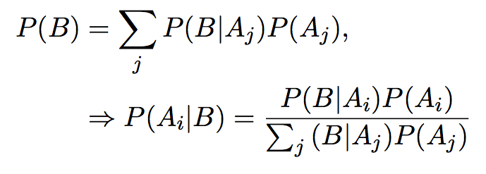
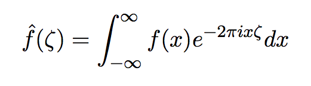
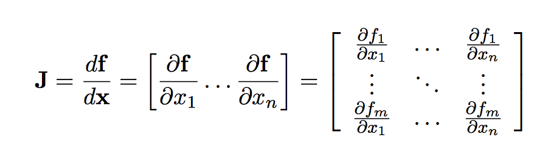

*Due Tuesday, 09 October, 1:00 PM*

20 points total.

$5^{n=day}$ points taken off for each day late.

This assigment includes turning in the first three assignments. All three should
include knitr files (named `homework1.rmd`, `homework2.rmd`, `homework3.rmd`, `homework4.rmd`)
along with valid PDF output files. Inside each file, clearly indicate which
parts of your responses go with which problems (you may use the original homework
document as a template). Add your name as `author` to the file's metadata section.
Raw R code/output or word processor files are not acceptable.

Failure to properly name files or include author name may result in 5 points taken off.

### Question 1 ###

**10 points**

1. Use GitHub to turn in the first four homework assignments. Make sure the teacher (couthcommander) and TA (colemanrharris) are collaborators. (5 points)

1. Commit each assignment individually.  This means your repository should have at least four commits. (5 points)

### Question 2 ###

**10 points**

Use \LaTeX to create the following expressions.

1. Hint: `\Rightarrow` (4 points)

    

1. Hint: `\zeta` (3 points)

    

1. Hint: `\partial` (3 points)

    
