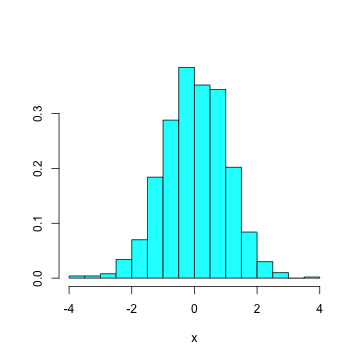
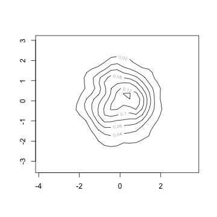
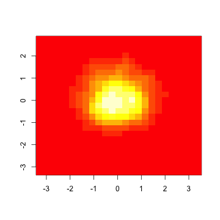
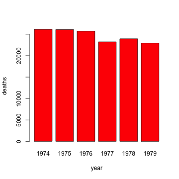
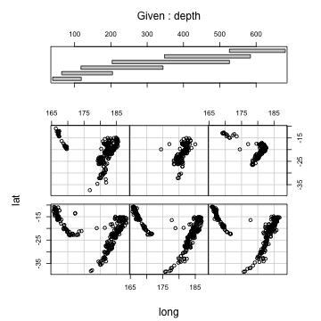

# Introducing R


R is an integrated suite of software for data manipulation, statistical analysis and plotting. It is an independent, open-source implementation of the S language, developed by Bell Laboratories and currently available as the S-plus software package (in fact, most R code can be run under S-plus without any changes). Several standard modules (called packages) that provide basic statistical functionality are built into the base R system, while most others that provide advanced or special-purpose statistical methods are available separately. most R packages are freely available from the [Comprehensive R Archive Network (CRAN) website](http://cran.r-project.org). These packages are written and maintained by a large community of statisticians and programmers. In current releases of the R system, packages can be downloaded and installed directly from within the system. Versions of R are available for most modern computing platforms, including Macintosh, Windows and Linux.

R is controlled from a command line interface (CLI), or shell. Many platform-dependent graphical user interfaces (GUI) exist that augment the CLI with drop-down menus of commands to trigger statistical functions. Commands are passed to R from the CLI or GUI, and results are returned, either in the form of data structures or graphical output. Often, output can be used in subsequent calls to R, creating an interactive environment of calls to the system and returned output. Below is a sample R session. Don’t worry if you don’t understand what R is doing at this stage; this is just an example of what can be done.


```r
# Import a package called \342\200\234MASS\342\200\235
library(MASS)
# Generate 1000 standard normal random deviates, and
#   assign them to variable \342\200\234x\342\200\235
x = rnorm(1000)
# Do the same for \342\200\234y\342\200\235
y = rnorm(1000)
# Return first 4 values of the vector x
x[1:4]
```

[1]  0.68085  0.86829  0.06133 -1.21888


```r
# Generate a histogram
truehist(x, nbins = 25)
```

 

```r
# Generate a 2D density plot
dd = kde2d(x, y)
contour(dd)
```

 

```r
# Generate a color contour plot
image(dd)
```

 

```r
# Build a linear model of y|x, and summarize
summary(lm(y ~ x))
```


Call:
lm(formula = y ~ x)

Residuals:
   Min     1Q Median     3Q    Max 
-3.311 -0.640 -0.023  0.664  3.556 

Coefficients:
            Estimate Std. Error t value Pr(>|t|)
(Intercept)  0.00123    0.03194    0.04     0.97
x           -0.01843    0.03277   -0.56     0.57

Residual standard error: 1.01 on 998 degrees of freedom
Multiple R-squared: 0.000317,	Adjusted R-squared: -0.000685 
F-statistic: 0.316 on 1 and 998 DF,  p-value: 0.574 


The greater-than (`>`) symbol is the standard prompt of the R shell that indicates the system is ready to receive a command. Notice that some commands assign values to parameters (an assignment), others generate graphical output, while others return a result to the screen (an expression). Although these commands have been run interactively, they could just as easily have been saved to a text file and run as a *script*.

Commands are separated either by a new line (*i.e.* hitting return), or by a semicolon. Commands that are incomplete at the end of a line are given a plus (`+`) prompt to indicate that more input is needed. Commands can be grouped together using pairs of braces (`{ }`) or more formally associated by constructing a function. Finally, it is important to note that R is case sensitive, so that a variable called `Y` is distinct from another variable called `y` within the same session.

## Numbers and Vectors

R performs operations on entities called *data structures*. These can be complex statistical objects, such as a `data.frame` (see below), or simple collections of numbers. The simplest is the vector, which is just a list of elements. The following creates a vector with 4 floating-point values, and assigns them to the variable a:


```r
x = c(9.5, 0.4, -2.1, 1)
```


Alternatively, the original R assignment operator `<-` may be used:


```r
x <- c(9.5, 0.4, -2.1, 1)
```


Essentially, the operator “points” to the variable receiving the assignment. A third, more verbose method of assignment employs the assign function1:


```r
assign("x", c(9.5, 0.4, -2.1, 1))
```


Calling the variable x reveals its contents:


```r
x
```

[1]  9.5  0.4 -2.1  1.0


Specific elements of vectors can be selected by indexing them using square brackets. For example, the second element of `x` can be indexed by:


```r
x[2]
```

[1] 0.4


Notice that vectors in R are indexed beginning with 1; in many computing languages, the first element of vectors is indexed instead by zero. Indexing in R is very versatile. For example, one may extract all the elements of x except the second:


```r
x[-2]
```

[1]  9.5 -2.1  1.0


Or, a *logical* vector may be used to select, for example, only positive elements:


```r
x[x > 0]
```

[1] 9.5 0.4 1.0


A logical vector is simply a vector containing only `TRUE` or `FALSE` elements. The index vector from the example above is simply:


```r
x > 0
```

[1]  TRUE  TRUE FALSE  TRUE


Thus, indexing with a logical  vector simply extracts the elements for which the corresponding index element is `TRUE`. This type of indexing is very powerful; for example, one may use logical indices to perform the absolute value function (also included in the base R package as `abs`):


```r
x[x < 0] = -x[x < 0]
x
```

[1] 9.5 0.4 2.1 1.0


Notice that the negative elements of x were made positive, then assigned back to the corresponding elements of the vector. Finally, vector elements can be indexed by assigning them names, and subsequently indexing them by those names:


```r
names(x) = c("Peter", "Ace", "Gene", "Paul")
x[c("Peter", "Paul")]
```

Peter  Paul 
  9.5   1.0 


Here, the `c` function simply concatenates the passed arguments (arguments are items that you specify for use by a function) into a vector. A data structure that is indexed by a key, as in the above example, is often referred to as a dictionary.

Vectors can be used with arithmetic functions, such as  `+`,  `-`,  `*`,  `/` and `^` to perform element-wise operations:


```r
y = c(6, 8, 4, 1)
z = x + y
z
```

Peter   Ace  Gene  Paul 
 15.5   8.4   6.1   2.0 


Notice that each element in `y` was added to its corresponding element in `x`, to produce a new vector, `z`. Notice also that adding a vector of floating-point numbers to a vector of integers yields a floating-point numbers. R automatically casts the integers to decimals in order to perform the calculation. Similarly, adding a simple number to a vector results in the value being added to each item in that vector, casting as necessary:


```r
z = x + 5
z
```

Peter   Ace  Gene  Paul 
 14.5   5.4   7.1   6.0 


A variety of functions may be performed on vectors. For example, to calculate the sample variance of x:

one may perform the following:


```r
sum((x - mean(x))^2)/(length(x) - 1)
```

[1] 17.86


Or, for the lazy, there is the built-in function var:


```r
var(x)
```

[1] 17.86


R retains several methods for generating sequences of numbers, in the form of vectors. For example, a sequence of integers can be specified simply by the beginning and ending element, separated by a colon:


```r
1:5
```

[1] 1 2 3 4 5


Or, in reverse:


```r
5:1
```

[1] 5 4 3 2 1


Regular sequences can be generated more generally by use of the `seq` function:


```r
y = seq(1, 3, by = 0.2)
y
```

 [1] 1.0 1.2 1.4 1.6 1.8 2.0 2.2 2.4 2.6 2.8 3.0


Here, the by argument specifies the step size for the sequence. Alternately, the same vector can be generated with different arguments:


```r
seq(length = 11, from = 1, by = 0.2)
```

 [1] 1.0 1.2 1.4 1.6 1.8 2.0 2.2 2.4 2.6 2.8 3.0


Of course, vectors can contain more than numbers. Character strings are common in R, particularly as labels. Character sequences are similarly easy to generate:


```r
paste("X", 1:10, sep = "")
```

 [1] "X1"  "X2"  "X3"  "X4"  "X5"  "X6"  "X7"  "X8"  "X9"  "X10"


The paste function concatenates the first two arguments (`“X”` and the sequence from 1 to 10, respectively), using the contents of the sep arguments as a separator.

## Objects and Their Attributes

Technically, each entity in R is an object. Objects can simply be characterized as data structures possessing attributes. In addition to vectors, other object classes include lists, factors, data frames and functions; some of these are discussed in greater detail below. Different attributes are what differentiate objects from one another.However, all objects have two attributes in common: mode and length. The latter is self-explanatory, simply the number of data elements contained by the object, while the mode is the data type of the object, which must be the same for all elements. For example, try creating a mixed vector:


```r
z = c(3, "foobar")
z
```

[1] "3"      "foobar"


You can see that R has automatically cast all elements of the vector to the same mode (in this case, character) before assigning it to z. Defined modes include logical, numeric, character and complex. Additional object attributes (if any) can be revealed using the attributes function. Lets revisit our vector x:


```r
attributes(x)
```

$names
[1] "Peter" "Ace"   "Gene"  "Paul" 


As you can see, the previous names call endowed `x` with a character vector, called names that can be used to index its elements. 

## Factors

An important subclass of vector is the factor class. Factors are used to classify or group other vectors. This is useful for both plotting and analyses, as we will see later (e.g. ANOVA). For example, consider a character vector of country abbreviations:


```r
country = c("NZ", "AU", "AU", "NZ", "NZ", "AU")
```


These can be cast into factors by using the factor function:


```r
country_factors = factor(country)
country_factors
```

[1] NZ AU AU NZ NZ AU
Levels: AU NZ


Notice the new factor object `country_factors` possesses an attribute called *Levels* that is a vector of each unique element in the country vector, hence containing two elements, rather than six. Now, consider a corresponding vector called `incomes`, representing individual incomes (scaled appropriately):


```r
incomes = c(60, 49, 40, 61, 64, 60)
```


The factors can then be used to summarize or analyze this data by country. For example, the mean income by country may be of interest:


```r
tapply(incomes, country_factors, mean)
```

   AU    NZ 
49.67 61.67 


Hence, `tapply` applies the function mean to the vector incomes according to the factor indices country.factors.

## Arrays and Matrices

In many environments, vectors and arrays are used interchangeably to refer to an ordered list of elements. Within R, an array is used to describe a k-dimensional (or multiply-subscripted) vector. A vector can be cast as an array if it is attributed with a dim vector that specifies its dimensions:


```r
dim(x) = c(2, 2)
```


Our now-famous vector `x` has been transformed into a 2-dimensional array, using the dim function. A 2-dimensional array is also known as a *matrix*. Specifying the first element of the second row in x is a simple matter of passing the appropriate index vector:


```r
x[2, 1]
```

[1] 0.4


Index ordering follows column major order, whereby the first index is incremented fastest (i.e. first) and the last index slowest (*i.e.* last). In the case of a matrix, the first index specifies the row, and the second index the column.

Slicing refers to the extracting of particular sections of an array. Identifying a somewhat larger array, say 4 by 2, it is straightforward to isolate any row or column:


```r
y = array(c(4, 6, 1, 4, 6, 7, 2, 0), dim = c(4, 
    2))
y[3, ]
```

[1] 1 2


```r
y[, 2]
```

[1] 6 7 2 0


Identifying slices of a row or column is done using the colon operator, separating the indices of the desired range:


```r
y[1:2, 2]
```

[1] 6 7


Indexing an array with a single index argument treats the array as if it were a one-dimensional vector (*e.g.* the first argument in the array call above), returning the corresponding element:


```r
y[6]
```

[1] 7


In addition to scalar indices, arrays may also be indexed by arrays of indices. For example, if we generate the following index array:


```r
i = array(c(1, 3, 2, 1), dim = c(2, 2))
i
```

     [,1] [,2]
[1,]    1    2
[2,]    3    1


it may subsequently be used to extract element [1,2] and [3,1] from array `y`:


```r
y
```

     [,1] [,2]
[1,]    4    6
[2,]    6    7
[3,]    1    2
[4,]    4    0


```r
y[i]
```

[1] 6 1


If desired, this index array could be used to replace the corresponding values with new values:


```r
y[i] = -1
y
```

     [,1] [,2]
[1,]    4   -1
[2,]    6    7
[3,]   -1    2
[4,]    4    0


If the vector argument for the array function is smaller than the total size specified by the dim argument, R simply recycles the vector until the array is filled. For example:


```r
array(c(4, 5), dim = c(3, 2, 2))
```

, , 1

     [,1] [,2]
[1,]    4    5
[2,]    5    4
[3,]    4    5

, , 2

     [,1] [,2]
[1,]    4    5
[2,]    5    4
[3,]    4    5


Since the vector has only two elements, and the array has 3 * 2 * 2 = 12 elements, the array is simply repeated six times. Conversely, when the vector argument is larger than required by the array dimensions, the vector is truncated:


```r
array(1:100, dim = c(3, 2, 2))
```

, , 1

     [,1] [,2]
[1,]    1    4
[2,]    2    5
[3,]    3    6

, , 2

     [,1] [,2]
[1,]    7   10
[2,]    8   11
[3,]    9   12


R provides a comprehensive set of matrix operations, for use in linear algebra calculations (You may not be familiar with matrix operations, but they are used in the estimation of regression model parameters, for example). Two such functions are `t`, the transpose function, and `%*%`, the inner product operator:


```r
xt = t(x)
xt
```

     [,1] [,2]
[1,]  9.5  0.4
[2,]  2.1  1.0


```r
xt %*% x
```

      [,1]  [,2]
[1,] 90.41 20.35
[2,] 20.35  5.41


Similarly, `%o%` is the outer product operator. Somewhat less obviously, computing the inverse of a matrix is performed using the solve function, which is a general function for solving systems of linear equations. Generally, solve (with arguments A and b) calculates the solution to $Ax = b$, where $A$ is a square matrix of coefficients, and $b$ an associated array. If only a matrix is passed, $b$ is assumed to be the identity matrix, and the inverse is computed:


```r
xinv = solve(x)
xinv
```

         [,1]    [,2]
[1,]  0.11547 -0.2425
[2,] -0.04619  1.0970


```r
xinv %*% x
```

     [,1]       [,2]
[1,]    1 -2.776e-17
[2,]    0  1.000e+00


Note that the product of `xinv` and `x` is approximately the 2-dimensional identity matrix, as expected.

## Lists and Data Frames

The data structures discussed so far are constrained in that all elements within a particular structure must be of the same type or mode. Frequently, however, datasets are composed of tables with mixed types; for example, a column of counts may be floating-point numbers, while an associated column of labels are characters. The most basic mixed-type data structure in R is a list. We can use a list to store, for example, data related to a sampled bird nest:


```r
nest = list(species = "WEVI", eggs = 4, latlon = c(25.73, 
    -81.3), Parasite = TRUE)
nest$eggs
```

[1] 4


```r
nest[[1]]
```

[1] "WEVI"


```r
nest$lat[2]
```

[1] -81.3


Each list component is given a label (though this is not necessary), and may subsequently be referenced using either its label (as an object attributes) or index number. Notice that the index itself is contained within square brackets; this returns the contents of the first list component. Passing an integer argument will return the list component itself, not just its contents. Also notice that the full label name is not always required to reference its corresponding component; in case you are lazy, only the minimum number of letters which identifies a component uniquely is required. Finally, recall from a previous example that component labels can be added afterward using the names function.

A slightly more complex (and useful) mixed data structure is the `data.frame`. The `data.frame` type can be regarded as a database table, similar to what one might find in a relational database (e.g. Microsoft Access or MySQL). It is an ordered list of variables, each of the same length, but possibly of differing types. This is a more appropriate data structure for multiple observations. To extend our simple example, we may have multiple sample nests. An easy way to create a data frame from these observations is to call data.frame, using vectors (corresponding to columns) as arguments:


```r
nests = data.frame(species = c("WEVI", "WETA"), 
    eggs = c(4, 3), parasite = c(TRUE, FALSE), lat = c(-81.3, 
        -79.11), lon = c(25.73, 21.04))
nests
```

  species eggs parasite    lat   lon
1    WEVI    4     TRUE -81.30 25.73
2    WETA    3    FALSE -79.11 21.04


The `data.frame` is the most common structure for holding data in R. Most statistical analysis functions accept data frames as arguments. A simple example is the summary function, which summarizes each column of the frame:


```r
summary(nests)
```

 species       eggs       parasite            lat             lon      
 WETA:1   Min.   :3.00   Mode :logical   Min.   :-81.3   Min.   :21.0  
 WEVI:1   1st Qu.:3.25   FALSE:1         1st Qu.:-80.8   1st Qu.:22.2  
          Median :3.50   TRUE :1         Median :-80.2   Median :23.4  
          Mean   :3.50   NA's :0         Mean   :-80.2   Mean   :23.4  
          3rd Qu.:3.75                   3rd Qu.:-79.7   3rd Qu.:24.6  
          Max.   :4.00                   Max.   :-79.1   Max.   :25.7  


Individual columns of the data frame may be added to the R environment by name, without having to index, by using the `attach` function:


```r
attach(nests)
```

The following object(s) are masked from 'nests (position 3)':

    eggs, lat, lon, parasite, species
The following object(s) are masked from 'nests (position 5)':

    eggs, lat, lon, parasite, species
The following object(s) are masked from 'nests (position 6)':

    eggs, lat, lon, parasite, species
The following object(s) are masked from 'nests (position 7)':

    eggs, lat, lon, parasite, species
The following object(s) are masked from 'nests (position 8)':

    eggs, lat, lon, parasite, species


The column be removed by using detach with the same argument. It is not recommended that users attach data frames  

All versions of R allow for interactive editing of existing data frames in spreadsheet-like interface. Simply call the function `fix`, with the data frame as the only argument. The edited version replaces the original when the editor is closed.

    fix(nests)

## Loading Data

Since it is awkward to manually generate large data objects interactively, R retains a number of facilities for importing data, either from files or databases. Moreover, data are often exchanged in the form of spreadsheet files or related electronic formats, so it is important to be able to import them. The commonest method for importing a flat (i.e. 2-dimensional) data file is to use the `read.table` function.

Files imported by `read.table` are restricted to delimited text data formats. This means that data are stored in a text file (i.e. not binary, so you should be able to read the file in a text editor) and that individual values are separated by a delimiter. The most common delimiters are commas, tabs and spaces, but in practice can be any sequence of characters. For example, consider a small table of additional nest data, called more_nests.dat; it looks like this in a text editor:

    species,eggs,parasite,lat,lon
    WOTH, 2, 0, -82.32, 25.10
    TOSO, 2, 0, -80.56, 26.66

This file is delimited by commas, and contains a header (a row of column names). Most modern spreadsheet programs can easily export to a comma-delimited text file, sometimes called a comma-separated values (CSV) file. This file can be imported directly into R:


```r
import = read.table("more_nests.dat", header = TRUE, 
    sep = ",")
```


```
Warning message: cannot open file 'more_nests.dat': No such file or directory
```


```
Error: cannot open the connection
```


```r
import
```


```
Error: object 'import' not found
```


read.table has a number of optional arguments (call ?read.table for a comprehensive list), but the two most common are header, which specifies whether or not the first line in the file is a header, and sep, which denotes the separator character(s). Notice that this new data frame, import, is structured similarly to nests, except that the parasite column (indicating parasitism by cowbirds) is in a numeric mode, rather than a logical mode. It is not necessary to change it, unless we want to merge the two data frames. If so, we must coerce one of the frames into the same column types as the other, before combining them using the rbind function:


```r
mode(import$parasite) = mode(nests$parasite)
```


```
Error: object 'import' not found
```


```r
nests = rbind(nests, import)
```


```
Error: object 'import' not found
```


```r
nests
```

  species eggs parasite    lat   lon
1    WEVI    4     TRUE -81.30 25.73
2    WETA    3    FALSE -79.11 21.04


A second very useful approach to importing data involves interfacing directly with a relational database management system (RDBMS). Relational databases are far more efficient for storing, maintaining and querying data than plain text files or spreadsheets, particularly for large datasets or multiple tables. A number of third parties have created packages for database access in R. For example, *RSQLite* is a package that provides connectivity for SQLite databases.

Though most data can be imported either from a delimited text file or a relational database, there exist a variety of other methods for inviting your data into the R environment. A comprehensive (and relatively up-to-date) summary of data import and export techniques in R is available online at http://cran.r-project.org/doc/manuals/R-data.html

## Probability Distributions

The `stats` package, included in the base installation of R, provides functions for calculating the density, distribution function, quantile function and random variable generation for the several common statistical distributions. For example, the functions related to the binomial distribution include: `rbinom` (random number generation), `pbinom` (distribution function), `dbinom` (density function) and `qbinom` (quantile function).

Using `rnorm`, it is easy to generate a sample dataset of normally-distributed values:


```r
ndata = rnorm(100, mean = 3, sd = 2)
summary(ndata)
```

   Min. 1st Qu.  Median    Mean 3rd Qu.    Max. 
  -2.59    1.63    2.95    2.96    4.41    9.32 


This generates 100 pseudo-random deviates drawn from a normal distribution with mean 3 and standard deviation 2. It is straightforward to generate a 95% confidence interval for the sample mean of this simulated dataset, using the quantile function for Student’s t-distribution. Recall that the 95% confidence interval for the mean of normally-distributed data satisfies:

$$Pr(\bar{X} - t_{0.025,n-1} S/\sqrt{n} < \mu < \bar{X} + t_{0.025,n-1} S/\sqrt{n}) = 0.95$$

where $t_{p,n-1}$ is the $(100*p)$th percentile of the t-distribution with $n-1$ degrees of freedom, and $S$ is the sample mean. In R, these confidence bounds can be calculated as:


```r
mean(ndata) + qt(0.025, 99) * sqrt(var(ndata)/100)
```

[1] 2.554


```r
mean(ndata) + qt(0.975, 99) * sqrt(var(ndata)/100)
```

[1] 3.375


Hence, the interval is (2.563714, 3.307351).

# Loops and Conditional Execution

Many analyses and models require more than single calls to pre-defined functions. Often, several commands must be grouped together in order to properly control the flow of instructions to R in a given model. In order to facilitate this control, R has a comprehensive set of control statements. One of the most important types of control structures is the conditional execution statement, commonly referred to as the “if statement”, which has the form:

    if (<condition>) {<do_something>} else {<do_something_else>}

where `<condition>`` defines an expression that returns a logical (`TRUE`, `FALSE`) value, and `<do_something>` and `<do_something_else>` are expressions that are evaluated, depending on the outcome of the condition. For example, a simple conditional expression can be formulated that calculates the absolute value of a scalar variable:


```r
x = -5
if (x >= 0) x else -x
```

[1] 5


Note that, in this example, because the conditional expressions were very simple (one-line expressions), the curly braces were not necessary.

Another type of control structure is the loop, which has 3 forms: `for`, `while` and `repeat`. A `for` loop has the general form:

    for (<items in sequence>) {<do_something_with_item>}

The `for` loop iterates over a sequence of variables, then executes an expression, usually involving the current variable in the loop. To extend the last example, suppose we wanted to extend the absolute value expression to evaluate each element in a vector of values. For this, a `for` loop is employed:


```r
x = c(4, -6, -1, 0)
for (i in 1:length(x)) if (x[i] < 0) x[i] = -x[i]
x
```

[1] 4 6 1 0


Here, the for statement iterates over the vector of index values for x, then uses each of the indices in turn to evaluate the elements of x.

The `while` and `repeat` statements do not involve explicit loops, but rather repeat the execution of a particular expression until specific events occur. The `while` syntax is:

    while (<condition>) <do_something>

This forces the expression to be evaluated repeatedly until the passed condition is evaluated to be `TRUE`. For example, if we want a positive-valued sample from a standard normal distribution, a where expression can be used:


```r
x = -1
while (x <= 0) {
    x = rnorm(1)
    print(x)
}
```

[1] -0.141
[1] 0.5784


This expression repeatedly draws a single sample from a standard normal distribution, stopping only when the sampled deviate is positive (the print statement was added only to illustrate the process).  Note that `x` was initialized to a negative value, in order to allow the loop to begin (if it were positive, the condition would have been false, and the loop would not have been executed). repeat is similar to while, except that the loop is broken only when the expression returns a break object. It is somewhat more awkward:


```r
x = -1
repeat {
    x = rnorm(1)
    print(x)
    if (x > 0) 
        break
}
```

[1] -0.4729
[1] -0.06313
[1] 0.4283


## Writing Functions

One of the attractive features of the R environment is the ability to write custom functions. Hence, R is a bona fide development environment, in addition to a sophisticated statistical analysis tool. Functions have their own mode (function), and follow a common format:

    func_name = function(<arg1>, <arg2>, ...) {<do_something>}

Thus, a function is created by use of the key word function, followed by the relevant arguments in parentheses, followed finally by the expressions to be evaluated in each call to the function (surrounded by braces, if necessary. Returning to our simple absolute value example, we can formalize (and generalize) this expression as a function:


```r
absval = function(value) {
    if (value < 0) 
        -value else value
}
absval(-7)
```

[1] 7


Incidentally, you can examine the source code for most functions (unless they are primitive functions) by calling the function without arguments or parentheses. For example, try typing `lsfit` (the function for finding the least-squared fit for a linear model) and hitting return.

In addition to defining new functions, new operators can be specified. They are coded in a similar fashion as functions, and have the following form:

    %<anything>%

For example, suppose we wanted an operator that divided the value on the left by the square root of the value on the left. One might then define it as:


```r
"%!%" = function(x, y) x/sqrt(y)
6 %!% 7
```

[1] 2.268


## Plotting

The base R installation includes an extremely versatile graphing and plotting facilities (some of these were demonstrated in the introduction). In addition, there are a variety of specialized plotting functions provided by third-party packages. Plot output is sent to one of several available graphical devices. By default, output is sent to the screen, so that graphics may be viewed by the user. However, it is often useful to send output to a file, so that it may be viewed outside of the R environment, or integrated into documents. Important alternative graphical devices include jpeg, png and pdf.

The barplot function can be used to generate bar charts. As an example, we will use a sample dataset included with one of the base R packages:


```r
barplot(t(aggregate(mdeaths + fdeaths, 1)), names = c(1974:1979), 
    ylab = "deaths", xlab = "year", col = "red")
```

 


This plots the number of lung cancer deaths (male and female) in the UK from 1974 to 1979. As with most of the plotting function, there are many optional arguments that can be used to customize the plot. It is essential to format the data appropriately for the function. In this case, the data was aggregated across months (function aggregate) and transposed.

Some more advanced functions allow for plotting of multivariate data. One method for visualizing three or more variables is the conditioning plot, which plots two variables while conditioning on the third (and fourth). Again, using a R sample dataset:


```r
coplot(lat ~ long | depth, data = quakes)
```

 


This gives a 3-dimensional snapshot of earthquake occurrence, showing latitude vs. longitude for each conditioning level of depth. The relationship among the variables is specified in the first argument; the response and predictive variables are separated by a tilde (`~`), while conditioning variables follow a pipe (`|`). The data argument allows us to omit the reference to the dataset for each variable.

## Statistical Analysis

Finally, the central feature of R is a large suite of facilities for statistical analysis and model fitting. This suite includes methods for univariate and multivariate statistics, linear and non-linear models, survival and time series analysis, and even optimization. This core set of functions is augmented by a huge repository of packages submitted by the open source community that include methods for Bayesian analysis, GIS functionality, meta-analysis, and much more. We have space remaining here only to show some of the basic conventions of statistical analysis in R.

Consider a simple linear regression model, with normal, independent and homoscedastic errors:

$$y_i = \sum_{j=0}^p \beta_j x_{ij} + \epsilon_i$$
$$\epsilon_i \sim N(0,\sigma^2)$$

This can be expressed in matrix notation as:

$$y=X\mathbf{\beta} + \mathbf{\epsilon}$$

where $y$ is the response vector, $X$ the design matrix and $\beta$ a vector of coefficients. In R, the tilde (`~`) operator (as seen in the plotting section) is used to define a model formula. The general syntax is:

    <response> ~ <operator> <predictor1> <operator> <predictor2> ...

For example, several alternative formulations could implement the linear model described above. The simplest is:
y ~ x
or
y ~ 1 + x

the former having an implicit intercept term, the latter explicit. Or, the model could be forced through the origin by explicitly removing the intercept term:
y ~ 0 + x
y ~ x - 1

Alternatively, a second-order polynomial regression could be defined using either:
y ~ poly(x, 2)
y ~ 1 + x + I(x^2)

Interaction terms may also be defined:
y ~ x1 + x2 + x1:x2
y ~ x1*x2

These formulations apply broadly to R statistical functions. The basic function for fitting linear models is `lm`. Though more specialized functions exist, it can be used to carry out regression, single stratum analysis of variance and analysis of covariance. A typical `lm` formulation is:

    lm(y ~ x, data=my.data.frame, weights=my.weights, subset=subset.vector, na.action=na.omit)

Note that after the formula, all the additional arguments are optional. data specifies the data frame, if used, weights is a vector of positive weights, if non-uniform weights are applicable, subset is a vector indicating the subset of the data to be used (the entire dataset is used if not specified), and `na.action` instructs the procedure how to handle missing values. By default, `na.omit` is used, which simply excludes them.

Lets examine a sample dataset of plant dry weight data, whereby some plants were subjected to a treatment of some kind:


```r
ctl = c(4.17, 5.58, 5.18, 6.11, 4.5, 4.61, 5.17, 
    4.53, 5.33, 5.14)
```


and others were untreated, as controls:


```r
trt = c(4.81, 4.17, 4.41, 3.59, 5.87, 3.83, 6.03, 
    4.89, 4.32, 4.69)
```


An obvious analysis to conduct for this data is an analysis of variance (ANOVA), which is just a special kind of linear model. Clearly, our response variable are the control and treatment weights:


```r
weight = c(ctl, trt)
```


The predictor variable is simply the corresponding group for each observation. An easy way to generate factor levels is to use the gl function, that uses the number of levels, the number of replications and the group names to generate a vector of levels:


```r
group = gl(2, 10, labels = c("Ctl", "Trt"))
group
```

 [1] Ctl Ctl Ctl Ctl Ctl Ctl Ctl Ctl Ctl Ctl Trt Trt Trt Trt Trt Trt Trt
[18] Trt Trt Trt
Levels: Ctl Trt


We now have everything required to build the linear model:


```r
wt_lm = lm(weight ~ group)
```


The output is send to another variable `wt_lm`, which can be summarized:


```r
summary(wt_lm)
```


Call:
lm(formula = weight ~ group)

Residuals:
    Min      1Q  Median      3Q     Max 
-1.0710 -0.4938  0.0685  0.2462  1.3690 

Coefficients:
            Estimate Std. Error t value Pr(>|t|)    
(Intercept)    5.032      0.220   22.85  9.5e-15 ***
groupTrt      -0.371      0.311   -1.19     0.25    
---
Signif. codes:  0 '***' 0.001 '**' 0.01 '*' 0.05 '.' 0.1 ' ' 1 

Residual standard error: 0.696 on 18 degrees of freedom
Multiple R-squared: 0.0731,	Adjusted R-squared: 0.0216 
F-statistic: 1.42 on 1 and 18 DF,  p-value: 0.249 


Notice that the format of the summary is the very general form that presents the estimates for the intercept and coefficient. Here, the control group is treated as the “baseline” making the coefficient represent the magnitude of effect of the treatment. However, this is not the standard output associated with ANOVA, which is a comparison of the variation within groups to variance among groups. This output can be obtained by calling the anova function on the linear model object:


```r
anova(wt_lm)
```

Analysis of Variance Table

Response: weight
          Df Sum Sq Mean Sq F value Pr(>F)
group      1   0.69   0.688    1.42   0.25
Residuals 18   8.73   0.485               


It is evident from this summary that the MSE for the groups is not much different from that of the residual. We therefore conclude that there is not a strong effect of the treatment on plant weight.

If we are interested in fitting other classes of linear models that, for example, have non-Gaussian error distributions, glm may be used instead. Consider a model that predicts outcomes based on group and treatment effects, but where the residual error is thought to be Poisson-distributed. A generalized linear model might be constructed as follows:


```r
counts = c(18, 17, 15, 20, 10, 20, 25, 13, 12)
group = gl(3, 1, 9)
treatment = gl(3, 3)
print(mydf = data.frame(treatment, group, counts))
```


```
Error: argument "x" is missing, with no default
```


```r
my_glm = glm(counts ~ group + treatment, family = poisson())
anova(my_glm)
```

Analysis of Deviance Table

Model: poisson, link: log

Response: counts

Terms added sequentially (first to last)


          Df Deviance Resid. Df Resid. Dev
NULL                          8      10.58
group      2     5.45         6       5.13
treatment  2     0.00         4       5.13


```r
summary(my_glm)
```


Call:
glm(formula = counts ~ group + treatment, family = poisson())

Deviance Residuals: 
      1        2        3        4        5        6        7        8  
-0.6712   0.9627  -0.1696  -0.2200  -0.9555   1.0494   0.8472  -0.0917  
      9  
-0.9666  

Coefficients:
             Estimate Std. Error z value Pr(>|z|)    
(Intercept)  3.04e+00   1.71e-01   17.81   <2e-16 ***
group2      -4.54e-01   2.02e-01   -2.25    0.025 *  
group3      -2.93e-01   1.93e-01   -1.52    0.128    
treatment2   1.34e-15   2.00e-01    0.00    1.000    
treatment3   1.42e-15   2.00e-01    0.00    1.000    
---
Signif. codes:  0 '***' 0.001 '**' 0.01 '*' 0.05 '.' 0.1 ' ' 1 

(Dispersion parameter for poisson family taken to be 1)

    Null deviance: 10.5814  on 8  degrees of freedom
Residual deviance:  5.1291  on 4  degrees of freedom
AIC: 56.76

Number of Fisher Scoring iterations: 4


<!-- Scripts -->
<script type="text/javascript" 
    src="http://cdn.mathjax.org/mathjax/latest/MathJax.js?config=TeX-AMS-MML_HTMLorMML">
</script>
<script type="text/javascript">MathJax.Hub.Config({tex2jax: {processEscapes: true, 
    processEnvironments: false, inlineMath: [ ['$','$'] ], 
    displayMath: [ ['$$','$$'] ] }, 
    asciimath2jax: {delimiters: [ ['$','$'] ] }, 
    "HTML-CSS": {minScaleAdjust: 125 } });
</script>
