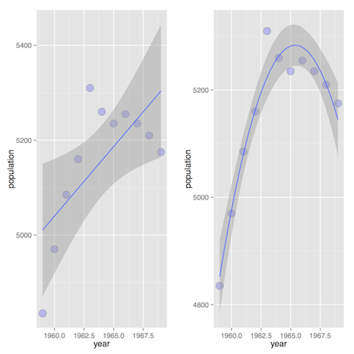

# Object-Oriented Programming

---

## Programming Paradigms

There are a handful of prevalent programming styles, or paradigms, in modern computing.

* **Imperative**: consists of statements that change the program *state*, in a stepwise fashion
* **Procedural**: imperative programming that is built from one or more procedures/subroutines/functions
* **Declarative**: expresses computational logic without describing flow control (*what* rather than *how*)
* **Functional**: declarative programming that is based on the evaluation of functions (no side effects)
* **Object-Oriented**: computation using abstractions called *objects* that interact to produce desired behavior

R can be used to support any of these paradigms.

---

## Object-Oriented Programming

Object-oriented programming (OOP) for short can simplify many problems.

It is based on defining **classes**, and creating instances of those classes called **objects**. A class is a structure that keeps data, functions and other attributes that are related to one another in some way together as a portable unit.

OOP tends to result in clearer, more reusable code.

Though very different from the familiar OOP languages like C++, Java, and Python, R is very much OOP in outlook.

---

## OOP in R

The following themes are key to R:

* Everything in R (e.g. numbers, character strings, matrices) is an object.
* R promotes **encapsulation**, which is packaging separate but related data items into one class instance. Encapsulation helps you keep track of related variables, enhancing clarity.
* R classes are **polymorphic**, which means that the same function call leads to different operations for objects of different classes. Polymorphism promotes reusability.
* R allows **inheritance**, which extends a general class to a more specialized class.

R supports OOP through so-called old-style (S3) and new-style (S4) classes.

It is not essential to apply the principles of OOP when writing R code, but doing so can have advantages, especially when writing code that is to be used by other people.

---

## S3 Classes

The original R structure for classes, S3 is still the dominant class paradigm in R use today.

Most of R's own built-in classes are of the S3 type.

An S3 class consists of a list, with a class name attribute and **dispatch** capability added.

S3's **generic functions** are a means for polymorphism in R, in the sense that the same function can lead to different operations for different classes.

* e.g. you can apply `plot` to many different types of objects, getting a different type of plot for each.

---

## S3 Classes

When a generic function is called, R will then *dispatch* the call to the proper class method, meaning that it will reroute the call to a function defined for the object's class.

**The advantage to the user** is that we get a *uniform interface* to different classes.

* If a function is new to you, just try running `plot` on the function's output; it will likely work.

**The advantage to the programmer** is polymorphism allows writing fairly general code, without worrying about what type of object is being manipulated, because the underlying class mechanisms take care of that.

---

## Example: `lm`

R's `lm` function runs a linear regression and returns an object of class `lm`:

    !r
    > x <- c(1,2,3)
    > y <- c(1,3,8)
    > lmout <- lm(y ~ x)
    > class(lmout)
    [1] "lm"
    > lmout

    Call:
    lm(formula = y ~ x)

    Coefficients:
    (Intercept)            x
           -3.0          3.5

Recall that typing the name of an object will print that object. The R interpreter is aware that the object is class `lm` and called `print.lm`.

---
## Example: `lm`

This is an example of **dispatch**. The call to the generic function `print` was dispatched to the method `print.lm`

The generic function `print` consists solely of a call to `UseMethod`.

    > print
    function(x, ...) UseMethod("print")
    <environment: namespace:base>
    > print.lm
    function (x, digits = max(3, getOption("digits") - 3), ...) {
        cat("\nCall:\n", deparse(x$call), "\n\n", sep = "")
        if (length(coef(x))) {
            cat("Coefficients:\n")
            print.default(format(coef(x), digits = digits),
              print.gap = 2, quote = FALSE)
        }
        else cat("No coefficients\n")
        cat("\n")
        invisible(x)
    }
    <environment: namespace:stats>

What gets printed depends on *context*.

---

## Example: `lm`

Notice what happens when we print `lmout` with its class attribute removed:

    !r
    > unclass(lmout)
    $coefficients
    (Intercept)           x
           -3.0         3.5

    $residuals
       1    2    3
     0.5 -1.0  0.5

    $effects
    (Intercept)           x
      -6.928203   -4.949747    1.224745

    $rank
    [1] 2

    $fitted.values
      1   2   3
    0.5 4.0 7.5

---

## Generic Methods

The function `methods` reveals all implementations of a generic method:

    !r
    > methods(print)
      [1] print.acf*                                  print.anova
      [3] print.aov*                                  print.aovlist*
      [5] print.ar*                                   print.Arima*
      [7] print.arima0*                               print.AsIs
      ...
      [167] print.warnings                              print.xgettext*
      [169] print.xngettext*                            print.xtabs*

Asterisks denote *non-visible* functions, meaning ones that are not in the default namespaces.

---

## Example: `aspell`

The `aspell` function itself does a spellcheck on the file specified in its argument.

    !r
    > aspell("~/Bios6301/slides/lecture10_oop.md")
    acf
      ~/Bios6301/slides/lecture10_oop.md:164:17

    anova
      ~/Bios6301/slides/lecture10_oop.md:164:61

    aov
      ~/Bios6301/slides/lecture10_oop.md:165:17
    ...

The `aspell` function returns an object of class `aspell`, which has its own generic print function, `print.aspell`. However:

    !r
    > aspout <- aspell("~/Bios6301/slides/lecture10_oop.md")
    > print.aspell(aspout)
    Error: could not find function "print.aspell"

This is because `print.aspell` is a non-visible function.

---

## Example: `aspell`

You can access non-visible functions via `getAnywhere`.

    !r
    > getAnywhere(print.aspell)
    A single object matching ‘print.aspell' was found
    It was found in the following places
      registered S3 method for print from namespace utils
      namespace:utils
    with value

    function (x, sort = TRUE, verbose = FALSE, indent = 2L, ...)
    {
        if (!(nr <- nrow(x)))
    ...

`print.aspell` is in the `utils` namespace, and we can execute it by adding a qualifier:

    !r
    !r
    > utils::print.aspell("~/Bios6301/slides/lecture10_oop.md")
    acf
      ~/Bios6301/slides/lecture10_oop.md:164:17

    anova
      ~/Bios6301/slides/lecture10_oop.md:164:61
    ...

---

## Writing S3 Classes

A class instance is created by forming a list, with the components of the list being the member variables of the class.

The `class` attribute is set by hand by using the `attr` or `class` function, and then  implementations of generic functions are defined as needed.

e.g the `lm` function:

    !r
    > lm
    ...
    z <- list(coefficients = if (is.matrix(y))
                        matrix(,0,3) else numeric(0L), residuals = y,
                      fitted.values = 0 * y, weights = w, rank = 0L,
                      df.residual = if (is.matrix(y)) nrow(y) else length(y))
    }
    ...
    class(z) <- c(if(is.matrix(y)) "mlm", "lm")
    ...

---

## Writing S3 Classes

Take a simple example of creating an `employee` class:

    !r
    > j <- list(name="Joe", salary=55000, union=T)
    > class(j) <- "employee"
    > attributes(j)
    $names
    [1] "name" "salary" "union"

    $class
    [1] "employee"

If we call the generic `print` function on `j`:

    !r
    >j
    $name
    [1] "Joe"

    $salary
    [1] 55000

    $union
    [1] TRUE

    attr(,"class")
    [1] "employee"

---

## Writing S3 Classes

Let's implement the generic `print` function for the `employee` class:

    !r
    print.employee <- function(wrkr) {
       cat("name:",wrkr$name,"\n")
       cat("salary: $",wrkr$salary,"\n", sep='')
       cat("union member:",wrkr$union,"\n")
    }

Any call to `print` on an object of class `employee` should now be dispatched to `print.employee`. We can check that formally:

    !r
    > methods(,"employee")
    [1] print.employee
    > j
    name: Joe
    salary: $55000
    union member: TRUE

---

## Inheritance

The idea of **inheritance** is to form new classes as specialized versions of old ones. For example, we could subclass `employee` form a new class devoted to hourly employees, `hourly_employee`:

    !r
    k <- list(name="Kate", salary=NA, union=F, rate=10.50, hrs_this_month=2)
    class(k) <- c("hourly_employee","employee")

`hourly_employee` has one extra attribute: `hrs_this_month`.

The class assignment consists of two character strings, representing the new class and the old class.

`hourly_employee` inherits the methods of `employee`.

    !r
    > k
    name: Kate
    salary: $NA
    union member: FALSE

## Presenter Notes

typing k resulted in the call print(k).
that caused UseMethod() to search for a print method
tries the first of k's two class names, "hrlyemployee".
tries the other class name, "employee", and found print.employee().

---

## Example: Upper-triangular Matrices

A less trivial example involves writing an R class to store upper-triangular matrices.

$$\left({
\begin{array}{c}
  {1} & {5} & {12} \cr
  {0} & {6} & {9} \cr
  {0} & {0} & {2}
\end{array}
}\right)$$

Our motivation here is to save storage space (though at the expense of a little extra access time) by storing only the *nonzero* portion of the matrix.

---

## Example: Upper-triangular Matrices

Key components:

`mat`: stores the diagonal and above-diagonal elements of the matrix.

- e.g. previous example consists of the vector (1,5,6,12,9,2)

`ix`: indices to show where in `mat` the various columns begin.

- e.g. for the preceding case, `ix <- c(1,2,4)`, meaning that column 1 begins at mat[1], column 2 begins at mat[2], and column 3 begins at mat[4].

$$\left({
\begin{array}{c}
  {\color{red} 1} & {\color{red}5} & {\color{red} {12}} \cr
  {0} & {\color{red} 6} & {\color{red} 9} \cr
  {0} & {0} & {\color{red} 2}
\end{array}
}\right)$$

---

## Example: Upper-triangular Matrices

First, create an object of class `ut` from the full matrix `inmat`:

    !r
    ut <- function(inmat) {
        n <- nrow(inmat)
        rtrn <- list()
        class(rtrn) <- "ut"
        rtrn$mat <- vector(length=sum1toi(n))
        rtrn$ix <- sum1toi(0:(n-1)) + 1
        # fill in rtrn$mat by column and assign rtrn$idx by element
        for (i in 1:n) {
           ixi <- rtrn$ix[i]
           rtrn$mat[ixi:(ixi+i-1)] <- inmat[1:i,i]
        }
        return(rtrn)
    }

This function is a **constructor**, which is a function whose job it is to create an instance of the given class, eventually returning that instance.

We need a utility function to return the sum from 1 to i:

    !r
    sum1toi <- function(i) return(i*(i+1)/2)

---

## Example: Upper-triangular Matrices

Functions that are tied to classes are called **methods**.

We need a method to uncompress a `ut` matrix to a full matrix.

    !r
    expand_ut <- function(ut_mat) {
        n <- length(ut_mat$ix) # numbers of rows and cols of matrix
        fullmat <- matrix(nrow=n,ncol=n)
        for (j in 1:n) {
            # fill jth column
            start <- ut_mat$ix[j]
            fin <- start+j-1
            above_diag_j <- ut_mat$mat[start:fin] # above-diag part of col j
            fullmat[,j] <- c(above_diag_j, rep(0, n-j))
        }
        return(fullmat)
    }

Implementing the generic print:

    !r
    print.ut <- function(ut_mat) print(expand_ut(ut_mat))

---

## Example: Upper-triangular Matrices

Users will probably want to be able to multiply one `ut` matrix by another, returning another `ut` instance. We can implement this as a binary operation:

    !r
    "%mut%" <- function(ut_mat1,ut_mat2) {
        # Dimension of matrix
        n <- length(ut_mat1$ix)
        # Pre-allocate product matrix
        ut_prod <- ut(matrix(0,nrow=n,ncol=n))
        # Compute col i of product
        for (i in 1:n) {
            start_bi <- ut_mat2$ix[i]
            prod_coli <- rep(0,i)
            # Find bi[j]*a[j], add to prodcoli
            for (j in 1:i) {
                start_aj <- ut_mat1$ix[j]
                bi_element <- ut_mat2$mat[start_bi+j-1]
                prod_coli[1:j] <- prod_coli[1:j] +
                    bi_element * ut_mat1$mat[start_aj:(start_aj+j-1)]
            }
            # Need to tack on the lower 0s
            start_prod_coli <- sum1toi(i-1) + 1
            ut_prod$mat[start_bi:(start_bi + i-1)] <- prod_coli
        }
        return(ut_prod)
    }

## Presenter Notes

we avoid multiplying by zeros simply by not adding terms to sums when the terms include a 0 factor

---

## Example: Upper-triangular Matrices

    !r
    > (utm1 <- ut(rbind(1:2,c(0,2))))
         [,1] [,2]
    [1,]    1    2
    [2,]    0    2
    > (utm2 <- ut(rbind(3:2,c(0,1))))
         [,1] [,2]
    [1,]    3    2
    [2,]    0    1
    > utm1 %mut% utm2
         [,1] [,2]
    [1,]    3    4
    [2,]    0    2

    > (utm1 <- ut(rbind(1:3,0:2,c(0,0,5))))
         [,1] [,2] [,3]
    [1,]    1    2    3
    [2,]    0    1    2
    [3,]    0    0    5
    > (utm2 <- ut(rbind(4:2,0:2,c(0,0,1))))
         [,1] [,2] [,3]
    [1,]    4    3    2
    [2,]    0    1    2
    [3,]    0    0    1
    > utm1 %mut% utm2
         [,1] [,2] [,3]
    [1,]    4    5    9
    [2,]    0    1    4
    [3,]    0    0    5

---

## Example: polynomial Regression

Consider a univariate regression. One can get better model fits by including polynomials of higher degrees.

$$f(x|\mathbf{\theta}) = \theta_0 + \theta_1 x_i + \theta_2 x_i^2 + \ldots + \theta_k x_i^k$$

However, including too many polynomial terms results in *over-fitting*, which reduces the model's predictive ability.

In this example, we will create a class `polyreg` for doing polynomial regression that assesses the relative fit of different polynomial functions using **cross-validation**.

---

## Polynomial Regression

---

## Cross-validation

To identify when additional parameters begin to degrade a model's predictive ability, we fit a model with part of the data, then try to predict the remainder. One criterion for the best model is the one with the lowest predictive error.

Here, we will use **leave-one-out cross-validation**

* For dataset of size *n*, we fit the model *n* times.
* For each, we use *n-1* samples to fit the model, and try to predict the holdout sample.
* For each model run, we can measure the difference between the predicted value and the observed.
* Calculate the mean squared prediction error: $MSPE = \frac{1}{N}\sum_{i=1}^n (\tilde{y}-y)^2$

---

## Example: Polynomial Regression

We will create a function to instantiate an S3 class `polyreg` that performs polynomial regression for one predictor variable.

Fits all polynomials up to degree `maxdeg`.

    !r
    polyfit <- function(y,x,maxdeg) {
        # Powers of predictor variable
        pwrs <- powers(x,maxdeg)
        # List to hold class attributes
        lmout <- list()
        # create a new class
        class(lmout) <- "polyreg"
        for (i in 1:maxdeg) {
            lmo <- lm(y ~ pwrs[,1:i])
            # Cross-validated predictions
            lmo$fitted.cvvalues <- leave_one_out(y, pwrs[,1:i,drop=F])
            lmout[[i]] <- lmo
        }
        lmout$x <- x
        lmout$y <- y
        return(lmout)
      }

---

## Example: Polynomial Regression

The generic `print` function for `polyreg` class. Prints a list of the MSPE for each model.

    !r
    print.polyreg <- function(fits) {
        maxdeg <- length(fits) - 2
        n <- length(fits$y)
        tbl <- matrix(nrow=maxdeg,ncol=1)
        colnames(tbl) <- "MSPE"
        for (i in 1:maxdeg) {
            fi <- fits[[i]]
            errs <- fits$y - fi$fitted.cvvalues
            # sum of squared prediction errors
            spe <- crossprod(errs,errs)
            tbl[i,1] <- spe/n
        }
        cat("mean squared prediction errors, by degree\n")
        print(tbl)
    }

---

## Example: Polynomial Regression

The `polyreg` class requires a couple of support functions.

First, `powers` calculates sequence of powers of predictor variable:

    !r
    powers <- function(x, dg) {
        pw <- matrix(x,nrow=length(x))
        prod <- x
        for (i in 2:dg) {
            prod <- prod * x
            pw <- cbind(pw,prod)
        }
        return(pw)
    }

    > powers(3, 5)
           prod prod prod prod
    [1,] 3    9   27   81  243

---

## Example: Polynomial Regression

`leave_one_out` performs sequence of regressions on all possible samples of size *n-1*, returning the prediction from each.

The leave-one-out method takes advantage of R's use of negative indices.

    !r
    leave_one_out <- function(y, xmat) {
        n <- length(y)
        pred_y <- vector(length=n)
        for (i in 1:n) {
            # regress, leaving out ith observation
            lmo <- lm(y[-i] ~ xmat[-i,])
            beta_hat <- as.vector(lmo$coef)
            # calculate prediction
            pred_y[i] <- beta_hat %*% c(1, xmat[i,])
         }
         return(pred_y)
    }

---

## Example: Polynomial Regression

    !r
    > n <- 60
    > x <- (1:n)/n
    > y <- vector(length=n)
    > for (i in 1:n) y[i] <- sin((3*pi/2)*x[i]) + x[i]^2 + rnorm(1,mean=0,sd=0.5)
    > dg <- 15
    > (lmo <- polyfit(y,x,dg))

    mean squared prediction errors, by degree
               MSPE
     [1,] 0.2864142
     [2,] 0.2806738
     [3,] 0.2478067
     [4,] 0.2525998
     [5,] 0.2458015
     [6,] 0.2503577
     [7,] 0.2634274
     [8,] 0.2513682
     [9,] 0.2526554
    [10,] 0.2754519
    [11,] 0.3164947
    [12,] 0.4373672
    [13,]        NA
    [14,]        NA
    [15,]        NA

---

## S4 Classes

The S3 approach to OOP is very informal. Each class characteristic is essentially a convention, and R does little to enforce these conventions. As a result, it is easy to accidentally break S3 classes:

* attributes may be left out
* attributes may be mis-spelled
* classes may be non-unique

Such events may result in unexpected results and unreliable code.

S4 classes provide a formal object-method framework for OOP, in an effort to make code more secure and reliable.

---

## Writing S4 Classes

You define an S4 class by calling `setClass`. Re-implementing our earlier example:

    !r
    setClass("employee",
        representation(name="character", salary="numeric", union="logical")
    )

The new class can be instantiated using the `new` function:

    !r
    > (joe <- new("employee",name="Joe",salary=55000,union=T))
    An object of class "employee"
    Slot "name":
    [1] "Joe"

    Slot "salary":
    [1] 55000

    Slot "union":
    [1] TRUE

---

## Writing S4 Classes

A unique aspect of S4 classes is how attributes are referenced.

    !r
    > joe@salary
    [1] 55000

S4 attributes are called `slots`. They can be assigned values:

    !r
    > joe@salary <- 65000
    > slot(joe, "union") <- FALSE
    > joe
    An object of class "employee"
    Slot "name":
    [1] "Joe"

    Slot "salary":
    [1] 65000

    Slot "union":
    [1] FALSE

---

## Writing S4 Classes

Note that S4 classes protect against slots being assigned illegal values and against additional slots being added:

    !r
    > joe@salary <- TRUE
    Error in checkSlotAssignment(object, name, value) :
      assignment of an object of class "logical" is not valid for slot "salary" in an
      object of class "employee"; is(value, "numeric") is not TRUE
    > joe@celery <- 100000
    Error in checkSlotAssignment(object, name, value) :
      "celery" is not a slot in class "employee"

By contrast, in S3 there would be no error message. S3 classes are just lists, and you are allowed to add a new component at any time.

---

## Implementing a Generic Function in S4

To define an implementation of a generic function on an S4 class, use `setMethod`.

In S4, the equivalent of S3's `print` generic is `show`.

    !r
    setMethod("show", "employee",
       function(object) {
          inorout <- ifelse(object@union,"is","is not")
          cat(object@name,"has a salary of",object@salary,
             "and", inorout, "in the union", "\n")
       }
    )

The first argument gives the name of the generic function for which we will define a class-specific method, and the second argument gives the class name.

    !r
    > show(joe)
    Joe has a salary of 65000 and is in the union

---

## S3 vs S4

<table border="0" cellspacing="7" cellpadding="5">
    <tr><th>Operation</th><th>S3</th><th>S4</th></tr>
    <tr><td>Define class</td><td>Implicit in constructor</td><td><code>setClass()</code></td></tr>
    <tr><td>Create object</td><td>Build list, set class attribute</td><td><code>new()</code></td></tr>
    <tr><td>Reference attribute</td><td>$</td><td>@</td></tr>
    <tr><td>Implement generic function</td><td><code>f.classname()</code></td><td><code>setMethod()</code></td></tr>
    <tr><td>Declare generic</td><td><code>UseMethod()</code></td><td><code>setGeneric()</code></td></tr>
</table>

The choice of S3 or S4 depends on how much one is willing to trade off convenience for safety.

Google's R style guide:

>  ... avoid S4 objects and methods when possible.

---

## Object Management

There are several functions for managing objects in an interactive R session. These include:

* `ls`
* `rm`
* `save`
* `exists`

---

## Listing Objects

The `ls` function lists all objects in the current environment.

    ls(name, pos = -1, envir = as.environment(pos),
       all.names = FALSE, pattern)

The `pattern` argument allows users to filter the objects listed by name.

    !r
    > ls()
     [1] "%mut%"         "dg"            "expand_ut"     "i"             "joe"           "jpeg"
     [7] "leave_one_out" "lmo"           "n"             "pdf"           "png"           "polyfit"
    [13] "powers"        "print.polyreg" "print.ut"      "sum1toi"       "ut"            "utm1"
    [19] "utm2"          "utp"           "x"             "y"
    > ls(pattern='ut')
    [1] "%mut%"         "expand_ut"     "leave_one_out" "print.ut"      "ut"            "utm1"
    [7] "utm2"          "utp"

---

## Removing Objects

To remove objects you no longer need, use `rm`:

    > rm(x,y,n,i)

You can use `rm` in conjunction with `ls` to delete objects by pattern:

    > rm(list=ls(pattern="ut"))
    > ls()
     [1] "dg"            "joe"           "jpeg"          "lmo"           "pdf"           "png"
     [7] "polyfit"       "powers"        "print.polyreg" "sum1toi"

To delete all objects in the current frame,

    !r
    rm(list = ls())

This code assigns all of our objects to list, thus removing everything.

---

## Saving Objects

Calling `save` on one or more objects will write them to disk for later retrieval by `load`:

    !r
    > save(joe, file="joe.Rdata")
    > rm(joe)
    > ls(pattern="joe")
    character(0)
    > load("joe.Rdata")
    > ls(pattern="joe")
    [1] "joe"

---

## Querying Objects

Several functions are available to query the structure of any function.

The `class` function reveals the class of an object:

    !r
    > x <- rnorm(10)
    > y <- rnorm(10)
    > lm_obj <- lm(y~x)
    > class(lm_obj)
    [1] "lm"

The generic `print` implementation for a particular object may hide several attributes:

    !r
    > lm_obj

    Call:
    lm(formula = y ~ x)

    Coefficients:
    (Intercept)            x
        0.27804      0.07412

---

## Querying Objects

`unclass` returns a copy of its argument with its class attribute removed. It is useful for overriding the generic `print` implementation:

    !r
    > unclass(lm_obj)
    $coefficients
    (Intercept)           x
     0.27804032  0.07411601

    $residuals
             1          2          3          4          5          6          7          8          9
     0.1300593 -2.7578351 -0.6427454  0.1491311  0.4297138  0.8466837  1.3672231 -0.2179880  0.8766061
            10
    -0.1808485

    $effects
    (Intercept)           x
    -0.91123624 -0.23639639 -1.22305099 -1.19007008 -0.30554788  1.69755644  0.74842812 -0.06236931

     1.13581336 -1.98396992

    $rank
    [1] 2

    $fitted.values
            1         2         3         4         5         6         7         8         9        10
    0.3848569 0.3257164 0.2620332 0.1938128 0.2481035 0.3906879 0.2585732 0.3281885 0.3375005 0.1521091

    $assign
    [1] 0 1

---

## Querying Objects

Additional object functions:

* `edit`
* `names`
* `str`
* `mode`
* `exists`

<!---->
