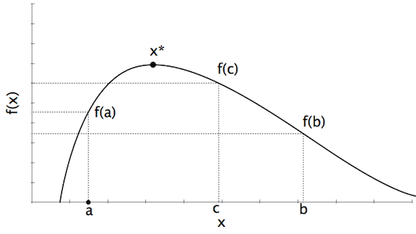
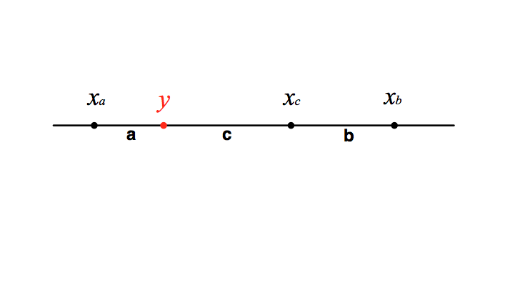

The process of finding the minima or maxima of a function. Consider a function:

$$f: \mathbf{R} \rightarrow \mathbf{R}$$
$$f',f'' \text{ continuous}$$

A point $x^*$ is a *global* maximum if:

$$f(x) \le f(x^*) \, \forall \, x$$

or a *local* maximum if:

$$f(x) \le f(x^*) \, \forall \, x:|x-x^*| < \epsilon$$

Necessary conditions:

1. $f'(x^*) = 0$
2. $f''(x^*) \le 0$ (sufficient if $f''(x^*) < 0$)

---

Local Search
============

We will consider *local* search methods that generate a series of values that converge to the maximum:

$$x_0, x_1, x_2, \ldots \rightarrow \text{argmax}(f)$$

As with the root-finding methods, we must identify stopping conditions:

$$|x_i - x^*| \le \epsilon$$

Since we do not know $x^*$, we must use an alternative criterion:

* $|x_i - x_{i-1}| \le \epsilon$
* $|f(x_i) - f(x_{i-1})| \le \epsilon$
* $|f'(x_i)| \le \epsilon$

---

Newton's Method
===============

Apply Newton-Raphson method for root-finding to $f'$:

$$x_{i+1} = x_i - \frac{f'(x_i)}{f''(x_i)}$$

called ***Newton's method***.

Since we are searching for $x^*$ such that $f'(x^*) = 0$, we will use $|f'(x_i)| \le \epsilon$ as our stopping criterion.

This finds points for which $f'(x)=0$.

---

R Code
======

```{r}
newton <- function(f, x0, tol = 1e-9, n_max = 100) {
    x <- x0
    f_x <- f(x)
    n <- 0
    while ((abs(f_x[2]) > tol) & (n < n_max)) {
        # Newton's update
        x <- x - f_x[2]/f_x[3]
        f_x <- f(x)
        # Increment counter
        n <- n + 1
    }
    if (n == n_max) {
        cat('newton failed to converge\n')
    } else {
        return(x)
    }
}
```

To use `newton`, we need a function $f$ that contains a vector $(f(x), f'(x), f''(x))$.

---

R Code
======

Let's try to find the maximum of a Gamma(3,2) distribution:

```{r}
gamma32 <- function(x) {
    # Error checking
    if (x < 0) return(c(0, 0, 0))
    if (x == 0) return(c(0, 0, NaN))
    y <- exp(-2*x)
    return(c(4*x^2*y, 8*x*(1-x)*y, 8*(1-2*x^2)*y))
}

x <- seq(0, 5, by=0.01)
plot(x, sapply(x, gamma32)[1,], ylab='y', main='Gamma(3,2)', type='l')

newton(gamma32, 4)
newton(gamma32, 0.1)
newton(gamma32, 20)
```

---

Convergence
===========

Using Newton's algorithm, $x_i \rightarrow x^*$ quickly, provided:

1. $f'(x^*)=0$
2. $f''(x^*)<0$
3. $f''$ is *Lipschitz-continuous* in the neighborbood of $x^*$

> Lipschitz continuous if there exists a $k$ such that:
>
> $|f''(x) - f''(y)| \le k|x-y| \, \forall \, x,y$

Presenter Notes
===============

Note that Newton's method requires 2 derivatives!

---

Golden Section Method
=====================

The Golden Section method does not require the use of derivatives.

Let $f:\textbf{R} \rightarrow \textbf{R}$. Consider 3 points $a < c < b$ such that:

$$f(a) \le f(c)$$
$$f(b) \le f(c)$$

this implies that there must be a local maximum in $[a,b]$.



---

Algorithm
=========

Choose $x_a, x_b, x_c$ such that:

$$x_a < x_c < x_b$$

While $x_b - x_a > \epsilon$:

* if $x_b - x_c > x_c - x_a$, choose $y \in (x_c, x_b)$:

    - if $f(y) \ge f(x_c)$:

        + $x_a = x_c$
        + $x_c = y$

    - else:

        + $x_b = y$

* else if $x_b - x_c < x_c - x_a$, choose $y \in (x_a, x_c)$:

    - if $f(y) \ge f(x_c)$:

        + $x_b = x_c$
        + $x_c = y$

    - else:

        + $x_a = y$

So, $y$ stays in the larger of the two intervals.

---

Golden Section Method
=====================

The Golden Section Method chooses $y$ such that the ratio of lengths of the larger to the smaller interval stays the same at each iteration:

$$\begin{aligned}
\text{let } a &= x_c -x_a \cr
b &= x_b - x_c \cr
c &= y - x_c
\end{aligned}$$

this implies: $\frac{c}{b} = \frac{b}{a}$ or $\frac{c}{a-c} = \frac{b}{a}$



---

Golden Ratio
============

Let $\phi$ be the ratio $a/b$. Solve for $c$:

$$\begin{aligned} &\Rightarrow \phi^2 - \phi - 1 = 0 \cr
&\Rightarrow \phi = \frac{1 + \sqrt{5}}{2} = 1.61680339 \ldots
\end{aligned}$$

This is the ***Golden Ratio***.


---

Choosing $y$
============

Note that:

$$\begin{aligned}a &= b + c \cr
\Rightarrow c &= b/(1+\phi)
\end{aligned}$$

Therefore, $y$ can be calculated by:

$$\begin{aligned}y &= x_c + c \cr
&= x_c + \frac{x_b - x_c}{1 + \phi}
\end{aligned}$$

At each iteration, the width of the bracketing interval is reduced by a factor of $\phi/(1+\phi)$

This is *optimal*

Presenter Notes
===============

The initial choice of $x_c$ is not critical; ratio will be restored a first iteration.

---

Multivariate Optimization
=========================

We may wish to find the maximum of a function of several variables:

$$f:\mathbf{R}^k \rightarrow \mathbf{R}$$

Assume:

* first- and second-order partial derivatives exist, and are everywhere continuous.

$$\begin{aligned}
\mathbf{x} &= (x_1, x_2, \ldots, x_k) \cr
&= x_1 \mathbf{e}_1 + x_2 \mathbf{e}_2, + \ldots + x_k \mathbf{e}_k
\end{aligned}$$

where $\mathbf{e}_i$ is the coordinate vector of element $i$.

---

Partial Derivatives
===================

Denote the $i$th partial derivative with respect to $x_i$ as $f_i(x)=\frac{\partial f(\mathbf{x})}{\partial x_i}$.

And we define the *gradient*:

$$\nabla f(\mathbf{x}) = (f_1(\mathbf{x}), \ldots, f_k(\mathbf{x}))'$$

And the *hessian*:

$$H(\mathbf{x}) = \left(
\begin{array}{ccc}
\frac{\partial^2 f(\mathbf{x})}{\partial x_1 \partial x_1} & \cdots & \frac{\partial^2 f(\mathbf{x})}{\partial x_1 \partial x_k} \\
\vdots & \ddots & \vdots \\
\frac{\partial^2 f(\mathbf{x})}{\partial x_k \partial x_1} & \cdots & \frac{\partial^2 f(\mathbf{x})}{\partial x_k \partial x_k}
\end{array}\right)$$

---

Curvature
=========

For any vector other than $\mathbf{0}$, the slope at $\mathbf{x}$ in direction $\mathbf{v}$ is given by:

$$\frac{\mathbf{v}' \nabla f(\mathbf{x})}{||\mathbf{v}||}$$

where $||\mathbf{v}||$ is the *euclidean norm* of $\mathbf{v}$.

$$||\mathbf{v}|| = \sqrt{v_1^2 + \ldots + v_k^2} = \sqrt{\mathbf{v} \cdot \mathbf{v}}$$

The *curvature* at point $\mathbf{x}$ is:

$$\frac{\mathbf{v}' H(\mathbf{x}) \mathbf{v}}{||\mathbf{v}||^2}$$

---

Conditions for Maximum
======================

$f$ has a local maximum if, for all $i=1,\ldots,k$ and sufficiently small $\epsilon$:

$$f(\mathbf{x} + \epsilon \mathbf{e}_i) \le f(\mathbf{x})$$

provided that:

$$\nabla f(\mathbf{x}) = \mathbf{0} = (0,\ldots,0)'$$

and the slope at $x$ in direction $v$ is $\le 0$ (*necessary* condition). This implies that the Hessian is negative semi-definite.

A *sufficient* condition is that the slope $v$ is $< 0$ (negative definite Hessian).

### How do we find the maximum?

---

Steepest Ascent
===============

The steepest ascent method is an iterative search algorithm. For a function $f:\mathbf{R}^k \rightarrow \mathbf{R}$ with continuous partial derivatives, we iterate via:

$$\mathbf{x}_{i+1} = \mathbf{x}_i + \alpha \mathbf{v}_{i}^*$$

where:

* $\alpha$ = positive scalar step size
* $\mathbf{v}_{i}^*$ = direction of largest slope at position $i$

$$\mathbf{v}_{i}^* = \text{argmax}_{\mathbf{v}} \frac{\mathbf{v}' \nabla f(\mathbf{x}_i)}{||\mathbf{v}||}$$

### How do we find this direction?

### How big of a step do we take?

---

Maximum Slope
=============

We need to maximize the slope, so consider the partial derivative with respect to $v_i$:

$$\frac{\partial}{\partial v_j} \frac{\mathbf{v}' \nabla f(\mathbf{x})}{||\mathbf{v}||} = \frac{f_j(\mathbf{x})}{||\mathbf{v}||} - \frac{(\mathbf{v}' \nabla f(\mathbf{x}))v_j}{||\mathbf{v}||^3}$$

Setting this equal to zero, we end up with:

$$v_j \propto f_j(\mathbf{x})$$

which implies that at point $\mathbf{x}$, the direction with the largest slope is $\nabla f(\mathbf{x})$. So, steepest ascent is:

$$\mathbf{x}_{x+1} = \mathbf{x}_i + \alpha \nabla f(\mathbf{x}_i)$$

---

Step Size
=========

What is the appropriate step size $\alpha$?

* too large, and we risk over-shooting the maximum
* too small, and the search is inefficient

We want to choose $\alpha$ to maximize:

$$g(\alpha) = f(\mathbf{x}_i + \alpha \nabla f(\mathbf{x}_i))$$

We already know how to optimize univariate functions!

* *e.g.* golden section method

---

Stopping Conditions
===================

Stopping conditions may include:

* $||\mathbf{x}_i - \mathbf{x}_{i-1}|| \le \epsilon$
* $|f(\mathbf{x}_i) - f(\mathbf{x}_{i-1})| \le \epsilon$
* $||\nabla f(\mathbf{x}_i)|| \le \epsilon$

for some small tolerance value $\epsilon$.

---

Steepest Ascent Pseudocode
==========================

Putting it all together, our steepest ascent algorithm should look something like this:

1. Initialize $\mathbf{x}_0$ and $\mathbf{x}_1$
2. Initialize counter $i=1$
3. While $f(\mathbf{x}_i) - f(\mathbf{x}_{i-1}) > \epsilon$:

    * $\mathbf{x}_{i-1} \leftarrow \mathbf{x}_i$
    * Find optimal step size
    * Calculate new $\mathbf{x}_i = \mathbf{x}_{i-1} + \alpha \nabla f(\mathbf{x}_{i-1})$
    * Increment $i$

---

R Code
======

Assume that we have a working golden section algorithm. Doing a line search for $\alpha$ involves finding suitable "bracketing values" with which to initialize the search.

There is no guarantee of a suitable $\alpha$ because the function $g$ may be increasing over $[0,\infty)$. So, we specify a maximum step size $\alpha_{\max}$ that we will use if there is no $\alpha \le \alpha_{\max}$ such that $g(\alpha) \le g(\alpha_{\max})$.

```{r}
line_search <- function(f, x, y, eps=1e-9, amax=2^5) {

    # specify function g(alpha) to optimize
    g <- function(a) f(x + a*y)

    # get left point
    a_l <- 0
    g_l <- g(a_l)

    # get mid point
    a_m <- 1
    g_m <- g(a_m)
    # make a_m smaller until g(a_m) > g(a_l)
    while ((g_m < g_l) & (a_m > eps)) {
        a_m <- a_m/2
        g_m <- g(a_m)
    }

    # use 0 for a if we cannot get a suitable mid-point
    if ((a_m <= eps) & (g_m < g_l)) return(0)

    # get right point
    a_r <- 2*a_m
    g_r <- g(a_r)
    # make a_r larger until g(a_m) > g(a_r)
    while ((g_m < g_r) & (a_r < a_max)) {
        a_m <- a_r
        g_m <- g_r
        a_r <- 2*a_m
        g_r <- g(a_r)
    }

    # use a_max for a if we cannot get a suitable right point
    if ((a_r >= a_max) & (g_m < g_r)) return(a_max)

    # apply golden-section algorithm to g to find a
    a <- gsection(g, a_l, a_r, a_m)

    return(a)

} # end of function
```

---

R Code
======

Now, we can call this line search function from the steepest ascent code:

```{r}
ascent <- function(f, grad_f, x0, eps = 1e-9, max_iter = 100) {

    # Initialize x values
    x_old <- x0
    gx <- grad_f(x0)
    a <- line_search(f, x0, gx)
    x <- x + a*gx
    # Initialize counter
    i <- 1
    while ((abs(f(x) - f(x_old)) > eps) & (i < max_iter)) {
        x_old <- x
        gx <- grad_f(x)
        a <- line_search(f, x, gx)
        x <- x + a*gx
        # Increment counter
        i <- i + 1
    }
    return(x)
}
```

Notice that rather than coding a single function with multiple embedded loops, we broke the algorithm up into a main function (`ascent`) and two sub-functions (`line_search`, `gsection`).

---

Steepest Ascent
===============


Presenter Notes
===============

Notice zig-zag pattern: direction of steepest ascent changes at each x

Inefficient! How can we speed convergence?

---

Newton's Method
===============

Recall that Newton's method uses second derivative information (Hessian, in multivariate terms). Adding second-order information about the function might speed convergence!

Again, we seek $\mathbf{x}^*$ such that $\nabla f(\mathbf{x}^*)=\mathbf{0}$.

Recall (hopefully), the Taylor expansion of $f$ about some point $\mathbf{x}_0$:

$f(\mathbf{x}) = f(\mathbf{x}_0) + (\mathbf{x} - \mathbf{x}_0)' \nabla f(\mathbf{x}) + \frac{1}{2}(\mathbf{x} - \mathbf{x}_0)'H(\mathbf{x})(\mathbf{x} - \mathbf{x}_0) + \ldots$

After some substitution and math, this becomes:

$f(\mathbf{x}) \approx f(\mathbf{x}_0) + \alpha \mathbf{v}' \nabla f(\mathbf{x}_0) + \frac{1}{2}\alpha^2 \mathbf{v}' H(\mathbf{x}_0)\mathbf{v}$

Presenter Notes
===============

Taylor series is a representation of a function as an infinite sum of terms that are calculated from the values of the function's derivatives at a single point.

---

Newton's Method
===============

Take first-order partial derivatives on both sides, and set equal to $\mathbf{0}$:

$$\nabla f(\mathbf{x}) \approx \nabla f(\mathbf{x}_0) + H(\mathbf{x}_0)(\mathbf{x}-\mathbf{x}_0) = 0$$

Solving for $\mathbf{x}$ gives:

$$\mathbf{x} = \mathbf{x}_0 - H(\mathbf{x}_0)^{-1} \nabla f(\mathbf{x}_0)$$

So, Newton's method is:

$$\mathbf{x}_{i+1} = \mathbf{x}_i - H(\mathbf{x}_i)^{-1} \nabla f(\mathbf{x}_i)$$

If $f$ has local maximum at $\mathbf{x}^*$, is "well-behaved" near $\mathbf{x}^*$, and initial point $\mathbf{x}_0$ is "close enough" to $\mathbf{x}^*$, *Newton's method will converge*.

Presenter Notes
===============

Note that H(x) must be non-singular!

---

`solve` function
================

Remember that the function `solve` in R is used to obtain the inverse of a matrix `a`:

    !r
    solve(a, b, ...)

If you only pass the first matrix `a`, it will assume `b` to be the identity matrix, and so the solution to `ax = b` will be the inverse of `a`. More generally, this is solved by $a^{-1}b$, which is the term that we require to use Newton's method.

Thus, we must pass the Hessian evaluated at $\mathbf{x}$ and the gradient of $f$ evaluated at $\mathbf{x}$ as the arguments to `solve`.

---

R Code
======

Here is an implementation of Newton's method in R:

```{r}
newton <- function(H, grad, x0, eps = 1e-9, max_iter = 100) {

    x <- x0
    gradx <- grad(x)
    Hx <- H(x)
    i <- 0
    while ((max(abs(gradx)) > eps) && (i < max_iter)) {
        x <- x - solve(Hx, gradx)
        gradx <- grad(x)
        Hx <- H(x)
        i <- i + 1
    }
    if (i == max_iter) {
        cat('newton failed to converge\n')
    } else {
        return(x)
    }
}
```

---

Newton's Method
===============


---

Context: Logistic Regression
============================

Logistic regression models binary outcomes as a function of zero or more covariates.

$$y_i \in \{0,1\}$$

$$\begin{aligned}f(\mathbf{x}) &= g(\mathbf{\theta}'\mathbf{x}) = g(\theta_0 + \theta_1 x_1 + \ldots + \theta_k x_k) \cr
&= \text{logit}(\mathbf{\theta}'\mathbf{x}) \cr
&= \frac{1}{1+e^{-\mathbf{\theta}'\mathbf{x}}} \cr
&= Pr(y=1 | \mathbf{x}, \mathbf{\theta}) = p
\end{aligned}$$

Hence,

$$Pr(y=0 | \mathbf{x}, \mathbf{\theta}) = 1 - f(\mathbf{x})$$

---

Likelihood Function
===================

The likelihood function describes how likely a set of possible parameter values are given a set of observed outcomes. The value of the likelihood function for a given parameter value is equal to the probability of the observations, given that parameter value.

For logistic regression,

$$L(\theta) = p^y + (1-p)^{1-y}$$

which is identical to the Bernoulli probability mass function.

We want to select suitable values for the logistic regression parameters. A reasonable choice is to select $\mathbf{\theta}$ that maximize the likelihood function.

For ordinary multivariate regression, this is easy:

$$\hat{\mathbf{\theta}} = (X'X)^{-1}X'\mathbf{y}$$

This *least squares* solution, however, cannot be applied to logistic regression.

---

Maximizing the Likelihood
=========================

It is often simpler to work with the likelihood function on the logarithmic scale:

$$\log L(\theta) = \sum_i y_i \log p_i + (1-y_i) \log(1-p_i)$$

To maximize, we take the (partial) derivative with respect to $\theta_j$:

$$\begin{aligned}\frac{\partial}{\partial \theta_j} \log L(\mathbf{\theta}) &= \frac{1}{n} \sum_i (f(\mathbf{x}_i) - y_i) \mathbf{x}_i \cr
&= \frac{1}{n} \mathbf{x}'(\mathbf{p} - \mathbf{y}) = \nabla J
\end{aligned}$$

We could use this to search for $\theta^*$ using gradient ascent, but we learned that this may be inefficient.

---

Newton's method
===============

Now, the Hessian:

$$H(\mathbf{\theta}) = \frac{1}{n} \sum_i \left[ \mathbf{x}_i'f(\mathbf{x}_i)(1-f(\mathbf{x}_i)) \mathbf{x}_i \right]$$

Update rule:

$$\mathbf{\theta}_{i+1} = \mathbf{\theta}_i - H^{-1} \nabla J$$
