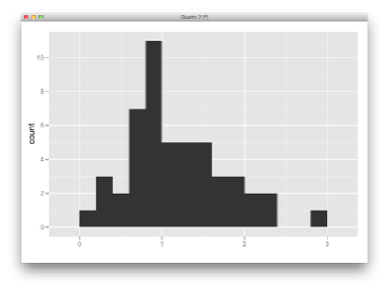
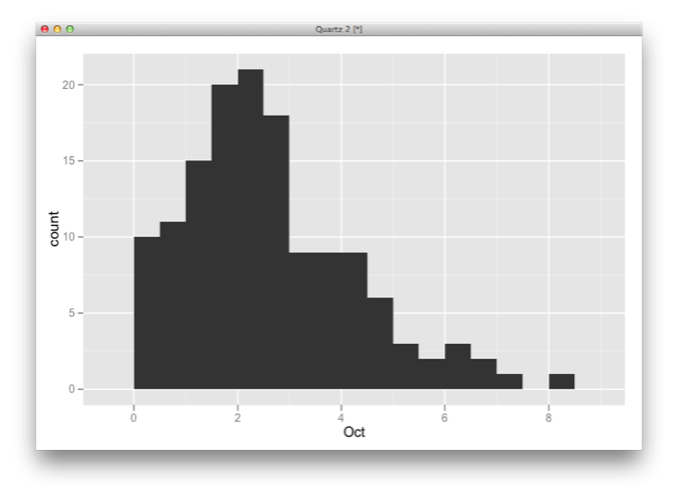
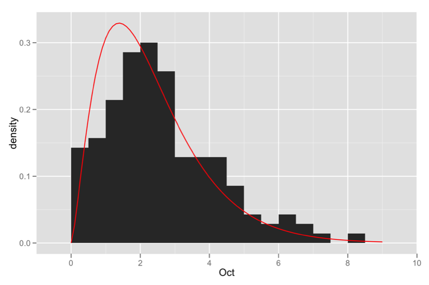
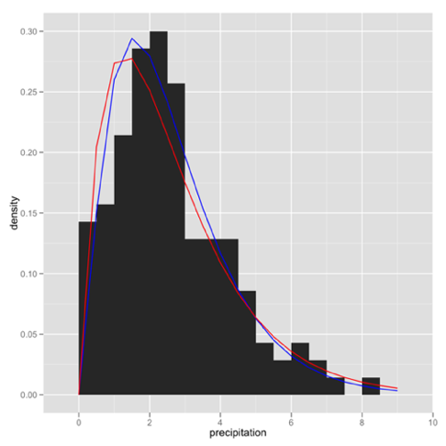
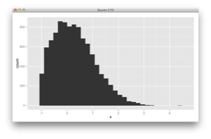
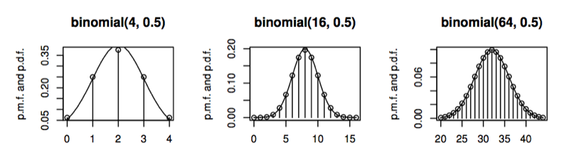
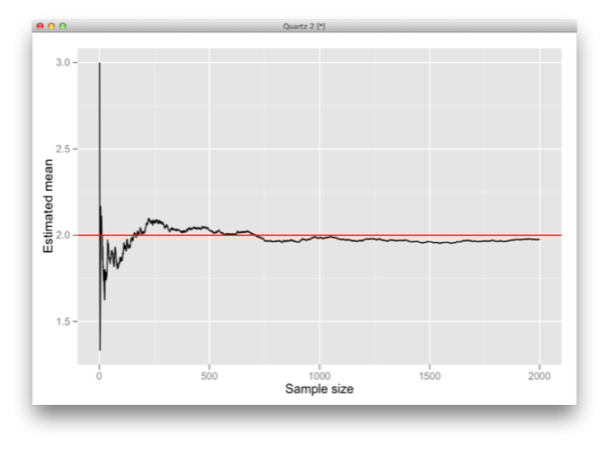
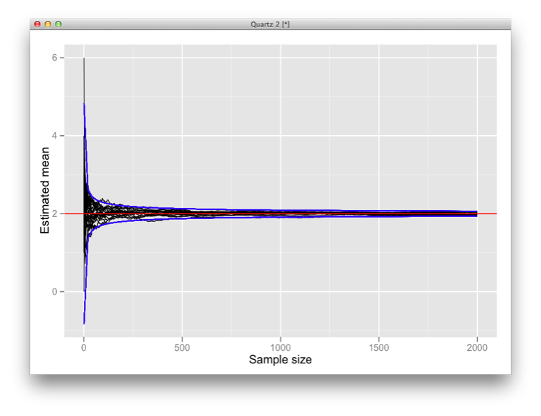
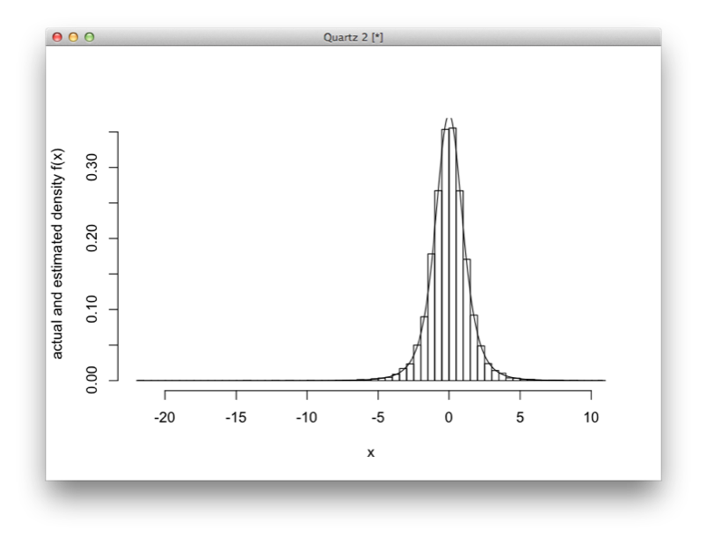

# Estimation

---

## Estimation

An recurring statistical problem is finding estimates of the relevant parameters that correspond to the distribution that best represents our data?

In parametric inference, we specify *a priori* a suitable distribution, then choose the parameters that best fit the data

* e.g. $\mu$ and $\sigma^2$ in the case of the normal distribution

---

## Point Estimation

We start with the problem of finding values for the parameters that provide the best fit between the model and the data, called point estimates. First, we need to define what we mean by "best fit". There are two commonly used criteria:

* **Method of moments** chooses the parameters so that the sample moments (*e.g.* sample mean and variance) match the theoretical moments of our chosen distribution.
* **Maximum likelihood** chooses the parameters to maximize the likelihood, which measures how likely it is to observe our given sample.

---

## Example: Nashville Precipitation

The dataset `nashville_precip.txt` contains NOAA precipitation data for Nashville measured since 1871. The gamma distribution is often a good fit to aggregated rainfall data, and will be our candidate distribution in this case.

*Data source: http://bit.ly/nasvhville_precip_data*

---

## Method of Moments

We can import the rainfall data into R, and use `apply` to get means and variances by month:

    !r
    > precip <- read.table("~/Bios6301/datasets/nashville_precip.txt", header=T)
    > precip_mean <- apply(precip[-1], 2, mean)
    > precip_var <- apply(precip[-1], 2, var)

Recall that data distributed $X \sim Gamma(\alpha, \beta)$ has mean $\alpha \beta$ and variance $\alpha \beta^2$. The method of moments simply assigns the empirical mean and variance to their theoretical counterparts, so that we can solve for the parameters.

$$ \hat{\mu} = \bar{X} = \alpha \beta $$
$$ \hat{\sigma}^2 = S^2 = \alpha \beta^2 $$

Hence:

$$ \alpha = \frac{\bar{X}^2}{S^2}, \, \beta = \frac{S^2}{\bar{X}} $$

---

## Method of Moments

To visually check how well our estimates match the data, we can plot a histogram of any month and then superimpose the density, given our estimated parameters:

    !r
    > alpha_hat <- precip_mean^2/precip_var
    > beta_hat <- precip_var/precip_mean
    > r <- seq(0, 9, 0.1)
    > gamfit <- data.frame(list(r=r, pr=dgamma(r, alpha_hat[10], beta_hat[10])))
    > p <- ggplot(precip, aes(Oct)) + geom_histogram(aes(y=..density..), bandwidth=0.5)
    > p + geom_line(aes(x=r, y=pr), data=gamfit, color="red")

---

## Method of Moments

---

## Example

Estimate the parameter of the Pareto distribution using the method of moments, based on the data in `pareto.csv` in your datasets directory.

$$f(x|\beta) = \frac{\beta}{x^{\beta+1}}, \, x>1$$

---

## Maximum Likelihood

Maximum likelihood fitting is usually more work than the method of moments, but it is preferred as the resulting estimator is known to have good theoretical properties.

We will restrict ourselves to the mechanics of maximum likelihood fitting, for a theoretical justification, talk to Bryan Shepherd!

Suppose $X_1, \ldots, X_n$ are iid continuous random variables with density function *f*, then for realizations $x_1,\ldots,x_n$, we have:

$$ P(x_1 \lt X_1 \le x1 + dx, \ldots , x_n \lt X_n \le x_n +dx) $$
$$ = \prod_{i=1}^n P(x_i \lt X_i \le x_i+dx) = \prod_{i=1}^n f(x_i) dx$$

The product $\prod_{i=1}^n f(x_i)$ gives us a measure of how **likely** it is to observe values $x_1,\ldots,x_n$. Maximum likelihood fitting consists of choosing *f* to maximise $\prod_{i=1}^n f(x_i)$, for a given set of observations.

## Presenter Notes

Usually easier to work in the log space.

---

## Maximum Likelihood

For the rainfall data, we need to maximize:

$$\begin{align}l(\alpha,\beta) &= \sum_{i=1}^n \log[\beta^{\alpha} x^{\alpha-1} e^{-x/\beta}\Gamma(\alpha)^{-1}] \cr
&= n[(\alpha-1)\overline{\log(x)} - \bar{x}\beta + \alpha\log(\beta) - \log\Gamma(\alpha)]\end{align}$$

where $n = 2012 - 1871 = 141$ and the bar indicates an average over all *i*. We choose $\alpha$ and $\beta$ to maximize $l(\alpha,\beta)$.

Notice $l$ is infinite if any $x$ is zero. We do not have any zeros, but we do have an NA value. We can deal with both instances:

    !r
    > precip_oct <- precip$Oct[!is.na(precip$Oct)]
    > precip_oct[precip_oct==0] <- 0.01

---

## Maximum Likelihood

Recall that to find the maximum of any function, we typically take the derivative with respect to the variable to be maximized, set it to zero and solve.

$$\frac{\partial l(\alpha,\beta)}{\partial \beta} = n\left(\frac{\alpha}{\beta} - \bar{x}\right) = 0$$

Which can be solved as $\beta = \alpha/\bar{x}$. However, plugging this into the derivative with respect to $\alpha$ yields:

$$\frac{\partial l(\alpha,\beta)}{\partial \alpha} = \log(\alpha) + \overline{\log(x)} - \log(\bar{x}) - \frac{\Gamma(\alpha)'}{\Gamma(\alpha)} = 0$$

This has no closed form solution. We must use numerical optimization!

---

## Maximum Likelihood

Recall that to apply the Newton-Raphson algorithm, we need a function that returns a vector containing the first and second derivatives of the function with respect to the variable of interest. In our case, this is:

    !r
    dl <- function(m, log_mean, mean_log) {
      return(c(log(m) - digamma(m) - log_mean + mean_log, 1/m - trigamma(m)))
    }

where `log_mean` and `mean_log` are $\log{\bar{x}}$ and $\overline{\log(x)}$, respectively. `digamma` and `trigamma` are complex functions of the Gamma function that result when you take first and second derivatives of that function.

---

## Maximum Likelihood

The moment estimator is blue and the MLE is red.

---

## Example: Truncated Normal

In a variety of settings, usually as a result of measurement problems or sampling restrictions, data must be selectively (non-randomly) discarded.

* Exclusion criteria for a study may cut off eligibility at some threshold value of a parameter (e.g. age, height, blood pressure)

* The log-concentration of biomedical samples may be lower than the accuracy of the measurement devices, and must be discarded.

In the second example, we may know how many samples were discarded (censoring), in the first we likely do not (truncation).

The truncated normal is also often used to model truncated data.

---

## Truncated Distributions

Suppose that we observe $Y$ truncated below at $a$ (where $a$ is known). If $X$ is the distribution of our observation, then:

$$ P(X \le x) = P(Y \le x|Y \gt a) = \frac{P(a \lt Y \le x)}{P(Y \gt a)}$$

Then X has the density:

$$f_X(x) = \frac{f_Y (x)}{1-F_Y (a)} \, \text{for} \, x \gt a$$

Suppose $Y \sim N(\mu, \sigma^2)$ and $x_1,\ldots,x_n$ are independent observations of $X$. We can use maximum likelihood to find $\mu$ and $\sigma$.

Log-likelihood:

    !r
    ell <- function(theta, a, x) {
        mu <- theta[1]
        si <- theta[2]
        sum(log(dnorm(x, mu, si)) - log(1 - pnorm(a, mu, si)))
    }

---

## Truncated Distribtuions

To test how well maximum likelihood performs in this situation, we simulate 10,000 $N(0, 1)$ random variables, conditioned to be greater than $a = -1$.

To maximize the likelihood we use the built-in function `optim`:

    !r
    optim(par, fn, gr = NULL, ...,
        method = c("Nelder-Mead", "BFGS", "CG", "L-BFGS-B", "SANN", "Brent"),
        lower = -Inf, upper = Inf,
        control = list(), hessian = FALSE)

Note that `optim` minimizes rather than maximizes, however the argument `control = list(fnscale = -1)` instructs `optim` to multiply the log-likelihood by -1.

---

## Truncated Distribtuions

    !r
    > mu <- 0
    > si <- 1
    > a <- -1
    > x <- rnorm(10000, mu, si)
    > x.small <- (x <= a)
    > while (sum(x.small) > 0) {
    +     x[x.small] <- rnorm(sum(x.small), mu, si)
    +     x.small <- (x <= a)
    + }
    > ell.optim <- optim(c(mu, si), ell, a = a, x = x,
    +       control = list(fnscale = -1))
    > cat("ML estimate of mu", ell.optim$par[1], "and sigma",
    +       ell.optim$par[2], "\n")

    ML estimate of mu 0.0075 and sigma 1.0081

---

## The Central Limit Theorem

The Central Limit Theorem (CLT) is one of the most important results in probability theory, providing the theoretical justification for many statistical procedures.

Here, we will use it principally to tell us how precise $\bar{X}$ is as an estimate of $E(X)$, which we do using confidence intervals.

Suppose that $X_1, X_2, \ldots , X_n$ are iid with mean $\mu$ and variance $\sigma^2$.

$$P\left(\frac{\bar{X} - E(X)}{\sqrt{\text{Var}(\bar{X})}} \le x\right) = P\left(\frac{\bar{X}-\mu}{\sigma/\sqrt{n}} \le x\right) \rightarrow \Phi(x)$$
$$\text{as} \,\, n \rightarrow \infty$$

Here $\Phi$ is the cumulative distribution function of the standard normal distribution.

## Presenter Notes

X not necessarily normal!

---

## The Central Limit Theorem

We say that $\sqrt{n}(\bar{X}-\mu)/\sigma$ *converges in distribution* to $Z \sim N(0,1)$

The process of transforming a random variable by subtracting the mean and dividing by the standard deviation is called **standardization**.

The CLT is frequently used to justify these approximations:

$$\begin{align}\bar{X} &\approx N(\mu,\sigma^2/n) \cr
\sum_i X_i &\approx N(n\mu,n\sigma^2)\end{align}$$

for large $n$.

---

## Normal Approximation to the Binomial

By the CLT, we can use a normal distribution to approximate the binomial distribution, provided $n$ is sufficiently large.

If $X_1,\ldots,X_n$ are iid *Bernoulli($p$)*, then $Y = \sum_{i=1}^n X_i \sim Bin(n,p)$. So,

$$Y \approx N(\mu_Y, \sigma_Y^2) = N(np, np(1-p))$$

As a rule of thumb, this approximation is reasonable provided $np > 5$ and $n(1 - p) > 5$

---

## Example: Occupancy Rate

In surveys of wildlife populations, the distribution of plants and animals can be quantified using an *occupancy rate*. That is, the proportion of suitable habitat patches that are occupied within a region.

Suppose there are 250 patches available in a survey region, and historically 10% of patches are occupied during a breeding season. What is the probability that more than 12% of patches are occupied this season?

Let $X$ be the number of occupied patches; we want to know $P(X>30)$.

$$X \sim Binomial(250, 0.1)$$

We can calculate this directly as a sum of binomial probabilities:

$$P(X>30) = 1 - P(X \le 30) = 1 - \sum_{k=0}^{30} P(X=k) $$
$$= 1 - \sum_{k=0}^{30} {250 \choose k} 0.1^k 0.9^{250-k}$$

---

## Continuity Correction

However, it is easier to use the normal approximation to the binomial. We seek $P(x>30)$, but we cannot use $P(Y>30)$ (where $Y \sim N(\mu, \sigma^2)$) directly to approximate this. We must first make a **continuity correction**.

When we are approximating a discrete random variable by a continuous one, how do we estimate quantities like $P(X=42)$ or distinguish between $P(X \gt 42)$ and $P(X \ge 42)$? A continuity correction defines discrete probabilities as follows:

$$P(X=x) \approx P(x - \frac{1}{2} \lt Y \lt x + \frac{1}{2})$$

Hence, $P(X \gt 42)$ is approximated by $P(Y \gt 42.5)$ and $P(X \ge 42)$ by $P(Y > 41.5)$.

---

## Example: Occupancy Rate

Using the continuity correction, we can approximate $P(X>30)$ by $P(y>30.5)$, where $Y \sim N(25, 22.5)$.

$$\begin{align}
P(Y > 30.5) &= P\left(\frac{Y-25}{\sqrt{22.5}} \gt \frac{30.5-25}{\sqrt{22.5}}\right) \cr
&= P(Z > 1.1595) = 1 - \Phi(1.1595)
\end{align}$$

We can calculate this easily in R:

    !r
    > 1 - pnorm(1.1595)
    [1] 0.1231262

Which can be confirmed by the exact calculation:

    !r
    > 1 - pbinom(30, 250, 0.1)
    [1] 0.1246714

---

## Normal Approximation to the Poisson

Recall the Poisson distribution:

$$Pr(X=x)=\frac{e^{-\lambda}\lambda^x}{x!}$$

where the parameter $\lambda$ describes both the mean and variance of the distribution. We can decompose $\lambda$ into the product $\lambda=np$. Provided that $n$ is sufficiently large ($p$ small), we can approximate:

$$Poisson(\lambda) \approx Binomial(n,p)$$

And, in turn:

$$Binomial(n,p) \approx N(np, np(1-p))$$

Suppose $p \rightarrow 0$:

$$np(1-p) = \lambda(1-p) \rightarrow \lambda$$
$$\Rightarrow Poisson(\lambda) \approx N(\lambda, \lambda)$$

## Presenter Notes

This approximation improves as n gets large

---

## Normal Approximation to Poisson

This approximation is helpful when exact methods for calculating Poisson probabilities fail. For example, consider $X \sim Poisson(150)$; if we wish to calculate, say:

$$P(X \le 180) = \sum_{k=0}^{180} P(X=k) = \sum_{k=0}^{180} \frac{150^k e^{-150}}{k!}$$

To calculate this in R:

    !r
    > poispmf <- function(k, lambda) lambda^k*exp(-lambda)/prod(1:k)
    > poiscdf <- function(k, lambda) sum(sapply(0:k, poispmf, lambda=lambda))
    > poiscdf(180, 150)
    [1] NaN

The calculation fails because for large k the values P(X = k) become impos- sible to calculate:

    !r
    > sapply(140:150, poispmf, lambda = 150)
    [1] 0.02396040 0.02548978        Inf        Inf        Inf        Inf        Inf        Inf
    [9]        Inf        Inf        Inf

---

## Normal Approximation to Poisson

This happens because calculating $150^k$ blows up past $k=141$, and $k!$ does the same shortly thereafter. This aside, $e^{\lambda}$ calculated for large $\lambda$ is inaccurate.

We can circumvent these issues using the normal approximation, $Y \sim N(150, 150)$

$$\begin{align}
P(X \le 180) &\approx P(Y \lt 180.5) \cr
&= P\left(\frac{Y-150}{\sqrt(150)} \lt \frac{180.5-150}{\sqrt(150)}\right) \cr
&= P(Z \le 2.4903) = \Phi(2.4903) = 0.9936
\end{align}$$

---

## Weak Law of Large Numbers

Also known as *Bernoulli's Theorem*, the Weak Law of Large Numbers tells us that as $n \rightarrow \infty$,

$$P(|\bar{X}-\mu| \ge \epsilon) = 0$$

where $\epsilon$ is some arbitrarily small positive quantity. In other words, $\bar{X} \xrightarrow{P} E(X)$.

However, we are not told **how fast** the estimate converges. To judge how useful an estimate is, we need to know how precise it is.

## Presenter Notes

Useful: promises that estimate will converge!

---

## Estimator Precision

We can judge estimator precision visually by plotting how it changes with increasing sample size.

Consider estimating the mean of a Poisson random variable $X$. It is easy to simulate, estimate and plot estimates.

    !r
    n <- 2000
    la <- 2
    x <- rpois(n, la)
    xbar <- cumsum(x)/1:n
    p <- qplot(1:n, xbar, geom="line", xlab="Sample size", ylab="Estimated mean", )
    p + geom_hline(yintercept=la, color="red")

---

## Estimator Precision

Because this is just one simulation experiment, it is difficult to tell if the estimate has converged or not.

---

## Estimator Precision

A better approach is to replicate the experiment several times:

    n <- 2000
    la <- 2
    xbar <- data.frame(x=numeric(0), y=numeric(0), sim=numeric(0))
    for (i in 1:20) {
        x <- rpois(n, la)
        xbar <- rbind(xbar, data.frame(x=1:n, y=cumsum(x)/1:n, sim=i))
    }
    p <- ggplot(xbar, aes(x=x, y=y, group=sim)) + geom_line(size=0.3)
    p <- p + geom_hline(yintercept=la, color="red")
    p <- p + stat_function(fun = function(x) la + 2*sqrt(la/x), colour = "blue")
    p <- p + stat_function(fun = function(x) la - 2*sqrt(la/x), colour = "blue")
    p + xlab("Sample size") + ylab("Estimated mean")

---

## Estimator Precision

---

## Estimator Precision

Notice two things:

1. For a sample of size n = 2000, the estimate tends to be between 1.95 and 2.05.
2. As k increases, the range of the estimates seems to decrease at a rate proportional to the square root of k.

The width of the range of estimates gives us an idea of the margin for error in the point estimate. Such intervals are called confidence intervals (CIs) and the process of estimating them is called interval estimation.

---

## Confidence Intervals

Suppose $X_1,\ldots,X_n$ are iid with mean $\mu$ and variance $\sigma^2$, then:

* by the CLT: $\frac{\sqrt{n}(\bar{X}-\mu)}{\sigma} \xrightarrow{d} N(0,1)$
* by the WLLN: $S^2 \xrightarrow{P} \sigma^2$

So, for large n:

$$\begin{align}
0.95 &= P(-1.96 \lt Z \lt 1.96) \cr
&\approx P(-1.96 \lt \frac{\bar{X}-\mu}{S/\sqrt{n}} \lt 1.96) \cr
&= P(-1.96\frac{S}{\sqrt{n}} \lt \bar{X}-\mu \lt 1.96\frac{S}{\sqrt{n}}) \cr
&= P(\bar{X}-1.96\frac{S}{\sqrt{n}} \lt \mu \lt \bar{X}+1.96\frac{S}{\sqrt{n}}) \cr
\end{align}$$

---

## Confidence Intervals

Interpretation: as the number of samples increases to infinity, 95% of the time this interval will include the true value of $\mu$.

The size of the CI about $\bar{X}$ gives us an idea of how reliable an estimate it is.

In R, we calculate a 95% CI as:

    !r
    > n <- 2000
    > la <- 2
    > x <- rpois(n, la)
    > xbar <- mean(x)
    > S <- sd(x)
    > L <- xbar - 1.96 * S/sqrt(n)
    > U <- xbar + 1.96 * S/sqrt(n)
    > sprintf("Point estimate: %4.2f, 95%% CI: [%4.2f, %4.2f]", xbar, L, U)
    [1] "Point estimate: 2.02, 95% CI: [1.95, 2.08]"

Different-sized confidence intervals may be constructed similarly:

$$\left(\bar{X}-z_{1-\alpha/2}\frac{S}{\sqrt{n}}, \bar{X}+z_{1-\alpha/2}\frac{S}{\sqrt{n}}\right)$$

---

## Confidence Intervals for Proportions

If $X \sim Binomial(n, p)$, then we can approximate:

$$\begin{align}\text{Var}(X) &= np(1-p) \cr
&\approx n\hat{p}(1-\hat{p}) = n(X/n)(1-X/n)
\end{align}$$

which allows us to calculate a 95% confidence interval as:

$$\left(\frac{X}{n} - 1.96\sqrt{\frac{(X/n)(1-X/n)}{n}}, \frac{X}{n}+1.96\sqrt{\frac{(X/n)(1-X/n)}{n}}\right)$$

Observe that for $p \in [0, 1]$, the maximum value of $p(1 - p)$ is 1/4 when $p$ = 1/2. Thus, the variance is always less than n/4. Using this bound to construct a confidence interval for large n:

$$P\left(p \in \left(\frac{X}{n} - \frac{1.96}{2\sqrt{n}}, \frac{X}{n}+\frac{1.96}{2\sqrt{n}}\right)\right) \ge 0.95$$

## Presenter Notes

This is a conservative confidence interval
In particular this CI may significantly overestimate the variability of phat when p is close to 0 or 1.
Its advantage is that you don"t have to know phat to estimate how large the sample should be to achieve some required precision.

---

## Example: Opinion poll accuracy

In a poll of 1141 Ohio voters before the last presidential election (31 Oct., 2012) by the University of Cincinnati, 548 respondents said they would vote for Barack Obama and 525 chose Mitt Romney.

95% confidence intervals for the true proportion of Ohio voters supporting each candidate are:

**Barack Obama**

$$0.480 \pm 1.96\sqrt{\frac{0.480 \times 0.520}{1141}} = 0.480 \pm 0.029 = (0.451, 0.509)$$

**Mitt Romney**

$$0.460 \pm 1.96\sqrt{\frac{0.460 \times 0.540}{1141}} = 0.460 \pm 0.029 = (0.431, 0.489)$$

---

## Exercise

### How large would *n* have to be to reduced the sampling error to $\pm 1\%$?

---

## Small Sample Size Intervals

Invoking the CLT relies on *n* being "large enough" (>100?).

For smaller sample sizes, we can still estimate a confidence interval. Suppose we have $X_1, \ldots, X_n$ iid $N(\mu, \sigma^2)$. Then for any *n*:

$$T = \frac{\bar{X}-\mu}{S/\sqrt{n}} \sim t_{n-1}$$

Here, $t_{\nu}$ is a Student-t distribution with $\nu$ degrees of freedom. As $n \rightarrow \infty$, the $t_{n-1}$ converges to a $N(0,1)$ distribution.

---

## Small Sample Size Intervals

We can test this numerically by repeatedly generating small samples from a normal distribution and comparing a histogram of their means to a Student-t distribution:

    !r
    n <- 5       # size of X sample
    nT <- 10000  # size of T sample
    T_sample <- rep(0, nT)

    for (i in 1:nT) {
        X_sample <- rnorm(n)
        T_sample[i] <- sqrt(n)*mean(Xsample)/sd(Xsample)
    }

    hist(Tsample, breaks=sqrt(nT), freq=F, xlab='x',
        ylab='actual and estimated density f(x)', main='')

    x <- seq(min(Tsample), max(Tsample), 0.01)
    lines(x, sapply(x, dt, df=n-1))

---

## Small Sample Size Intervals

---

## Small Sample Size Intervals

If we wish to construct a robust 95% interval for normally-distributed data:

$$\begin{align}
0.95 &= P\left(t_{0.025,n-1} \lt \frac{\bar{X}-\mu}{S/\sqrt{n}} \lt t_{0.975,n-1}\right) \cr
&= P\left(\bar{X}-t_{0.975,n-1}\frac{S}{\sqrt{n}} \lt \mu \lt \bar{X}-t_{0.025,n-1}\frac{S}{\sqrt{n}}\right) \cr
&= P\left(\mu \in \left(\bar{X}-t_{0.975,n-1}\frac{S}{\sqrt{n}}, \bar{X}-t_{0.025,n-1}\frac{S}{\sqrt{n}}\right)\right) \cr
\end{align}$$

where $t_{\eta,\nu}$ is the $(100\times\eta)\%$ point of the $t_{\nu}$ distribution.

For $\nu=5$, we have $t_{0.975,5}=2.5706$, which results in a wider interval than if we had invoked the central limit theorem. However, $t_{0.975,\infty}=1.9600$.

---

## Monte Carlo Confidence Intervals

It is sometimes useful to be able to approximate the variability of a set of independent estimators of some quantity of interest.

Consider $E_1, \ldots, E_k$ independent, continuous, unbiased estimators of $\mu$. Specifically, consider $\mu$ to be the median of each $E_i$:

$$P(E_i < \mu) = 0.5$$

For example, take $E_i$ to be the mean of some sample of size $n(i)$: $E_i = (X_1, \ldots, N_{n_i})/n(i)$

Under the CLT, $E_i$ is approximately normal, so $\mu$ is approximately the median.

---

## Monte Carlo Confidence Intervals

Now consider the ordered sample $E_{(1)}, \ldots, E_{(k)}$ so that $E_{(1)} < E_{(2)} < \ldots < E_{(k)}$. Then we have:

$$\begin{align}P(E_{(1)} \le \mu \le E_{(k)}) &= 1 - P(E_{(1)} \gt \mu) - P(E_{(k)} \lt \mu) \cr
&= 1 - P(\text{all} \, E_i \gt \mu) - P(\text{all} \, E_i \lt \mu) \cr
&= 1 - 0.5^k - 0.5^k = 1 - 0.5^{k-1}
\end{align}$$

So, for $k=6$ we get $1 - 0.5^5 = 0.96875$ -- essentially a 97% interval.

---

## Monte Carlo Confidence Intervals

In general, for $a,b: 1 \le a \lt b \le k$:

$$P(E_{(a)} \le \mu \le E_{(b)}) $$
$$= P(\text{at least a of the}\,E_i \lt \mu \, \text{and at most b-1 of the} \, E_i \lt \mu)$$

Now, let $N = \sum_i I(E_i \lt \mu)$, which can be considered a binomial draw of size $k$ with $p=0.5$.

So,

$$P(E_{(a)} \le \mu \le E_{(b)}) = P(a \le N \le b) = \sum_{i=a}^{b-1} {k \choose i} 0.5^k $$

This provides a quick and simple way to estimate the precision of an estimate.

## Presenter Notes

Better to use bootstrap methods, but they are more complicated.

---

## Meta-analysis of Election Forecasting

In the last year's US presidential election, Ohio was seen as an important swing state. As a result, there were several models that were used to forecast outcomes in that state. Here are seven recent model results:

- **538.com**: Obama +2.4
- **E-V.com**: Obama +2.0
- **Linzer**: Obama +3.0
- **Pollster**: Obama +2.3
- **RCP**: Obama +2.1
- **TPM**: Obama +2.1
- **Wang**: Romney +3.0

What sort of precision can we get with this data?

---

## Meta-analysis of Election Forecasting

We will use the 2nd and 6th points in the ordered sample to form a confidence interval:

$$\begin{align}\sum_{i=2}^6 {7 \choose i} 0.5^7 &= 1 - \left[{7 \choose 0} + {7 \choose 1} + {7 \choose 7}\right] 0.5^7 \cr
&= 1 - 9 \times 0.5^7 = 0.930\end{align}$$

Hence, a 93% confidence interval for the true margin is (2.1, 3.0) for Obama.

---

## Example: Coverage probability

We know that the $U(-1,1)$ distribution has mean 0. Use a sample of size 100 to estimate the mean and give a 95% confidence interval. Does the confidence interval contain 0?

Repeat the above a large number of times. What percentage of time does the confidence interval contain 0?

