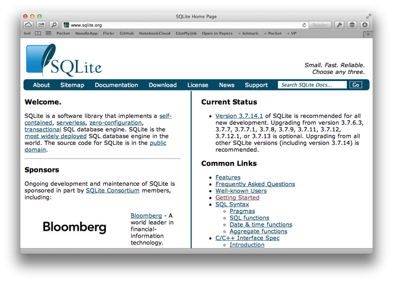
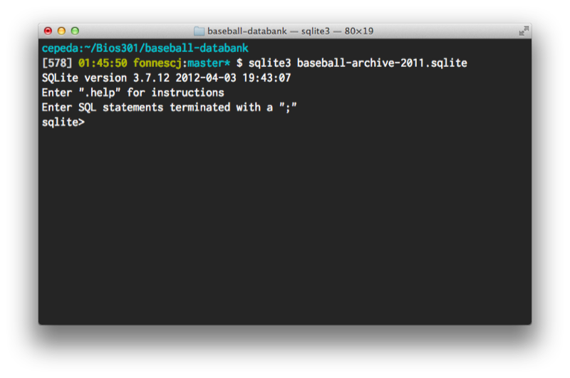
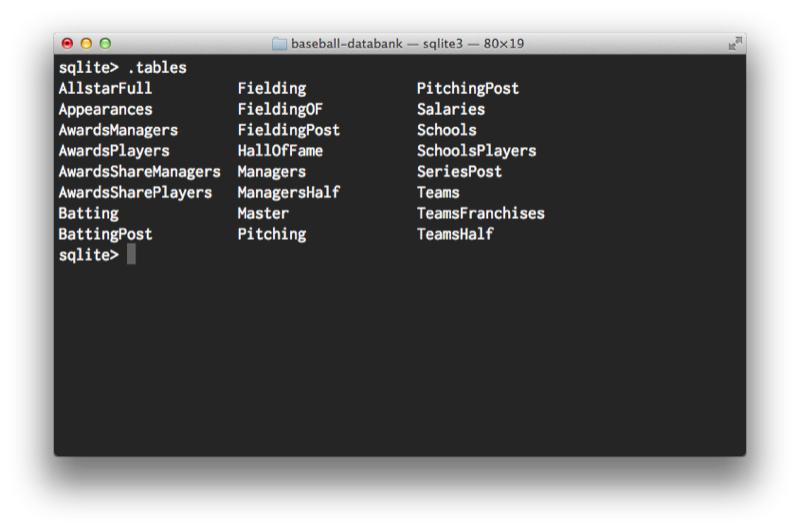
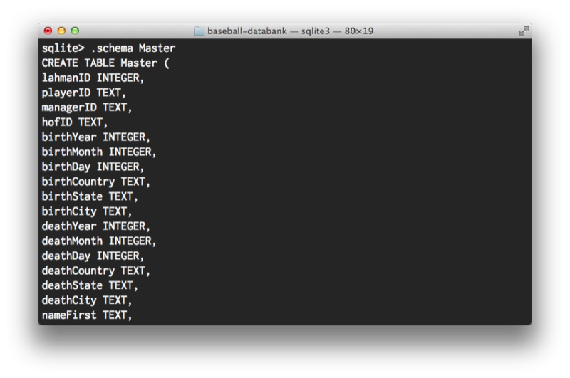
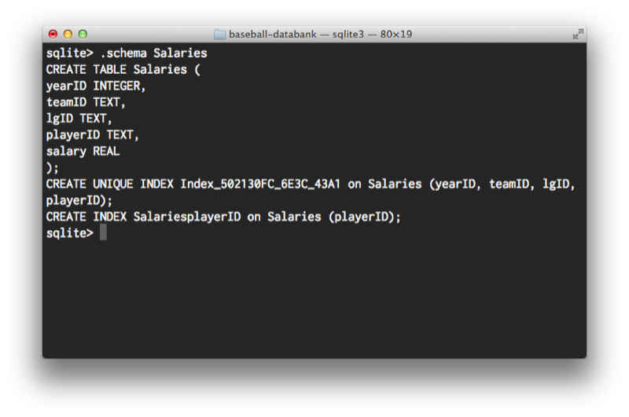
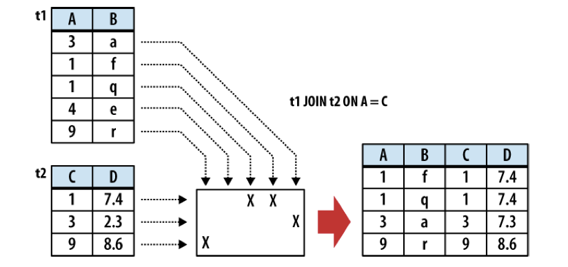
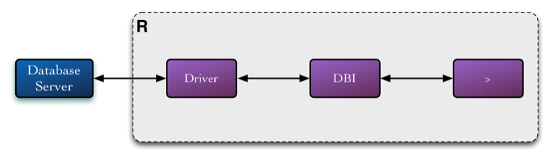

# Relational Databases

---

## Databases

A database is generally any organized collection of data.

* usually applied to large collections of data.

Databases are ubiquitous: websites, embedded software.

Databases are commonly **relational**.

---

## Databases

Why should a statistician use databases?

* big data
* efficient management
* reliability
* portability

---

## Interacting with Databases

Within the R environment, several packages are available for interacting with various database management systems (DBMS).

All databases have their own client software to run queries directly within the database.

---

## Relational Databases

A relational database consists of a set of **tables**

* analogous to R's `data.frame`
* variables organized by column, observations by row

Databases are typically **normalized** to reduce redundancy in data storage.

---

## Example: healthcare providers

Consider a hypothetical database of patients and physicians.

<table border="1">
<tr><th>patno</th><th>patname</th><th>gpno</th><th>gpname</th><th>gpaddr</th></tr>
<tr><td>01027</td><td>Grist</td><td>919</td>
<td>Robinson</td><td>Acadia Rd</td></tr>
<tr><td>08023</td><td>Daniels</td><td>818</td>
<td>Seymour</td><td>Fir St</td></tr>
<tr><td>191146</td><td>Falken</td><td>717</td><td>Ibbotson</td>
<td>Beach Ave</td></tr>
<tr><td>001239</td><td>Burgess</td><td>818</td><td>Seymour</td>
<td>Fir St</td></tr>
<tr><td>007249</td><td>Lynch</td><td>717</td><td>Ibbotson</td>
<td>Beach Ave</td></tr>
</table>

What happens if a doctor changes their address?

## Presenter Notes

Too much redundant information

---

## Example: healthcare database

We can eliminate redundant storage by breaking the data into two tables:

**patients**

<table border="1">
<tr><th>patno</th><th>patname</th></tr>
<tr><td>01027</td><td>Grist</td></tr>
<tr><td>08023</td><td>Daniels</td></tr>
<tr><td>191146</td><td>Falken</td></tr>
<tr><td>001239</td><td>Burgess</td></tr>
<tr><td>007249</td><td>Lynch</td></tr>
</table>

**physicians**

<table border="1">
<tr><th>gpno</th><th>gpname</th><th>gpaddr</th></tr>
<tr><td>919</td><td>Robinson</td><td>Acadia Rd</td></tr>
<tr><td>818</td><td>Seymour</td><td>Fir St</td></tr>
<tr><td>717</td><td>Ibbotson</td><td>Beach Ave</td></tr>
</table>

---

## Keys

Records are associated with unique identifiers.

In the previous example `gpno` and `patno` are **keys**, which uniquely identify patients and doctors, respectively.

How do we connect patients with their doctors when they reside in different tables?

---

## Normalization

The process of dividing large tables with redundant information into a set of tables in a relational database is called **normalization**.

* reduces redundancy
* decrease dependencies

Through normalization, modifications of a field can be made in one table and be propagated through the rest of the database via the defined relationships.

Keys are used to relate one table to another.

<table border="1">
<tr><th>patno</th><th>patname</th><th>gpno</th></tr>
<tr><td>01027</td><td>Grist</td><td>919</td></tr>
<tr><td>08023</td><td>Daniels</td><td>818</td></tr>
<tr><td>191146</td><td>Falken</td><td>717</td></tr>
<tr><td>001239</td><td>Burgess</td><td>818</td></tr>
<tr><td>007249</td><td>Lynch</td><td>717</td></tr>
</table>

---

## Example: healthcare database

Suppose now that we add tests conducted on individual patients by physicians. How would we add this information to the database?

* Patient *Grist* gave a blood sample on 3/9/2012
* Patient *Daniels* gave a urine sample on 4/10/2012
* Patient *Daniels* gave a blood sample on 5/6/2012
* Patient *Burgess* gave a sputum sample on 9/10/2012

---

## Example: healthcare database

**tests**

<table border="1">
<tr><th>sampleno</th><th>patno</th><th>date</th><th>sample</th></tr>
<tr><td>5542</td><td>01027</td><td>3/9/2012</td><td>blood</td></tr>
<tr><td>9931</td><td>08023</td><td>4/10/2012</td><td>urine</td></tr>
<tr><td>9977</td><td>08023</td><td>5/6/2012</td><td>blood</td></tr>
<tr><td>10214</td><td>001239</td><td>9/10/2012</td><td>sputum</td></tr>
</table>

---

## Database Server

Databases are typically based on a client-server model

The model consists of:

* one server instance
* many client instances

Popular database servers include: Oracle, MySQL, Microsoft SQL, SQLite

Example: web server

* server database provides content for html pages
* multiple website visitors request and render pages

---

## Database Server

Server:

* accepts connections from clients
* processes requests and provide results

Client:

* connects to server
* makes requests and receives results from server

---

## Database Interaction

The database interaction paradigm consists of multiple steps:

1. Connect to database server
2. Issue request
3. Fetch result
4. Repeat 2,3 as necessary
5. Disconnect from server

---

## Client Access

There are three common ways of interacting with a database server:

1. Graphical client
2. Native client
3. Client library

---

## SQLite

---

## SQLite

We will learn how to manipulate a relational database using the SQLite database.

SQLite is a lightweight, open-source RDBMS that is frequently embedded within other software.

SQLite is the most widely deployed SQL database engine in the world!

We will use both the native SQLite client and the R package `RSQLite`.

---

## Example: Baseball

To fully-demonstrate relational database functionality, we will use baseball statistics from `Baseball-DataBank.org`.

A SQLite database of all the tables has been added as a submodule of the course GitHub repository:

    git submodule add https://github.com/jknecht/baseball-archive-sqlite
        baseball-databank

---

## SQLite Client

Move into the directory containing the database you wish to access (or create), and run `sqlite3`:

---

## .tables

Calling `.tables` lists all the tables in the current database:

---

## .schema

We can describe particular tables using `.schema`:

---

## .schema

---

## Querying

How do we extract particular subsets of interest from the database?

* top 10 salaries
* the names of the highest-paid players
* the highest-paid players on each team

---

## SQL

Structured Querying Language (SQL) is a declarative language for programming relational databases.

Queries consist of single statements, delimited with semicolons.

* **`SHOW DATBASES`** lists available databases (`.databases`)
* **`SHOW TABLE IN my_db`** lists tables in database `my_db` (`.tables`)
* **`SHOW COLUMNS IN table1`** lists columns in table `table1`
* **`DESCRIBE table1`** describes fields in table `table1` (`.schema tables`)
* **`USE another_db`** changes the default database to `another_db`

(SQLite shortcuts shown in parentheses)

SQL keywords are case insensitive (though table and column names are not)

---

## `SELECT`

The command most relevant to querying a relational database is `SELECT`.

`SELECT` returns a table, which includes names of columns and rows with values.

The `SELECT` syntax is a generic template that allows users to express different types of queries.

* `SELECT` has a large number of optional clauses

---

## `SELECT`

The most general format of `SELECT` in SQLite:

    SELECT [DISTINCT] select_heading FROM source_tables
    WHERE filter_expression
    GROUP BY grouping_expressions
    HAVING filter_expression
    ORDER BY ordering_expressions
    LIMIT count
    OFFSET count

Each clause of the `SELECT` statement is a step in a "pipeline" that processes an initial working table.

Most clauses are optional.

---

## `SELECT`

    !sql
    SELECT [DISTINCT] select_heading FROM source_tables WHERE filter_expression
    GROUP BY grouping_expressions HAVING filter_expression ORDER BY ordering_expressions
    LIMIT count OFFSET count

1. **`FROM source_tables`** Designates one or more source tables and combines them together into one largeworking table.
2. **`WHERE filter_expression`** Filters specific rows out of the working table.
3. **`GROUP BY grouping_expressions`** Groups sets of rows in the working table based off similar values.
4. **`SELECT select_heading`** Defines the result set columns and (if applicable) grouping aggregates.
5. **`HAVING filter_expression`** Filters specific rows out of the grouped table. Requires a GROUP BY.
6. **`DISTINCT`** Eliminates duplicate rows.
7. **`ORDER BY ordering_expressions`** Sorts the rows of the result set.
8. **`OFFSET count`** Skips over rows at the beginning of the result set. Requires a LIMIT.
9. **`LIMIT count`** Limits the result set output to a specific number of rows.

---

## Selecting Columns

The columns of interest are specified in a comma-separated list:

    !sql
    sqlite> SELECT PlayerID, yearID, AB, H FROM Batting;
    aardsda01|2004|0|0
    aardsda01|2006|2|0
    aardsda01|2007|0|0
    aardsda01|2008|1|0
    aardsda01|2009|0|0
    aardsda01|2010|0|0
    aaronha01|1954|468|131
    aaronha01|1955|602|189
    ...
    zuverge01|1958|9|2
    zuverge01|1959|0|0
    zwilldu01|1910|87|16
    zwilldu01|1914|592|185
    zwilldu01|1915|548|157
    zwilldu01|1916|53|6

---

## Selecting Columns

The wildcard (`*`) selects all columns:

    !sql
    sqlite> SELECT * from Salaries;
    1959|DET|AL|cashno01|7000.0
    1980|TOR|AL|stiebda01|55000.0
    1981|NYA|AL|jacksre01|588000.0
    1981|TOR|AL|stiebda01|85000.0
    1982|TOR|AL|stiebda01|250000.0
    1983|TOR|AL|stiebda01|450000.0
    1984|TOR|AL|stiebda01|650000.0
    1985|ATL|NL|barkele01|870000.0
    1985|ATL|NL|bedrost01|550000.0
    ...

---

## `ORDER BY` Clause

    !sql
    sqlite> SELECT * from Salaries ORDER BY Salary;
    1993|NYA|AL|jamesdi01|0.0
    1999|PIT|NL|martija02|0.0
    1959|DET|AL|cashno01|7000.0
    1993|NYA|AL|silveda01|10900.0
    1994|CHA|AL|carych01|50000.0
    1997|FLO|NL|penaal01|50000.0
    1980|TOR|AL|stiebda01|55000.0
    1985|BAL|AL|sheetla01|60000.0
    1985|CAL|AL|clibust02|60000.0
    1985|CAL|AL|mccaski01|60000.0
    1985|CHA|AL|guilloz01|60000.0
    ...
    2009|LAN|NL|ramirma02|23854494.0
    2010|NYA|AL|sabatcc01|24285714.0
    2005|NYA|AL|rodrial01|26000000.0
    2008|NYA|AL|rodrial01|28000000.0
    2009|NYA|AL|rodrial01|33000000.0
    2010|NYA|AL|rodrial01|33000000.0

---

## Top 10 Salaries

We can use two additional clauses to obtain a list of the top 10 salaries:

    !sql
    sqlite> SELECT * from Salaries ORDER BY Salary DESC LIMIT 10;
    2009|NYA|AL|rodrial01|33000000.0
    2010|NYA|AL|rodrial01|33000000.0
    2008|NYA|AL|rodrial01|28000000.0
    2005|NYA|AL|rodrial01|26000000.0
    2010|NYA|AL|sabatcc01|24285714.0
    2009|LAN|NL|ramirma02|23854494.0
    2007|NYA|AL|giambja01|23428571.0
    2008|NYA|AL|giambja01|23428571.0
    2007|NYA|AL|rodrial01|22708525.0
    2010|NYA|AL|jeterde01|22600000.0

---

## Selecting Rows

The `WHERE` clause is used to filter rows from the working table generated by the `FROM` clause.

Generates a boolean condition that is evaluated for each row.

    !sql
    sqlite> SELECT PlayerID, yearID, AB, H FROM Batting WHERE AB>300
        ORDER BY H LIMIT 10;
    bergebi01|1909|346|48
    bakerge01|1884|317|52
    lathaju01|1884|308|52
    bergebi01|1908|302|53
    mcbrige01|1906|313|53
    roberda06|1974|318|53
    bergebi01|1901|308|55
    doolami01|1918|308|55
    penato01|1993|304|55
    stantle01|1978|302|55

---

## Aggregate Functions

An **aggregate function** takes a column expression as input and aggregates the column values from the rows of a group to produce a single output value.

Common aggregate functions:

* `COUNT`
* `AVG`
* `SUM`
* `MIN`
* `MAX`
* `VAR_SAMP`
* `STDDEV_SAMP`

We can use these functions to generate interesting statistics:

    !sql
    sqlite> SELECT MAX(AB), AVG(AB) FROM Batting;
    716|154.786044471438

---

## Aggregate Functions

Suppose we wish to calculate batting averages for all player-years:

    !sql
    sqlite> SELECT PlayerID, AB, H, H/AB FROM Batting
    WHERE AB>300;
    aaronha01|468|131|0
    aaronha01|602|189|0
    aaronha01|609|200|0
    aaronha01|615|198|0
    aaronha01|601|196|0
    aaronha01|629|223|0
    aaronha01|590|172|0
    aaronha01|603|197|0
    aaronha01|592|191|0
    aaronha01|631|201|0
    aaronha01|570|187|0
    aaronha01|570|181|0
    aaronha01|603|168|0
    aaronha01|600|184|0
    aaronha01|606|174|0
    ...

What happened?

---

## Aggregate Functions

`H` and `AB` are both integers, so the result is also an integer! We need to *cast* one of the columns to a REAL.

    !sql
    sqlite> SELECT PlayerID, AB, H, CAST(H AS REAL)/AB FROM Batting WHERE AB>300;
    aaronha01|468|131|0.27991452991453
    aaronha01|602|189|0.313953488372093
    aaronha01|609|200|0.328407224958949
    aaronha01|615|198|0.321951219512195
    aaronha01|601|196|0.3261231281198
    aaronha01|629|223|0.354531001589825
    aaronha01|590|172|0.291525423728814
    aaronha01|603|197|0.326699834162521
    aaronha01|592|191|0.322635135135135
    aaronha01|631|201|0.318541996830428
    aaronha01|570|187|0.328070175438597
    aaronha01|570|181|0.317543859649123
    aaronha01|603|168|0.278606965174129
    aaronha01|600|184|0.306666666666667
    aaronha01|606|174|0.287128712871287

Notice that the results are ordered by `PlayerID` by default. We probably want to order by batting average.

How do we order by a calculated column?

---

## Aggregate Functions

We need to assign a name to the calculated column:

    !sql
    sqlite> SELECT PlayerID, AB, H, CAST(H AS REAL)/AB AS BatAvg FROM Batting WHERE AB>300 ORDER BY BatAvg DESC LIMIT 10;
    duffyhu01|539|237|0.439703153988868
    oneilti01|517|225|0.435203094777563
    barnero01|322|138|0.428571428571429
    lajoina01|544|232|0.426470588235294
    barnero01|322|137|0.425465838509317
    keelewi01|564|239|0.423758865248227
    hornsro01|536|227|0.423507462686567
    sislege01|586|246|0.419795221843003
    cobbty01|591|248|0.419627749576988
    turnetu01|339|141|0.415929203539823

---

## Aggregation

The `GROUP BY` clause enables group-wise calculations.

To calculate the average salary by player, we must aggregate on `playerID`, which averages across years:

    !sql
    sqlite> SELECT playerID, AVG(salary) AS AvgSalary FROM Salaries
        GROUP BY playerID ORDER BY AvgSalary DESC;
    rodrial01|15553897.1764706
    jeterde01|13695333.3333333
    kurodhi01|11766666.3333333
    ramirma02|11378209.3888889
    fukudko01|11166666.6666667
    suzukic01|11113148.3
    matsuhi01|9875000.0
    delgaca01|9753266.66666667
    zambrca01|9634375.0
    beltrca01|9621445.5
    ...

---

## Aggregation

There are two ways of selecting rows in conjunction with aggregation.

* To filter rows pre-aggregation, use the `WHERE` clause
* To filter rows post-aggregation, use the `HAVING` clause

---

## `WHERE` Clause

Calculating the average salary for Atlanta Braves players in 1995:

    !sql
    sqlite> SELECT playerID, AVG(salary) AS AvgSalary FROM Salaries
        WHERE teamID='ATL' AND yearID='1995' GROUP BY playerID;
    averyst01|4000000.0
    bedrost01|750000.0
    bellira01|550000.0
    blausje01|3420000.0
    borbope02|111500.0
    clontbr01|109000.0
    glavito02|4750000.0
    grissma02|4950000.0
    jonesch06|114000.0
    justida01|5200000.0
    ...

---

## `HAVING` Clause

To filter on an aggregate value, we must use `HAVING` instead. Here are the Atlanta players with average salaries higher than $5M:

    !sql
    sqlite> SELECT playerID, AVG(salary) AS AvgSalary FROM Salaries
        WHERE teamID='ATL' GROUP BY playerID HAVING AvgSalary>5000000;
    galaran01|8383333.33333334
    hamptmi01|14725621.1666667
    hudsoti01|10250000.0
    jonesan01|7308875.0
    jonesch06|7864007.38888889
    kawakke01|7833666.0
    kotsama01|7000000.0
    lowede01|15000000.0
    maddugr01|9313636.36363637
    ortizru01|5431250.0
    renteed01|9000000.0
    sheffga01|10666667.0
    smoltjo01|6504772.3
    teixema01|12500000.0
    vazquja01|11500000.0
    wagnebi02|6750000.0
    wickmbo01|6500000.0

---

## Exercise

### Construct a query to return the largest salary from each team in 2001.

## Presenter Notes

    SELECT playerID, teamID, MAX(salary) FROM Salaries WHERE yearID=2001
    GROUP BY teamID ORDER BY salary;

---

## Joining Tables

So far we have only seen queries *within* a single table. If we have properly normalized our database, we need to be able to query *across* tables.

Tables are combined using the `JOIN` operator, which temporarily combines two tables into a larger table.

The commonest is the `INNER JOIN`, which matches rows in 2 tables based on a common key.

    SELECT ... FROM t1 JOIN t2 ON conditional_expression ...

---

## `INNER JOIN`

Notice `INNER JOIN` ignores rows that do not have a corresponding key in the adjoining table.

---

## `INNER JOIN`

Recall our fictitious healthcare database, which we normalized based on the unique `gpno`:

**physicians**

<table border="1">
<tr><th>gpno</th><th>gpname</th><th>gpaddr</th></tr>
<tr><td>919</td><td>Robinson</td><td>Acadia Rd</td></tr>
<tr><td>818</td><td>Seymour</td><td>Fir St</td></tr>
<tr><td>717</td><td>Ibbotson</td><td>Beach Ave</td></tr>
</table>

**patients**

<table border="1">
<tr><th>patno</th><th>patname</th><th>gpno</th></tr>
<tr><td>01027</td><td>Grist</td><td>919</td></tr>
<tr><td>08023</td><td>Daniels</td><td>818</td></tr>
<tr><td>191146</td><td>Falken</td><td>717</td></tr>
<tr><td>001239</td><td>Burgess</td><td>818</td></tr>
<tr><td>007249</td><td>Lynch</td><td>717</td></tr>
</table>

---

## `INNER JOIN`

A full inner join of these tables on `gpno` would produce the following table:

<table border="1">
<tr><th>patno</th><th>patname</th><th>gpno</th><th>gpname</th><th>gpaddr</th></tr>
<tr><td>01027</td><td>Grist</td><td>919</td><td>Robinson</td><td>Acadia Rd</td></tr>
<tr><td>08023</td><td>Daniels</td><td>818</td><td>Seymour</td><td>Fir St</td></tr>
<tr><td>191146</td><td>Falken</td><td>717</td><td>Ibbotson</td><td>Beach Ave</td></tr>
<tr><td>001239</td><td>Burgess</td><td>818</td><td>Seymour</td><td>Fir St</td></tr>
<tr><td>007249</td><td>Lynch</td><td>717</td><td>Ibbotson</td><td>Beach Ave</td></tr>
</table>

Internally, there are 2 steps to an inner join:

1. **Cartesian product**: combine all rows of first table with all rows of second.
2. Select rows that satisfy the conditional expression.

---

## Example: Baseball

Perhaps we wanted to obtain the full names of players and display them alongside their batting statistics.

* biographic information in `Master` table
* batting data in `Batting` table

We can query across these tables using an inner join on `playerID`

---

## `INNER JOIN`

    !sql
    sqlite> SELECT nameLast, nameFirst, yearID, HR, RBI FROM Master
        JOIN Batting USING(playerID);
    Aaron|Hank|1954|13|69
    Aaron|Hank|1955|27|106
    Aaron|Hank|1956|26|92
    Aaron|Hank|1957|44|132
    Aaron|Hank|1958|30|95
    Aaron|Hank|1959|39|123
    Aaron|Hank|1960|40|126
    Aaron|Hank|1961|34|120
    Aaron|Hank|1962|45|128
    Aaron|Hank|1963|44|130
    Aaron|Hank|1964|24|95
    Aaron|Hank|1965|32|89
    Aaron|Hank|1966|44|127
    Aaron|Hank|1967|39|109
    Aaron|Hank|1968|29|86
    ...
    Savery|Joe|2011|0|0
    Clevenger|Steve|2011|0|0
    Dolis|Rafael|2011|0|0
    Parker|Jarrod|2011|0|0

Notice that `INNER` is optional. It is the default join.

---

## `INNER JOIN`

Alternately, the key column can be specified using the `ON` clause:

    !sql
    SELECT nameLast, nameFirst, yearID, HR, RBI FROM Master
            JOIN Batting ON Master.playerID==Batting.playerID;

This is useful when the key column is named differently in the two tables.

---

## `NATURAL JOIN`

A convenient shortcut for tables that have exactly one column in common is the `NATURAL JOIN`. Here, we do not need to specify the key column.

    !sql
    sqlite> SELECT nameLast, nameFirst, yearID, HR, RBI FROM Master
            NATURAL JOIN Batting;
    Aaron|Hank|1954|13|69
    Aaron|Hank|1955|27|106
    Aaron|Hank|1956|26|92
    Aaron|Hank|1957|44|132
    Aaron|Hank|1958|30|95
    ...

---

## Multiple Joins

Joins can be chained together to query across multiple tables. For example, if we wish to add salary information to our query:

    !sql
    sqlite> SELECT nameLast, nameFirst, yearID, HR, RBI, salary FROM Master
        NATURAL JOIN Batting NATURAL JOIN Salaries ORDER BY HR DESC LIMIT 15;
    Bonds|Barry|2001|73|137|10300000.0
    McGwire|Mark|1998|70|147|8928354.0
    Sosa|Sammy|1998|66|158|8325000.0
    McGwire|Mark|1999|65|147|9358667.0
    Sosa|Sammy|2001|64|160|12500000.0
    Sosa|Sammy|1999|63|141|9000000.0
    Howard|Ryan|2006|58|149|355000.0
    Gonzalez|Luis|2001|57|142|4833333.0
    Rodriguez|Alex|2002|57|142|22000000.0
    Griffey|Ken|1997|56|147|7885532.0
    Griffey|Ken|1998|56|146|8153667.0
    Ortiz|David|2006|54|137|6500000.0
    Rodriguez|Alex|2007|54|156|22708525.0
    Bautista|Jose|2010|54|124|2400000.0
    McGwire|Mark|1996|52|113|7050000.0

---

## Name Collisions

When tables have columns with the same name, we can prepend the table name to the column to distinguish them.

For example, in our baseball database, pitchers will have name collisions in the `Batting` and `Pitching` tables.

    !sql
    sqlite> SELECT playerID, Pitching.H, Batting.H FROM Pitching
        JOIN Batting USING(playerID) ORDER BY Batting.H DESC;
    sislege01|62|257
    sislege01|18|257
    sislege01|10|257
    sislege01|0|257
    sislege01|1|257
    sislege01|0|257
    sislege01|0|257
    odoulle01|7|254
    odoulle01|4|254
    odoulle01|24|254
    odoulle01|69|254
    cobbty01|6|248
    cobbty01|0|248
    sislege01|62|246
    sislege01|18|246
    ...

---

## Name Collisions

We can use `AS` to create aliases for both the colliding names and their respective tables:

    !sql
    sqlite> SELECT playerID, p.H as oppHits, b.H as Hits FROM Pitching AS p
        JOIN Batting AS b USING(playerID) ORDER BY Hits DESC limit 15;

---

## Creating Tables

A new table can be added to the current database using `CREATE TABLE`. At a minimum, this specifies the name of the table and the names of the columns. You will usually want to specify the column types as well:

    !sql
    CREATE TABLE table_name (column_name column_type,[...] );

SQLite supports only five concrete datatypes (or *storage classes*):

* NULL
* Integer
* Float
* Text
* BLOB

---

## `CREATE TABLE`

You can see the `CREATE TABLE` command used to create tables in an existing database by looking at the schema.

    !sql
    sqlite> .schema TeamsFranchises
    CREATE TABLE TeamsFranchises (
    franchID TEXT,
    franchName TEXT,
    active TEXT,
    NAassoc TEXT
    );
    CREATE UNIQUE INDEX Index_B2BF8FA0_DC1C_4010 on TeamsFranchises (franchID);

In addition to column names and types, a table definition can also impose constraints on specific columns or sets of columns.

    !sql
    CREATE TABLE table_name(column_name column_type column_constraints...,
        [... ,] table_constraints, [...] );

---

## `CREATE TABLE`

For example, let's try to create a table in the trivial patient database we showed earlier. We may do the following:

    !sql
    CREATE TABLE Patients (
        patno INTEGER PRIMARY KEY AUTOINCREMENT,
        patname TEXT NOT NULL,
        enrolldate TEXT DEFAULT CURRENT_DATE,
        gpname TEXT CHECK( gpname != '' ),
        gpaddr TEXT
    )

Each table can have only one primary key. Primary keys must be unique, so designating a column as `PRIMARY KEY` implies the `UNIQUE` constraint as well, and will result in an automatic unique index being created.

A primary key is valuable for using as an *index* by the database, which serves to speed up queries in larger databases.

---

## Modifying Tables

There are three commands used for adding, modifying, and removing data from a database.

* `INSERT` adds new rows
* `UPDATE` modifies existing rows
* `DELETE` removes rows

Each operates on a single table.

---

## `INSERT`

The INSERT command is used to create new rows in the specified table.

    !sql
    INSERT INTO table_name (column_name [, ...]) VALUES (new_value [, ...]);

The columns can be listed in any order, but must be aligned with values.

    !sql
    sqlite> INSERT INTO Salaries VALUES (2012, 'KC', 'AL', 'fonnesch', 3000000);
    sqlite> SELECT * FROM Salaries WHERE yearID==2012;
    2012|KC|AL|fonnesch|3000000.0

Any columns that are not listed will receive their default values.

---

## `INSERT`

Rows may be inserted into tables based on the results of a `SELECT` query.

    !sql
    INSERT INTO table_name (column_name, [...]) SELECT query_statement;

For example,

    !sql
    sqlite> INSERT INTO Salaries SELECT MIN(yearID)+40, MIN(teamID),
        MIN(lgID), playerID, AVG(salary) FROM Salaries WHERE playerID=='stiebda01';
    sqlite> SELECT * FROM Salaries WHERE yearID>2012;
    2020|CHA|AL|stiebda01|1049333.33333333

This is often used to bulk copy data from one table to another.

---

## `UPDATE`

`UPDATE` is used to assign new values to one or more columns of existing rows in a table.

    !sql
    UPDATE table_name SET column_name=new_value [, ...] WHERE expression

This is the easiest way to change individual elements of rows, without removing and re-creating the row.

    !sql
    sqlite> UPDATE Salaries SET salary=4000000 WHERE playerID=='fonnesch';
    sqlite> SELECT * FROM Salaries WHERE yearID==2012;
    2012|KC|AL|fonnesch|4000000.0

---

## `DELETE`

DELETE command is used to delete or remove one or more rows from a single table.

    !sql
    DELETE FROM table_name WHERE expression;

The rows where the expression evaluate to TRUE are deleted.

    !sql
    sqlite> DELETE FROM Salaries WHERE yearID>2011;

An easy way to empty a table:

    !sql
    sqlite> DELETE FROM Salaries WHERE 1;

---

## Accessing Databases From R

Every database server has its own software package for controlling the database: Relational Database Management System (RDBMS)

Rather than learn a different interface for every database, it can be beneficial to access databases directly from R

* avoids having to import/export data

---

## DBI

The primary interface to relational databases from R is the `DBI` package:

* decouples front-end and back-end of RDBMS connectivity
* ensures the interface is the same regardless of server brand

---

## Drivers

The driver handles back-end communication with the database server.

There are drivers available for:

* Oracle
* MySQL
* PostgreSQL
* SQLite

For access to SQLite, we require the `RSQLite` DBI device driver:

    !r
    > install.packages("RSQLite", dep=T)

---

## `DBI` Usage

1. Load RDBMS driver
2. Connect to RDBMS
3. Interact with RDBMS
4. Disconnect from RDBMS
5. Unload driver

---

## Connecting to SQLite

To connect to our SQLite database via DBI, we use the functions `dbDriver` and `dbConnect`:

    !r
    > setwd("~/Bios6301/baseball-databank")
    > library(RSQLite)
    Loading required package: DBI
    > drv <- dbDriver('SQLite')
    > con <- dbConnect(drv, dbname='baseball-archive-2011.sqlite')

Other RDBMS may require user name, password and host arguments to connect.

---

## DBI Functions

The primary functions for interacting with the RDBMS from DBI include:

* `dbListTables` lists tables in database
* `dbListFields` lists columns in a table
* `dbReadTable` imports a table as a `data.frame`
* `dbGetQuery` sends SQL query and returns result as a `data.frame`

---

## `dbListTables`

`dbListTables` returns a vector of available tables in the database to which the connection `con` has been established:

    !r
    > dbListTables(con)
     [1] "AllstarFull"         "Appearances"         "AwardsManagers"
     [4] "AwardsPlayers"       "AwardsShareManagers" "AwardsSharePlayers"
     [7] "Batting"             "BattingPost"         "Fielding"
    [10] "FieldingOF"          "FieldingPost"        "HallOfFame"
    [13] "Managers"            "ManagersHalf"        "Master"
    [16] "Pitching"            "PitchingPost"        "Salaries"
    [19] "Schools"             "SchoolsPlayers"      "SeriesPost"
    [22] "Teams"               "TeamsFranchises"     "TeamsHalf"

---

## `dbListFields`

`dbListFields` returns the columns associated with the passed table name:

    !r
    > dbListFields(con, 'Batting')
     [1] "playerID"  "yearID"    "stint"     "teamID"    "lgID"      "G"
     [7] "G_batting" "AB"        "R"         "H"         "2B"        "3B"
    [13] "HR"        "RBI"       "SB"        "CS"        "BB"        "SO"
    [19] "IBB"       "HBP"       "SH"        "SF"        "GIDP"      "G_old"

---

## `dbReadTable`

For importing an entire table as a `data.frame`, `dbReadTable` is your friend:

    !r
    > salaries <- dbReadTable(con, 'Salaries')
    > head(salaries)
      yearID teamID lgID  playerID salary
    1   1959    DET   AL  cashno01   7000
    2   1980    TOR   AL stiebda01  55000
    3   1981    NYA   AL jacksre01 588000
    4   1981    TOR   AL stiebda01  85000
    5   1982    TOR   AL stiebda01 250000
    6   1983    TOR   AL stiebda01 450000

---

## `dbGetQuery`

SQL queries can be passed as a character string to `dbGetQuery`:

    !r
    > dbGetQuery(con, 'SELECT * FROM Pitching LIMIT 5')
       playerID yearID stint teamID lgID W L  G GS CG SHO SV IPouts  H ER HR BB
    1 aardsda01   2004     1    SFN   NL 1 0 11  0  0   0  0     32 20  8  1 10
    2 aardsda01   2006     1    CHN   NL 3 0 45  0  0   0  0    159 41 24  9 28
    3 aardsda01   2007     1    CHA   AL 2 1 25  0  0   0  0     97 39 23  4 17
    4 aardsda01   2008     1    BOS   AL 4 2 47  0  0   0  0    146 49 30  4 35
    5 aardsda01   2009     1    SEA   AL 3 6 73  0  0   0 38    214 49 20  4 34
      SO BAOpp  ERA IBB WP HBP BK BFP GF  R SH SF GIDP
    1  5  0.41 6.75   0  0   2  0  61  5  8 NA NA   NA
    2 49    NA 4.08   0  1   1  0 225  9 25 NA NA   NA
    3 36    NA 6.40   3  2   1  0 151  7 24 NA NA   NA
    4 49    NA 5.55   2  3   5  0 228  7 32 NA NA   NA
    5 80    NA 2.52   3  2   0  0 296 53 23 NA NA   NA

---

## Queries

More complex queries can be assembled piece-wise using `paste`:

    !r
    > q <- 'SELECT nameLast, nameFirst, yearID, HR, RBI, salary'
    > q <- paste(q, 'FROM Master NATURAL JOIN Batting NATURAL JOIN Salaries')
    > q <- paste(q, 'ORDER BY HR DESC LIMIT 15')
    > dbGetQuery(con, q)
        nameLast nameFirst yearID HR RBI   salary
    1      Bonds     Barry   2001 73 137 10300000
    2    McGwire      Mark   1998 70 147  8928354
    3       Sosa     Sammy   1998 66 158  8325000
    4    McGwire      Mark   1999 65 147  9358667
    5       Sosa     Sammy   2001 64 160 12500000
    6       Sosa     Sammy   1999 63 141  9000000
    7     Howard      Ryan   2006 58 149   355000
    8   Gonzalez      Luis   2001 57 142  4833333
    9  Rodriguez      Alex   2002 57 142 22000000
    10   Griffey       Ken   1997 56 147  7885532
    11   Griffey       Ken   1998 56 146  8153667
    12     Ortiz     David   2006 54 137  6500000
    13 Rodriguez      Alex   2007 54 156 22708525
    14  Bautista      Jose   2010 54 124  2400000
    15   McGwire      Mark   1996 52 113  7050000

---

## Cleaning Up

When interaction with the database is complete, it is good practice to close the connection and unload the driver (in that order!):

    !r
    > dbDisconnect(con)
    > dbUnloadDriver(drv)

---

## Databases and R

Why not just import the entire database into R and manipulate the tables locally?

* databases can be large, and it is often simpler to leave as many computations as possible to the database server.
