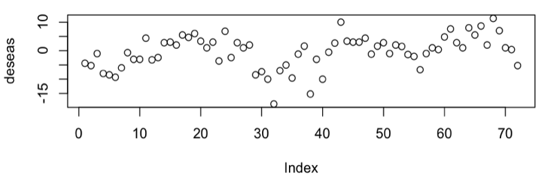
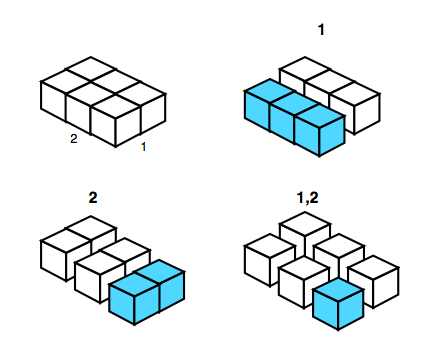
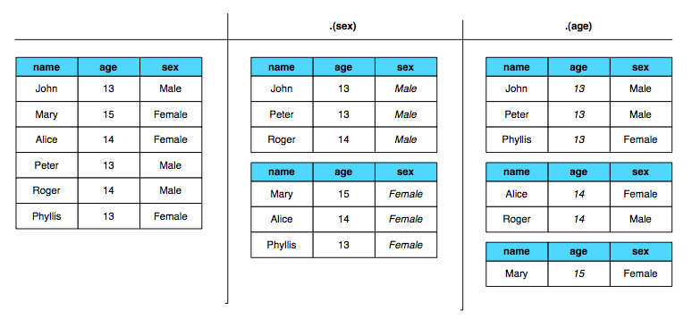
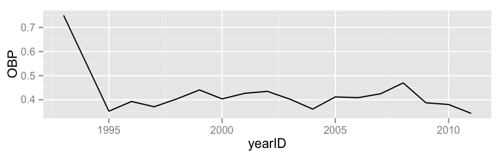
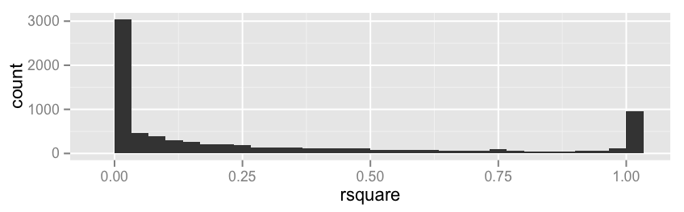
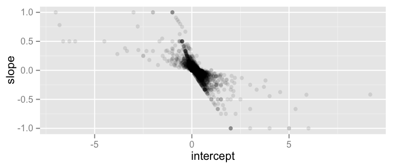

# Split-Apply-Combine

---

## Split-Apply-Combine

The split-apply-combine approach to data analysis is used to:

1. Break up a larger dataset into smaller (manageable) pieces
2. Perform operations on each piece independently
3. Recombine pieces in a meaningful way

We encounter these situations often:

* data preparation steps that involve summaries/calculations on a group-wise basis
* summarizing or visualizing data or analyses by groups
* fitting models to different subsets of a dataset

---

## Split-Apply-Combine

There are many tools for implementing split-apply-combine:

* pivot tables in a spreadsheet
* `GROUP BY` in SQL
* `apply` class of functions in R

In R, the use of `apply` can be unintuitive:

    !r
    > library(RSQLite)
    > setwd("~/Bios6301/baseball-databank")
    > con <- dbConnect(dbDriver('SQLite'), dbname='baseball-archive-2011.sqlite')
    > batting <- dbReadTable(con, "Batting")
    > getData <- function(y) batting[batting$yearID==y,]
    > head(getData(2001), 3)
         playerID yearID stint teamID lgID   G G_batting  AB   R   H X2B X3B HR RBI
    50   abadan01   2001     1    OAK   AL   1         1   1   0   0   0   0  0   0
    98  abbotje01   2001     1    FLO   NL  28        28  42   5  11   3   0  0   5
    119 abbotku01   2001     1    ATL   NL   6         6   9   0   2   0   0  0   0
        SB CS  BB  SO IBB HBP SH SF GIDP G_old
    50   0  0   0   0   0   0  0  0    0     1
    98   0  0   3   7   0   1  0  0    1    28
    119  1  0   0   3   0   0  0  0    0     6

---

## Split-Apply-Combine

    > yrs <- 2001:2003
    > head(sapply(yrs, getData))
             [,1]           [,2]           [,3]
    playerID Character,1339 Character,1319 Character,1347
    yearID   Integer,1339   Integer,1319   Integer,1347
    stint    Integer,1339   Integer,1319   Integer,1347
    teamID   Character,1339 Character,1319 Character,1347
    lgID     Character,1339 Character,1319 Character,1347
    G        Integer,1339   Integer,1319   Integer,1347

---

## `plyr`

An effective implementation of split-apply-combine in R is in the `plyr` package.

There is a suite of `ply` functions that are named according to the desired input and output formats.

* the first letter denotes the type of data **input**: `d` for data frame, `a` for array, `l` for list.
* the second letter denotes the type of data **output**

For example, `ddply` takes a data frame as input and returns a data frame; `alply` takes an array as input and returns a list.

---

## Example: Ozone

The `plyr` package contains a sample dataset containing monthly ozone averages on a 24 x 24 grid in Central America, from Jan 1995 to Dec 2000.

* 3 dimensions: latitude, longitude, time (24 x 24 x 72)

We may want to remove the seasonality from the dataset by running a robust linear model `rlm` on each location, and extracting the residuals.

    !r
    > data(ozone)
    > one_loc <- ozone[1, 1, ]
    > month <- ordered(rep(1:12, length = 72))
    > model <- rlm(one_loc ~ month - 1)
    > deseas <- resid(model)

## Presenter Notes

This example is for one location

---

## Example: Ozone

How would we apply this to **all** the locations?

Using `for` loops:

    !r
    # Turn model into function
    deseasf <- function(value) rlm(value ~ month - 1)
    # Initialize list of models
    models <- as.list(rep(NA, 24 * 24))
    dim(models) <- c(24, 24)
    # Initialize array of residuals
    deseas <- array(NA, c(24, 24, 72))
    dimnames(deseas) <- dimnames(ozone)
    for (i in seq_len(24)) {
      for(j in seq_len(24)) {
        # run model
        mod <- deseasf(ozone[i, j, ])
        # Populate model list and residual arrays
        models[[i, j]] <- mod
        deseas[i, j, ] <- resid(mod)
      }
    }

---

## Example: Ozone

Using `apply` functions:

    !r
    models <- apply(ozone, 1:2, deseasf)
    resids_list <- lapply(models, resid)
    # Change list to vector
    resids <- unlist(resids_list)
    dim(resids) <- c(72, 24, 24)
    # Transpose residuals
    deseas <- aperm(resids, c(2, 3, 1))
    dimnames(deseas) <- dimnames(ozone)

These approaches either require a lot of "bookkeeping" (`for` loops) or a lot of manual shape manipulation (`apply`).

* `aperm` is an array permutation function, allowing for a transposition among multiple dimensions

---

## Example: Ozone

Using `plyr` functions:

    !r
    > models <- aaply(ozone, 1:2, deseasf)
    > deseas <- aaply(models, 1:2, resid)

The general form of `aaply` is:

    !r
    aaply(.data, .margins, .fun, ..., progress="none")

So, in our example, data are split by the first two dimensions (`.margins`) over which the function `.fun` is applied.

## Presenter Notes

dot notation to prevent name collisions with arguments of the processing function.

---

## Margins

Three ways of splitting up data are:

* `.margins = 1`: Slice up into rows.
* `.margins = 2`: Slice up into columns.
* `.margins = c(1,2)`: Slice up into individual cells.

---

## Useful Functions

The function specified in `.fun` can be almost anything, but there are some common ones that are broadly useful:

* `scale` scales columns of a data frame
* `rank` ranks values of each vector or column
* `sample` takes a random permutation
* `transform` adds or redefines columns in data frame
* `summarize` performs group-wise summaries
* `subset` returns a particular subset of data frame

---

## `d*ply`

When operating on a data frame, we split on variables using the `d*ply` functions, *e.g.* `ddply`:

    ddply(.data, .variables, .fun = NULL, ...,
      .progress = "none", .inform = FALSE, .drop = TRUE,
      .parallel = FALSE, .paropts = NULL)

So, the second argument specifies the variable(s):

* `.(var1)` will split the data frame into groups defined by the value of the `var1` variable.
* `.(a, b, c)` will group by interaction of variables, with output labelled with all variables.
* functions of variables: `.(round(a))`, `.(a * b)`
* character vector of column names: `c("var1", "var2")`
* formula: `~ var1 + var2`

---

## `d*ply`

---

## Example: Baseball

Let's use `plyr` to explore the baseball databank database. Let's say we want to examine the performance of players over their careers.

To make players comparable, we need to transform the year into "career year", which is the number of years since the player started in the major leagues.

    !r
    > batting <- dbReadTable(con, "Batting")
    > chipper <- subset(batting, playerID == "jonesch06")
    > chipper <- transform(chipper, cyear = yearID - min(yearID) + 1)
    > head(chipper)
           playerID yearID stint teamID lgID   G G_batting  AB   R   H X2B X3B HR RBI SB CS  BB SO IBB HBP
    43108 jonesch06   1993     1    ATL   NL   8         8   3   2   2   1   0  0   0  0  0   1  1   0   0
    43109 jonesch06   1995     1    ATL   NL 140       140 524  87 139  22   3 23  86  8  4  73 99   1   0
    43110 jonesch06   1996     1    ATL   NL 157       157 598 114 185  32   5 30 110 14  1  87 88   0   0
    43111 jonesch06   1997     1    ATL   NL 157       157 597 100 176  41   3 21 111 20  5  76 88   8   0
    43112 jonesch06   1998     1    ATL   NL 160       160 601 123 188  29   5 34 107 16  6  96 93   1   1
    43113 jonesch06   1999     1    ATL   NL 157       157 567 116 181  41   1 45 110 25  3 126 94  18   2
          SH SF GIDP G_old cyear
    43108  0  0    0     8     1
    43109  1  4   10   140     3
    43110  1  7   14   157     4
    43111  0  6   19   157     5
    43112  1  8   17   160     6
    43113  0  6   20   157     7

---

## Example: Baseball

To perform this transformation on all the players, we can use `ddply`:

    !r
    > batting <- ddply(batting, .(playerID), transform, cyear = yearID - min(yearID) + 1,
    + .progress="text")
    |===============================================================================| 100%

---

## Summarize

We have seen how the `plyr` function `transform` adds columns to a data frame. `summarize` similarly performs group-wise summaries.

For example, we can determine how many years a player has played, and with how many teams:

    !r
    > summarize(chipper, career=max(yearID)-min(yearID), nteams=length(unique(teamID)))
      career nteams
    1     18      1

This is more powerful when used alongside `ddply` to summarize the careers of every player in the dataset:

    !r
    > batting_sum <- ddply(batting, .(playerID), summarize, career=max(yearID)-min(yearID),
        nteams=length(unique(teamID)))
    > head(batting_sum)
       playerID career nteams
    1 aardsda01      6      5
    2 aaronha01     22      3
    3 aaronto01      9      2
    4  aasedo01     13      5
    5  abadan01      5      3
    6  abadfe01      1      1

---

## Example: Baseball

Now, let's examine the on base percentage of players over their careers.

$$OBP = \frac{H + BB + HBP}{AB + BB + HBP + SF}$$

Chipper Jones:

---

## Example: Baseball

We can hypothesize a linear trend:

    !r
    model <- function(df) {
        lm((H+BB+HBP)/(AB+BB+HBP+SF) ~ cyear, data = df)
    }

    > model(chipper)
    Call:
    lm(formula = (H + BB + HBP)/(AB + BB + HBP + SF) ~ cyear, data = df)

    Coefficients:
    (Intercept)        cyear
        0.48650     -0.00632

To apply this to all players:

    !r
    > batting$OBP <- with(batting, (H + BB + HBP)/(AB + BB + HBP + SF))
    > bmodels <- dlply(batting[!is.na(batting$OBP),], .(playerID), model)

---

## Example: Baseball

`bmodels` is a list of linear model objects; we probably want to extract key model outputs, such as coefficient estimates, r-squared, etc.

    !r
    > rsq <- function(x) summary(x)$r.squared
    > bcoefs <- ldply(bmodels, function(x) c(coef(x), rsquare = rsq(x)))
    > names(bcoefs)[2:3] <- c("intercept", "slope")
    > head(bcoefs)
        playerID   intercept         slope     rsquare
     1 aardsda01  0.00000000  0.0000000000         NaN
     2 aaronha01  0.37565177 -0.0003175329 0.006779956
     3 aaronto01  0.27953573 -0.0007069448 0.005608915
     4  aasedo01  0.00000000            NA 0.000000000
     5  abadan01 -0.05872576  0.0786703601 0.979025053

## Presenter Notes

Most models fit very poorly; some perfectly

---

## Example: Baseball

If we want to see which players had perfect fits to the linear model, we need to merge bcoefs with the original data frame.

    !r
    > battingcoef <- merge(batting, bcoefs, by = "playerID")
    > subset(battingcoef, rsquare > 0.999)$playerID[1:10]
    [1] "abbotky01" "abbotky01" "abbotky01" "abbotky01" "accarje01" "accarje01" "accarje01" "accarje01"
    [9] "accarje01" "accarje01"

We can also evaluate the intercept-slope relationship.

---

## Exercise: BABIP

An advanced baseball metric known as **Batting Average on Balls In Play** (BABIP) attempts to tease apart the component of a pitcher's performance that is due to things beyond the pitcher's control. A consistently low BABIP means that a pitcher may be getting lucky!

$$BABIP = \frac{H-HR}{AB-SO-HR+SF}$$

Use `ddply` to calculate BABIP for all the players in the `Batting` table, and find the luckiest hitter in history!

Perhaps more meaningfully, find the highest season (rather than career) BABIP in history.

---

## More `plyr`

Wickham, H. 2011. *The Split-Apply-Combine Strategy for Data Analysis*, Journal of Statistical Software, 40(1).

**http://www.jstatsoft.org/v40/i01**

<!-- Mathjax -->

