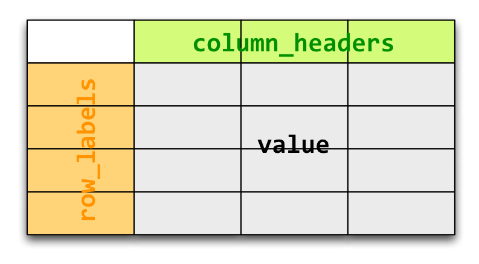

# Reshaping Data

---

## Reshaping Data

The best layout for recording data is not always the same as the appropriate layout for analyzing the same data.

It is helpful to be able to easily re-arrange, re-shape and re-aggregate a dataset without changing the content.

There are built-in R functions for reshaping:

* `apply`, `sapply`, `tapply`, `lapply`
* `aggregate`
* `reshape`

---

## `aggregate`

The `aggregate` function splits data into subsets and computes summary statistics for each. Its arguments depends on the class passed to it:

    !r
    ## Default S3 method:
    aggregate(x, ...)

    ## S3 method for class 'data.frame'
    aggregate(x, by, FUN, ..., simplify = TRUE)

    ## S3 method for class 'formula'
    aggregate(formula, data, FUN, ...,
              subset, na.action = na.omit)

    ## S3 method for class 'ts'
    aggregate(x, nfrequency = 1, FUN = sum, ndeltat = 1,
              ts.eps = getOption("ts.eps"), ...)

For example, using the built-in states database:

    !r
    > head(state.x77)
               Population Income Illiteracy Life Exp Murder HS Grad Frost   Area
    Alabama          3615   3624        2.1    69.05   15.1    41.3    20  50708
    Alaska            365   6315        1.5    69.31   11.3    66.7   152 566432
    Arizona          2212   4530        1.8    70.55    7.8    58.1    15 113417
    Arkansas         2110   3378        1.9    70.66   10.1    39.9    65  51945
    California      21198   5114        1.1    71.71   10.3    62.6    20 156361
    Colorado         2541   4884        0.7    72.06    6.8    63.9   166 103766

---

## Aggregate

Let's use `aggregate` to compute variable averages, grouped by region:

    !r
    > aggregate(state.x77, list(Region = state.region), mean)
             Region Population   Income Illiteracy Life Exp    Murder  HS Grad
    1     Northeast   5495.111 4570.222   1.000000 71.26444  4.722222 53.96667
    2         South   4208.125 4011.938   1.737500 69.70625 10.581250 44.34375
    3 North Central   4803.000 4611.083   0.700000 71.76667  5.275000 54.51667
    4          West   2915.308 4702.615   1.023077 71.23462  7.215385 62.00000
         Frost      Area
    1 132.7778  18141.00
    2  64.6250  54605.12
    3 138.8333  62652.00
    4 102.1538 134463.00

Now compute how many regions had more than 130 days of frost:

    !r
    > aggregate(state.x77,
           list(Region = state.region, Cold = state.x77[,"Frost"] > 130), mean)
               Region  Cold Population   Income Illiteracy Life Exp    Murder
      1     Northeast FALSE  8802.8000 4780.400  1.1800000 71.12800  5.580000
      2         South FALSE  4208.1250 4011.938  1.7375000 69.70625 10.581250
      3 North Central FALSE  7233.8333 4633.333  0.7833333 70.95667  8.283333
      4          West FALSE  4582.5714 4550.143  1.2571429 71.70000  6.828571
      5     Northeast  TRUE  1360.5000 4307.500  0.7750000 71.43500  3.650000
      6 North Central  TRUE  2372.1667 4588.833  0.6166667 72.57667  2.266667
      7          West  TRUE   970.1667 4880.500  0.7500000 70.69167  7.666667
         HS Grad    Frost      Area
      1 52.06000 110.6000  21838.60
      2 44.34375  64.6250  54605.12
      3 53.36667 120.0000  56736.50
      4 60.11429  51.0000  91863.71
      5 56.35000 160.5000  13519.00
      6 55.66667 157.6667  68567.50
      7 64.20000 161.8333 184162.17

---

## Long and Wide Data Tables

Consider a longitudinal dataset, in which multiple measurements are taken over time.

A *wide* longitudinal dataset will have one record for each individual with some time-constant variables that occupy single columns and some time-varying variables that occupy a column for each time point.

A *long* format will have multiple records for each individual, with some variables being constant across these records and others varying across the records.

---

## Example: Rainfall

Here is a trivial rainfall dataset, in wide format:

    !r
    > rain_wide
             city jan feb mar apr
    1   Nashville 5.6 7.1 2.1 5.0
    2 Chattanooga 4.6 4.4 5.4 4.8

Here is the same dataset, in long format:

    !r
    > rain_long
             city month jan
    1   Nashville   jan 5.6
    2 Chattanooga   jan 4.6
    3   Nashville   feb 7.1
    4 Chattanooga   feb 4.4
    5   Nashville   mar 2.1
    6 Chattanooga   mar 5.4
    7   Nashville   apr 5.0
    8 Chattanooga   apr 4.8

---

## `reshape`

`reshape` reshapes a data frame between wide and long formats:

    !r
    reshape(data, varying = NULL, v.names = NULL, timevar = "time",
            idvar = "id", ids = 1:NROW(data),
            times = seq_along(varying[[1]]),
            drop = NULL, direction, new.row.names = NULL,
            ...)

* `varying`: names of sets of variables in the wide format that correspond to single variables in long format
* `v.names`: names of variables in the long format that correspond to multiple variables in the wide format
* `timevar`: the variable in long format that differentiates multiple records from the same group or individual
* `idvar`: one or more variables in long format that identify multiple records from the same group/individual
* `ids`: the values to use for a newly created `idvar` variable in long format
* `times`: the values to use for a newly created timevar variable in long format
* `direction`: "wide" to reshape to wide format, "long" to reshape to long format.

---

## Example: States Data

Wide to long:

    !r
    > state.x77 <- as.data.frame(state.x77)
    > long <- reshape(state.x77, idvar = "state", ids = row.names(state.x77),
    +                 times = names(state.x77), timevar = "Characteristic",
    +                 varying = list(names(state.x77)), direction = "long")
    > head(long)
                          Characteristic Population      state
    Alabama.Population        Population       3615    Alabama
    Alaska.Population         Population        365     Alaska
    Arizona.Population        Population       2212    Arizona
    Arkansas.Population       Population       2110   Arkansas
    California.Population     Population      21198 California
    Colorado.Population       Population       2541   Colorado

... and back again:

    !r
    > head(reshape(long, direction = "wide"))
                               state Population Income Illiteracy Life Exp Murder
    Alabama.Population       Alabama       3615   3624        2.1    69.05   15.1
    Alaska.Population         Alaska        365   6315        1.5    69.31   11.3
    Arizona.Population       Arizona       2212   4530        1.8    70.55    7.8
    Arkansas.Population     Arkansas       2110   3378        1.9    70.66   10.1
    California.Population California      21198   5114        1.1    71.71   10.3
    Colorado.Population     Colorado       2541   4884        0.7    72.06    6.8
                          HS Grad Frost   Area
    Alabama.Population       41.3    20  50708
    Alaska.Population        66.7   152 566432
    Arizona.Population       58.1    15 113417
    Arkansas.Population      39.9    65  51945
    California.Population    62.6    20 156361
    Colorado.Population      63.9   166 103766

## Presenter Notes

The row names are the states in this dataset.

---

## A Better Way?

The suite of built-in R functions for manipulating the shape of data frames is *ad hoc*.

* very specific use cases
* inconsistent arguments

The `reshape` (more recently, `reshape2`) package by Hadley Wickham provides a more general framework for reshaping data.

---

## Conceptual Framework

For the purposes of manipulating the shape of datasets, we can break variables into one of two classes:

1. **Identifiers** Discrete variables usually fixed by design to identify measurements.
2. **Measurements** Actual observations associated with identifier variables.

In our trivial rainfall example:

* city, months are identifiers
* rainfall observations are measurements

---

## Melting

In `reshape` parlance, expressing a dataset in "long" format, whereby each row represents one observation of one variable is called **melting**.

Here is another simple example:

    !r
         subject time age weight height
    1 John Smith    1  33     90   1.87
    2 Mary Smith    1  NA     NA   1.54

And in melted form:

    !r
         subject time variable value
    1 John Smith    1      age 33.00
    2 Mary Smith    1      age    NA
    3 John Smith    1   weight 90.00
    4 Mary Smith    1   weight    NA
    5 John Smith    1   height  1.87
    6 Mary Smith    1   height  1.54

Note that the measurement fields have been converted to variable-value pairs.

---

## `melt`

The `reshape2` function `melt` operates on data frames, arrays and matrices. The user needs to specify identifiers, variables, or both.

If only one is specified, the remaining variables are assumed to be the other class. Thus, each of the following are equivalent:

    !r
    > melt(smiths, id = c("subject", "time"),
        measured = c("age", "weight", "height"))
    > melt(smiths, id = c("subject", "time"))
    > melt(smiths, id = 1:2)

         subject time variable value
    1 John Smith    1      age 33.00
    2 Mary Smith    1      age    NA
    3 John Smith    1   weight 90.00
    4 Mary Smith    1   weight    NA
    5 John Smith    1   height  1.87
    6 Mary Smith    1   height  1.54

All measured variables need to be of the same type.

---

## Example: rainfall

In our simple rainfall data table, melting the original data frame is very straightforward:

    !r
    > melt(rain, id=1)
             city variable value
    1   Nashville      jan   5.6
    2 Chattanooga      jan   4.6
    3   Nashville      feb   7.1
    4 Chattanooga      feb   4.4
    5   Nashville      mar   2.1
    6 Chattanooga      mar   5.4
    7   Nashville      apr   5.0
    8 Chattanooga      apr   4.8

---

## Extracting Variables from Names

Unfortunately, data are sometimes recorded with data encoded into the names of variables. For example, consider a study that includes 2 treatments and two time periods. This data layout is not uncommon:

    !r
    > trial
      id A_1 A_2 B_1
    1  1   1   2   3
    2  2   2   1   3
    3  3   1   2   3
    4  4   2   1   3

Notice that the time information is part of the names of the treatments. If we try to melt this:

    !r
    > (trial_melted <- melt(trial))
    Using id as id variables
       id variable value
    1   1      A_1     1
    2   2      A_1     2
    3   3      A_1     1
    4   4      A_1     2
    5   1      A_2     2
    6   2      A_2     1
    7   3      A_2     2
    8   4      A_2     1
    9   1      B_1     3
    10  2      B_1     3
    11  3      B_1     3
    12  4      B_1     3

We see that time and treatment are still confounded.

---

## `colsplit`

The `colsplit` function will split a column into multiple variables that are  delimited.

    !r
    colsplit(string, pattern, names)

where `string` is the column name to split, `pattern` is the delimiter, and `names` are the names of the new columns.

    !r
    > (s <- colsplit(trial_melted$variable, '_', names=c("treatment", "time")))
       treatment time
    1          A    1
    2          A    1
    3          A    1
    4          A    1
    5          A    2
    6          A    2
    7          A    2
    8          A    2
    9          B    1
    10         B    1
    11         B    1
    12         B    1

---

## `colsplit`

Now we can replace the concatenated column with the parsed columns:

    !r
    > cbind(trial_melted[,-2], s)
       id value treatment time
    1   1     1         A    1
    2   2     2         A    1
    3   3     1         A    1
    4   4     2         A    1
    5   1     2         A    2
    6   2     1         A    2
    7   3     2         A    2
    8   4     1         A    2
    9   1     3         B    1
    10  2     3         B    1
    11  3     3         B    1
    12  4     3         B    1

If there is no delimiter, you can use `substr` instead.

---

## Missing Data

We can remove missing measurements from a melted dataset using `na.rm`:

    !r
    > melt(smiths, id=1:2)
         subject time variable value
    1 John Smith    1      age 33.00
    2 Mary Smith    1      age    NA
    3 John Smith    1   weight 90.00
    4 Mary Smith    1   weight    NA
    5 John Smith    1   height  1.87
    6 Mary Smith    1   height  1.54

    > melt(smiths, id=1:2, na.rm=T)
         subject time variable value
    1 John Smith    1      age 33.00
    3 John Smith    1   weight 90.00
    5 John Smith    1   height  1.87
    6 Mary Smith    1   height  1.54

---

## Casting

The main advantage of melting datasets is that it is the most flexible layout. From the "molten" state, we can "cast" a data frame to whatever shape is required for analysis.

The `reshape2` package has two casting functions, `acast` and `dcast` which work on vectors and matrices or data frames, respectively.

There are two required arguments:

* `data`: a matrix, vector, array or data frame
* `formula`: a **casting formula**

and two important optional arguments:

* `fun.aggregate`: aggregation function to use
* `margins`: what marginal values should be computed

---

## Casting

Let's start with our simple dataset:

    !r
    > (msmiths <- melt(smiths, id=1:2, na.rm=T))
         subject time variable value
    1 John Smith    1      age 33.00
    3 John Smith    1   weight 90.00
    5 John Smith    1   height  1.87
    6 Mary Smith    1   height  1.54

Suppose we want to revert back to the original "wide" format. We can use `dcast`:

    !r
    > dcast(msmiths, subject ~ variable)
         subject age weight height
    1 John Smith  33     90   1.87
    2 Mary Smith  NA     NA   1.54

---

## Casting

The key to casting effectively is understanding the casting formula.

    !r
    row_labels ~ column_headers

The tilde separates variables that we want to appear down the left side of the table from those we want as column headers.

    !r
    subject ~ variable

    > dcast(msmiths, subject ~ variable)
         subject age weight height
    1 John Smith  33     90   1.87
    2 Mary Smith  NA     NA   1.54

`acast` and `dcast` require a column called `value` to populate the table. You can specify an alternate name with `value.var`.

---

## Casting Formula

    !r
    dcast(df, row_labels ~ column_headers)

---

## Casting

Adding another row label variable places an additional label down the left of the table:

    !r
    > dcast(msmiths, time + subject ~ variable)
      time    subject age weight height
    1    1 John Smith  33     90   1.87
    2    1 Mary Smith  NA     NA   1.54

---

## Casting

Adding another column header variable creates columns that comprise all combinations of the two column header variable values. Let's add another sample of data from the Smiths:

    !r
    > rbind(msmiths, msmiths2)
          subject time variable  value
    1  John Smith    1      age 36.300
    2  Mary Smith    1      age     NA
    3  John Smith    1   weight 99.000
    4  Mary Smith    1   weight     NA
    5  John Smith    1   height  2.057
    6  Mary Smith    1   height  1.694
    7  John Smith    2      age 33.000
    8  Mary Smith    2      age     NA
    9  John Smith    2   weight 90.000
    10 Mary Smith    2   weight     NA
    11 John Smith    2   height  1.870
    12 Mary Smith    2   height  1.540

Now, try casting with two column header variables:

    !r
    > dcast(msmiths, subject ~ variable + time)
         subject age_1 age_2 weight_1 weight_2 height_1 height_2
    1 John Smith  36.3    33       99       90    2.057     1.87
    2 Mary Smith    NA    NA       NA       NA    1.694     1.54

## Presenter Notes

data frames are not allowed to have hierarchical column headers

---

## Exercise

Start with the `smiths` dataset and reshape it as follows:

    !r
        variable John Smith Mary Smith
      1      age      33.00         NA
      2   weight      90.00         NA
      3   height       1.87       1.54

## Presenter Notes

    > msmiths <- melt(smiths, id=1:2)
    > dcast(msmiths, variable ~ subject)

---

## Aggregation

Aggregation occurs when the combination of variables in the cast formula does not identify individual observations.

Consider the Nashville precipitation data on the GitHub repo:

    !r
    > precip <- read.table("~/Bios6301/datasets/nashville_precip.txt", head=T)
    > mprecip <- melt(precip, id=1)
    > head(mprecip)
      Year variable value
    1 1871      Jan  2.76
    2 1872      Jan  2.32
    3 1873      Jan  2.96
    4 1874      Jan  5.22
    5 1875      Jan  6.15
    6 1876      Jan  6.41

---

## Aggregation

Using aggregation, we can calculate the total annual precipitation:

    !r
    > dcast(mprecip, Year~., sum)
        Year    NA
    1   1871 32.74
    2   1872 40.20
    3   1873 51.69
    4   1874 58.24
    5   1875 53.45
    ...

Or, the average precipitation per month:

    !r
    > dcast(mprecip, variable~., mean, na.rm=T)
       variable       NA
    1       Jan 4.523688
    2       Feb 4.097801
    3       Mar 4.977589
    4       Apr 4.204468
    5       May 4.325674
    ...

---

## Margins

Its often useful to see the total for each row and column. These totals are known as margins or marginal distributions.

    !r
    > dcast(mprecip, Year ~ variable, sum, margins=TRUE, na.rm=T)
         Year    Jan    Feb    Mar    Apr ...    Sep  Oct    Nov    Dec (all)
    1    1871   2.76   4.58   5.01   4.13 ...   0.95 1.31   2.13   1.65 32.74
    2    1872   2.32   2.11   3.14   5.91 ...   4.50 1.58   2.25   2.38 40.20
    3    1873   2.96   7.14   4.11   3.59 ...   1.81 4.28   4.36   5.94 51.69
    ...
    141  2011   2.31   5.54   4.59   7.51 ...   6.20   0.93   6.15   4.25   52.14
    142 (all) 637.84 577.79 701.84 592.83 ... 476.25 365.47 519.71 588.85 6640.71

---

## Example: rainfall data

Import the `nashville_precip.txt` and perform the following:

1. Melt the dataset

2. Summarize the dataset by season:

    * winter: dec, jan, feb
    * spring: mar, apr, may
    * summer: jun, jul, aug,
    * autumn: sep, oct, nov

## Presenter Notes

    > mprecip <- melt(precip, id=1)
    > mprecip$season <- ifelse(mprecip$variable %in% c('Jan','Feb','Dec'),
    "winter", ifelse(mprecip$variable %in% c('Mar','Apr','May'),
    "spring", ifelse(mprecip$variable %in% c('Jun','Jul','Aug'),
    "summer", "autumn")))
    > dcast(mprecip, Year ~ season, sum)

---

## More `reshape`

Wickham, H. 2007. *Reshaping Data with the reshape Package*, Journal of Statistical Software, 21(12).

**http://www.jstatsoft.org/v21/i12**