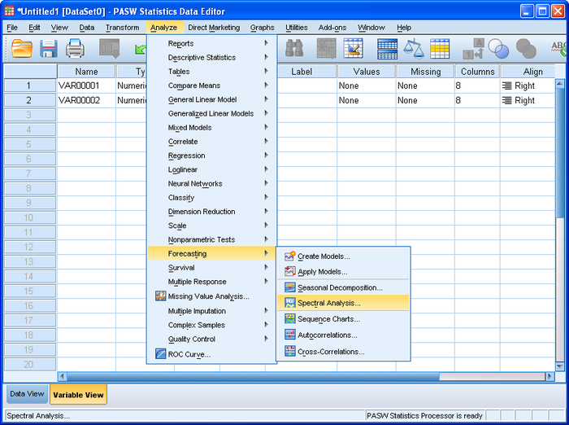
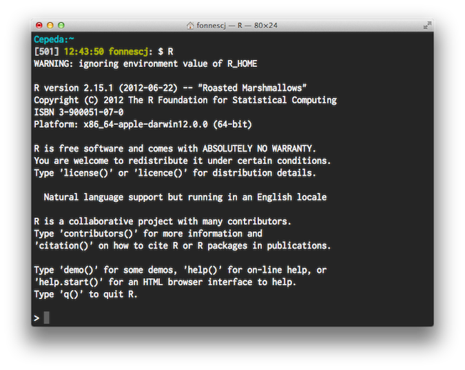
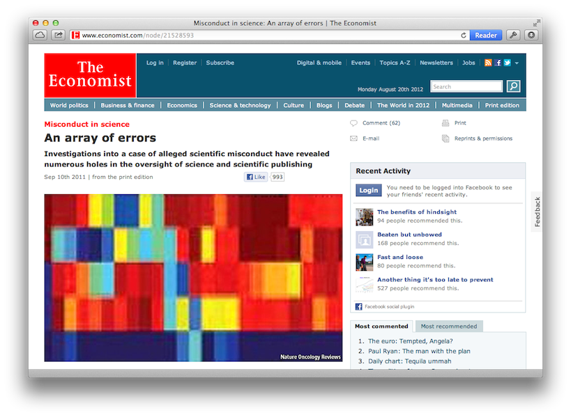
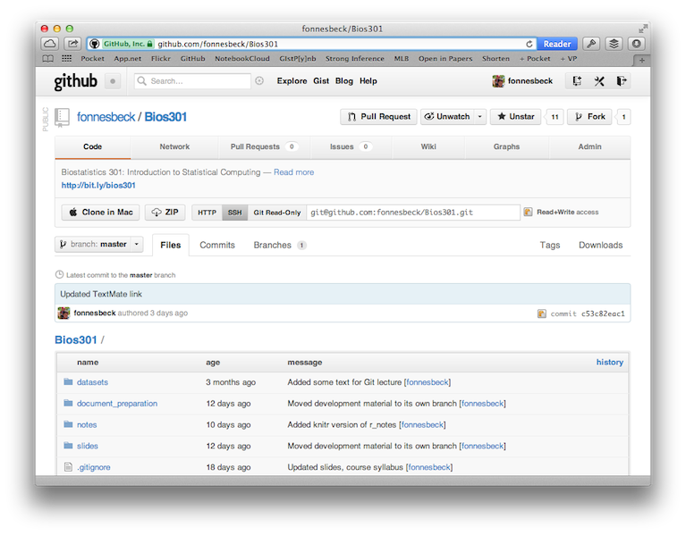

# Bios301: Introduction to Statistical Computing

---

## Instructor

**Christopher Fonnesbeck**

* Office: T-2303 MCN
* Email: chris.fonnesbeck@vanderbilt.edu
* Twitter: vandy_biostat

## Teaching Assistant

**Svetlana Eden**

* Office: S-2323 MCN
* Email: svetlana.eden@vanderbilt.edu

---

# Course Aim

To equip students with relevant, modern, flexible tools for proficient statistical computation.

Presenter Notes
===============

Many modern problems/data require a computational approach

---

Bios 301
========

* **Lecture 1**: Course introduction; Version control using Git
* **Lecture 2**: Document preparation using LaTeX, Markdown and `knitr`
* **Lecture 3**: Data, data types and data structures (Chapters 2-5)
* **Lecture 4**: Control structures; Writing and calling functions (Chapter 7)
* **Lecture 5**: Simulation; optimization (Chapter 8) 
* **Lecture 6**: Debugging and testing (Chapter 13)
* **Lecture 7**: Top-down design and scoping 
* **Lecture 8**: Programming paradigms (Chapter 9)
* **Lecture 9**: Scientific graphics; `ggplot2` (Chapter 12) 
* **Lecture 10**: Split, apply and combine 
* **Lecture 11**: High performance computing; basic parallel computing (Chapters 14, 16) 
* **Lecture 12**: I/O and databases; regular expressions (Chapters 10-11) 
* **Lecture 13**: Overview of STATA 

Presenter Notes
===============

---

Bios 366
========

## Advanced Statistical Computing ##

* Python programming
* numerical optimization
* Markov Chain Monte Carlo (MCMC)
* estimation-maximization (EM) algorithms
* data augmentation algorithms
* machine learning

---

## Cumulative

Presenter Notes
===============

Content later in the course builds on what was presented earlier -- keep up!

---

# Hands-on

* Each lecture will be accompanied by hands on exercises
* Homeworks are longer and more involved

---

# Evaluation

A final course grade will be calculated based on:

- four (4) equally-weighted homework assignments (50%)
- a take-home final exam (50%)

The final exam has been tentatively scheduled for December 13.

---

# Textbook

Presenter Notes
===============

Read some of it every week.

---

# Text Editor

---

# Software

- Statistical analysis tools: [R](http://cran.r-project.org/), [Stata](http://www.stata.com/)
- Version control system: [Git](http://git-scm.com/)
- Document preparation tools: LaTeX, [knitr](http://yihui.name/knitr/), [MultiMarkdown](http://fletcherpenney.net/multimarkdown/)
- Relational database: [SQLite](http://www.sqlite.org/)

---

# R

R is an open-source implementation of the **S programming language**, and was created by Ross Ihaka and Robert Gentleman. It is a domain-specific language, engineered for doing statistical and graphical computation.

## Why R?

- widely-used throughout academia and industry
- free and open-source
- extremely flexible and powerful
- extensible
- the primary statistical package used in our department

---

# Git

Git is a software tool for source code management and revision control. 

## Why Git?

- provides a method for version control and backup
- facilitates collaboration on code and documents
- fast and scalable
- effective tool for reproducible research

---

# Document Tools

---

# No Word Processors

Assignments may be submitted in **LaTeX**, **Sweave**, **knitr**, or any markup format that allows for easy conversion to LaTeX (e.g. **Markdown**, **reStructuredText**). 

Assignments submitted in word processor file formats, including Microsoft Word, will not be accepted. 

Hand-written assignments (including scanned documents) are also not permitted

---

# Databases

Relational databases organize data into a structured set of tables, which can be queried and manipulated using the structured querying language (SQL).

## Why databases?

- ensures data integrity and security
- changes to data are logged
- efficient means of managing large data
- data can be accessed from models via API
- data do not belong in spreadsheets!

---

# Statistical Programming

Real-world statistical analysis rarely involves plugging data into a software package and running built-in routines.

Typical components of statistical analysis:

- data importation
- data cleaning
- data transformation
- model specification and parameterization
- model fitting
- model checking
- generation of model outputs
- report generation

Each of these may, and often do, require programming.

Presenter Notes
===============

The precise function for doing your particular analysis may not exist!

---

---

---

# Reproducible Research

**Research should be reproducible!**

> "... research papers with accompanying software tools that allow
> the reader to directly reproduce the results and employ the
> methods that are presented in the research paper."
[(Gentleman and Lang 2004)][gentleman_lang]

It is important to integrate the computations and code used in generating research.

However, much of modern research is too complicated to be reproduced from simple methodlogical descriptions.

Fortunately, tools exist for making statistical analyses and reporting 100% reproducible.

Presenter Notes
===============

The *entire analysis* should be reproducible!

---

# Reproducible Research

[http://bit.ly/duke_misconduct](http://bit.ly/duke_misconduct)

Presenter Notes
===============

About 1500 hours of work to uncover scandal

---

# Reproducible Research

More mundane (but equally motivating) justifications for making your work reproducible:

"Remember that microarray analysis you did six months ago? We ran a few more arrays. Can you add them to the project and repeat the same analysis?"

"Can you write the methods section for the paper I am submitting based on the analysis you did for me earlier this year?"

---

## Reproducible HOMEWORK

---

# Lecture Structure

Two hours, once per week (Mondays 1-3pm)

10 min. break

At the end of each lecture, you will be left with a "programming problem" that should be solved by the beginning of the next class. The contents of these exercises will be testable material on the homeworks and final exam.

---

# Course Website

### github.com/fonnesbeck/Bios301

[gentleman_lang]: http://biostats.bepress.com/bioconductor/paper2/