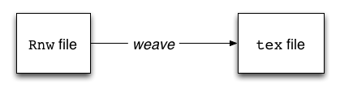
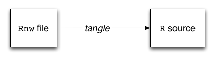

Dynamic Report Generation with `knitr`
======================================

---

Dynamic Reports
===============

Traditionally, report generation is a two-step process:

1. Analyze data/run models in software of choice
2. Export the results and integrate into separate report document

This results in a static document. Any changes to the analysis forces you back to step one!

**Dynamic reports** are generated in a one-step process:

1. Construct an integrated analysis and report document
2. There is no step 2

Dynamic reports can be updated automatically if data or analysis change.

Presenter Notes
===============

Report written around the results of analysis

---

What is `knitr`?
================

The `knitr` is an R package created by Yihui Xie.

> The knitr package was designed to be a transparent engine for 
> dynamic report generation with R ...

It allows users to combine analytic code and the corresponding documentation into a single file.

[knitr][knitr] essentially re-implements and extends **Sweave**


github.com/yihui/knitr

Presenter Notes
===============


---

Sweave
======

Created by Friedrich Leisch (member of R Core Team)

Sweave provides a way of interfacing R code with LaTeX documents. 

    <<>>=
    a<-1
    b<-4
    print(a+b)
    @

... becomes ...

    \begin{Schunk}
    \begin{Sinput}
    > a <- 1
    > b <- 4
    > print(a + b)
    \end{Sinput}
    \begin{Soutput}
    [1] 5
    \end{Soutput}
    \end{Schunk}

Presenter Notes
===============

Around 10 years old.

---

Literate Programming
====================

The term *literate programming* was coined by Donald Knuth.

Literate programming asserts:

- Programs are useless without descriptions.
- Descriptions should be *literate*, not comments in code or typical reference manuals.
- The code in the descriptions should work. Thus it is necessary to extract the real working code from the literary description.

An early tool for implementing LP was [noweb][noweb] (Ramasey 1998), upon which Sweave was based.

Presenter Notes
===============

Knuth is the author/inventor of TeX, among other things

---

Sweave files
============

Sweave source files are regular noweb files (Ramsey, 1998) with some additional syntax that allows control over the final output.

Sweave allows either for the integration of R code and output into a LaTeX file



... or the extraction of the source code from the report file




Presenter Notes
===============


---

Code Chunks
===========

R code that is to be dynamically run and integrated within the `Rnw` document are contained within "chunks":

    !r
    <<my-label, eval=TRUE, dev='png'>>=
    set.seed(1213)  # for reproducibility
    x = cumsum(rnorm(100))
    mean(x)  # mean of x
    plot(x, type = 'l')  # Brownian motion
    @

The `<< >>=` delimiter indicates the beginning of a chunk, and can contain zero or more user-defined options, including a label.

The `@` delimiter indicates the end of a chunk. Anything beyond this symbol is not processed as code.

Other than these chunks, the content of the `Rnw` file is just LaTeX.

Presenter Notes
===============


---

Sweave vs knitr
===============

`knitr` is an updated superset of Sweave's functionality. It is more modular than Sweave, provides more flexibility to users, and has a wider range of built-in options.

- support for additional document types: `Markdown`, `html`, `reStructuredText`
- improved chunk options
- code decoration using the `highlight` and `framed` packages
- supports multiple graphics devices
- better plot manipulation capabilities
- built-in cacheing
- code externalization

From the `knitr` website: 

    knitr ≈ Sweave + cacheSweave + pgfSweave + weaver + animation::saveLatex 
    + R2HTML::RweaveHTML + highlight::HighlightWeaveLatex + 0.2 * brew + 
    + 0.1 * SweaveListingUtils + more

Presenter Notes
===============

No reason to use Sweave today.

---

Running `knitr`
===============

If you have not done so already, install `knitr` from the R prompt:

    !r
    > install.packages('knitr', dependencies = TRUE)

To load the `knitr` package:

    !r
    > library(knitr)

To process a report document in the working directory called `my_report.rnw`:

    !r
    > knit("my_report.rnw")

To extract the source code only:

    !r
    > purl("my_report.rnw")

Presenter Notes
===============


---

Running `knitr`
===============

Running `knit` on a report document with the following code chunk:

    !r
    <<my-label, eval=TRUE, dev='png'>>=
    set.seed(1213)  # for reproducibility
    x = cumsum(rnorm(100))
    mean(x)  # mean of x
    plot(x, type = 'l')  # Brownian motion
    @


Presenter Notes
===============


---

Running `knitr`
===============

... generates corresponding output to `tex`/`html`/`md` document

    !r
    set.seed(1213)  # for reproducibility
    x = cumsum(rnorm(100))
    mean(x)  # mean of x
    ## [1] -1.939758
    plot(x, type = 'l')  # Brownian motion


Presenter Notes
===============


---

Chunk Options
=============

Chunk options are speficied in `key=value` format:

    <<mychunk, cache=TRUE, eval=FALSE, dpi=100>>=

Chunk options must be written in one line; no line breaks are allowed inside chunk options.

All option values must be valid R expressions.

Avoid spaces and periods in chunk labels and directory names.

Presenter Notes
===============


---

Chunk Options
=============

- **eval**: (TRUE; logical) whether to evaluate the code chunk
- **echo**: (TRUE; logical or numeric) whether to include R source code in the output file
- **results**: ('markup'; character) takes three possible values
    + 'markup': mark up the results using the output hook
    + 'asis': write raw results from R into the output document
    + 'hide' hide results
- **include**: (TRUE; logical) whether to include the chunk output in the final output document
- **comment**: ('##'; character) the prefix to be put before source code output
- **cache**: (FALSE; logical) whether to cache a code chunk
- **dev**: ('pdf' for LaTeX output and 'png' for HTML/markdown; character) the graphical device to record plots

Comprehensive list of options at `yihui.name/knitr/options`

Presenter Notes
===============


---

Global Options
==============

Chunk options that will apply by default to every chunk in a document can be set using the `opts_chunk` object:

    !r
    <<setup, include=FALSE, cache=FALSE>>=
    opts_chunk$set(fig.width=5, fig.height=5)
    @

This example will constrain the dimensions of all figures to 5x5.

Presenter Notes
===============


---

Inline Code
===========

We often wish to integrate variables and output from code chunks into sentences of our report. This can be done using the `\Sexpr{}` command. For example:

    !latex
    The first element of \texttt{x} is \Sexpr{x[1]}.

... produces this sentence in LaTeX:

    !latex
    The first element of \texttt{x} is -0.2412.


Presenter Notes
===============


---

`knitr` with Markdown
=====================

There are two important differences between using `knitr` with `rmd` documents, rather than `rnw` documents:

The markup for code chunks is different:

    !r
    ``` {r eval=TRUE, dev='png'}
    set.seed(1213)  # for reproducibility
    x = cumsum(rnorm(100))
    mean(x)  # mean of x
    plot(x, type = 'l')  # Brownian motion
    ```

Output is to Markdown:

\\[\text{.rnw} \rightarrow \text{.tex}\\]
\\[\text{.rmd} \rightarrow \text{.md} (\rightarrow \text{.html})\\]

Presenter Notes
===============


---

Exercise
========

Grab the files `binomial.tex` and `binomial.R` in the exercises folder of the Bios301 GitHub repo.

1. Integrate the R code into the LaTeX file to produce a working `rnw` report. Verify that it works.
2. Change the options on the R code so that it shows shows the plot, but not the code itself.
3. Add a sentence at the bottom of the document that says: "*The mean value of the binomial sample was was x*", but replace *x* with a variable that inserts the actual mean value.

Try building the `r_basics.rmd` file located in the *notes* folder.

[knitr]: http://yihui.name/knitr/
[noweb]: http://www.cs.tufts.edu/~nr/noweb/

<!-- Mathjax -->
<script type="text/x-mathjax-config">
  MathJax.Hub.Config({
    tex2jax: {
      displayMath: [ ['$$','$$'], ["\\[","\\]"] ],
      inlineMath: [ ['$','$'], ["\\(","\\)"] ],
      processEscapes: true
    }
  });
</script>
<script type="text/javascript"
    src="../MathJax/MathJax.js?config=TeX-AMS-MML_HTMLorMML">
</script>