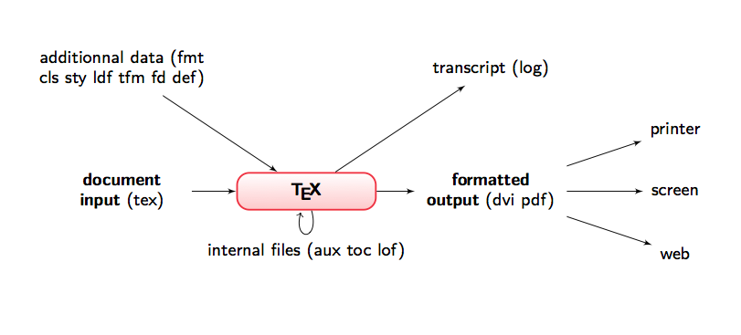
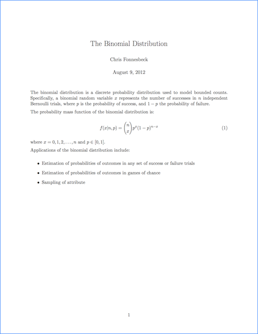
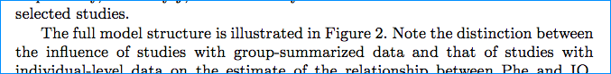
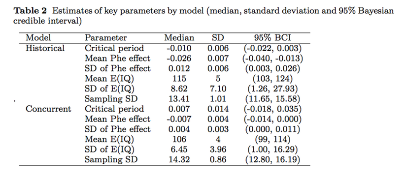
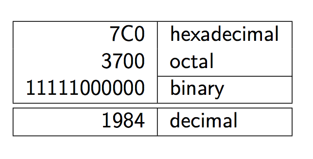
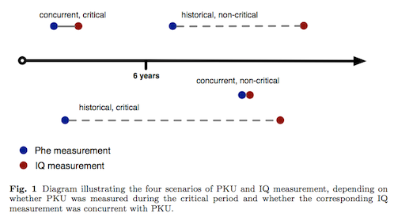
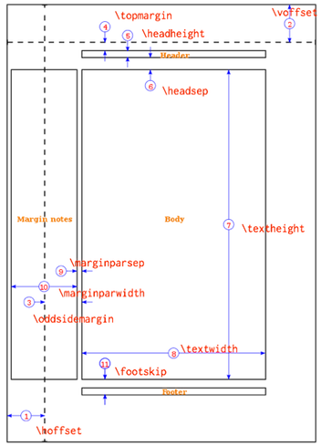
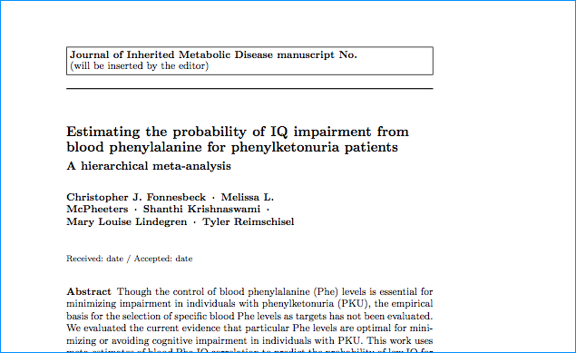
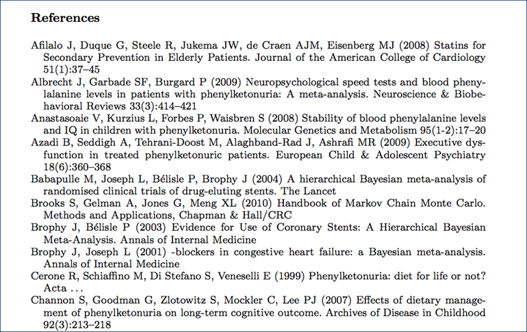
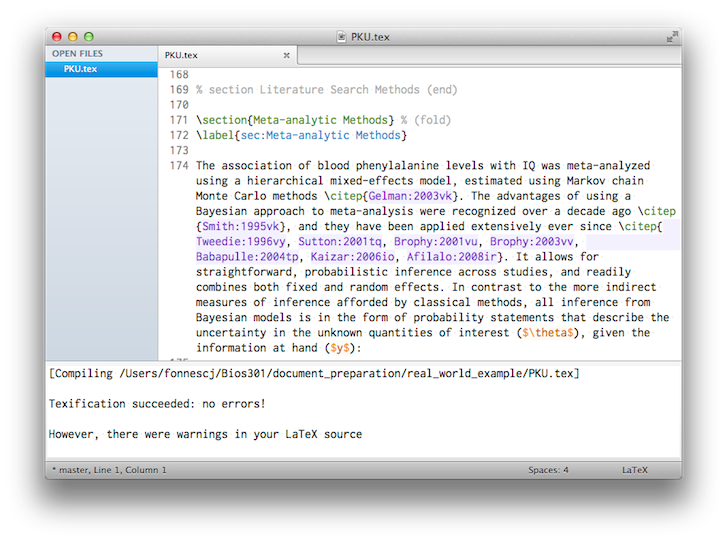

Document Preparation using LaTeX
================================

Presenter Notes
===============

Notes

---

TeX vs LaTeX
============

TeX:

- is a low-level markup and programming language
- was created by Donald Knuth between 1977 and 1989!
- is very stable and powerful but time-consuming and difficult to learn

LaTeX

- is a package of macros based on TEX to make a document preparation system
- created by Leslie Lamport and still actively maintained 
- easier to code and extendable (classes, packages, styles)

Presenter Notes
===============

Notes

---

LaTeX vs. WYSIWYG
=================

Pros of LaTeX:

- style is consistent (layout, fonts, tables, maths, etc.) 
- mathematics are easily typeset
- indexes, footnotes and references are easily generated
- the author is forced to correctly structure your documents
- source document is plain

Cons of LaTeX:

- the final result is not visible straight away
- the necessary LATEX commands have to be learned 
- customization can sometimes be difficult

Presenter Notes
===============

Notes

---

The TEX/LATEX system
====================

Presenter Notes
===============

Notes

---

Document Structure
==================

    !latex
    \documentclass{report} % or article , book , etc .
    % this part is the preamble
    % it contains commands that affect the entire document.
    \begin{document}
    % this part is the body of your document % this is where you write your text
    \end{document}

Presenter Notes
===============

Notes

---

Preamble
========

    !latex
    \documentclass[11pt]{article}  

This is the required first line, though the arguments can vary. This says we will use 11-point font, in the "article" format. Other formats include:

- **article** for articles, presentations, short reports, documentation. 
- **report** for reports containing several chapters, small books, thesis
- **book** for real books
- **letter** for writing letters

Presenter Notes
===============

Notes

---

Preamble
========
    !latex
    \usepackage{amsmath}

A lot of packages exist, the most important are:

- `amsmath`, `amssymb` and `amsthm` for mathematical symbols
- `babel` for the internationalization of LaTeX
- `fontenc` to choose the font encoding of the output text 
- `geometry` for easy management of document margins
- `graphicx` to manage external pictures
- `inputenc` to choose the encoding of the input text

Presenter Notes
===============

Notes

---

Preamble
========

A range of layout options can be set in the preamble. For example, these lines concern page layout, amount of paragraph indentation etc.

    !latex
    \setlength{\oddsidemargin}{0.0in}
    \setlength{\evensidemargin}{0.0in}
    \setlength{\topmargin}{-0.25in}
    \setlength{\headheight}{0in}
    \setlength{\headsep}{0in}
    \setlength{\textwidth}{6.5in}
    \setlength{\textheight}{9.25in}
    \setlength{\parindent}{0in}
    \setlength{\parskip}{2mm}

Presenter Notes
===============

beginners should ignore them (but include them)

---

A Simple Document
=================

    !latex
    \documentclass[11pt]{article}  
    
    \setlength{\oddsidemargin}{0.0in}
    \setlength{\evensidemargin}{0.0in}
    \setlength{\topmargin}{-0.25in}
    \setlength{\headheight}{0in}
    \setlength{\headsep}{0in}
    \setlength{\textwidth}{6.5in}
    \setlength{\textheight}{9.25in}
    \setlength{\parindent}{0in}
    \setlength{\parskip}{2mm}

    \title{The Binomial Distribution}
    \author{Chris Fonnesbeck}
    
    \begin{document}
        
    \maketitle % generates a title based on the information in the preamble

Presenter Notes
===============

Notes

---

A Simple Document
=================

    !latex
    The binomial distribution is a discrete probability distribution used to
    model bounded counts. Specifically, a binomial random variable $x$ represents
    % the $ delimiter marks the start and end of a mathematical expression
    the number of successes in $n$ independent Bernoulli trials, where $p$ is
    the probability of success, and $1-p$ the probability of failure.

    % a blank line means a new paragraph

    The probability mass function of the binomial distribution is:

    \begin{equation}
        f(x | n,p) = {n \choose x} p^x (1-p)^{n-x} % note the need for braces around the n-x
    \end{equation}

    \noindent where $x = 0,1,2,\ldots,n$ and $p \in [0,1]$.

    Applications of the binomial distribution include:

    \begin{itemize} % this is an unordered list
        \item Estimation of probabilities of outcomes in any set of success or failure trials
        \item Estimation of probabilities of outcomes in games of chance
        \item Sampling of attribute
    \end{itemize}

    \end{document}  % required; the document ends here

Presenter Notes
===============

Notes

---

Building the Document
=====================

    pdflatex binomial.tex

Presenter Notes
===============

Notes

---

Sectioning Commands
===================

Code is organized depending on the logical structure of the content:

<table>
<tr><td><b>Command</b></td>
<td><b>Level</b></td></tr>
<tr><td>\part{this is a part}</td>
<td>-1</td></tr>
<tr><td>\chapter{this is a chapter}</td>
<td>0</td></tr>
<tr><td>\section{this is a section}</td>
<td>1</td></tr>
<tr><td>\subsection{this is a subsection}</td>
<td>2</td></tr>
<tr><td>\subsubsection{this is a subsubsection}</td>
<td>3</td></tr>
<tr><td>\paragraph{this is a paragraph}</td>
<td>4</td></tr>
<tr><td>\subparagraph{this is a subparagraph}</td>
<td>5</td></tr>
</table>

Note: `\chapter{}` only exists for book and report classes.

Sections have optional subheadings, placed in brackets:

    \section[Effect on executive function]{An analysis of the
    effect of blood Phe levels on executive function}

Presenter Notes
===============

Notes

---

Font Styles
===========

\\[\def\sc#1{\dosc#1\csod} \def\dosc#1#2\csod{{\rm #1{\small #2}}}\\]
    
    \textit{italic}

\\[\textit{italic}\\]

    \textbf{boldface}

\\[\textbf{boldface}\\]

    \texttt{typewriter}

\\[\mathtt{typewriter}\\]

    \textsf{sans serif}

\\[\mathsf{sans}\;\mathsf{serif}\\]

Presenter Notes
===============

---

Font size
=========

    \begin{tiny} tiny \end{tiny}

\\[{\tiny tiny}\\]

    \begin{small} small \end{small}

\\[{\small small}\\]

    \begin{large} large \end{large}

\\[{\large large}\\]

    \begin{Large} Large \end{Large}

\\[{\Large Large}\\]

    \begin{Huge} Huge \end{Huge}

\\[{\Huge Huge}\\]

Presenter Notes
===============

---

Positioning
===========

    \begin{flushright}
    This text is flushright.
    \end{flushright}

This text is flushright.

    \begin{center}
    This text is centered. 
    \end{center}

This text is centered.

    \begin{flushleft}
    This text is flushleft.
    \end{flushleft}

This text is flushleft.

Presenter Notes
===============

---

Math
====

One great strength of LaTeX over word processors is its math typesetting capabilities.

One can either embed equations within text:

    !latex
    The logit transformation is $\log(\frac{p}{1-p})$.

`The logit transformation is `  \\(\log(\frac{p}{1-p})\\).

Or as standalone equations:

    !latex
    \begin{equation}
        f(x | n,p) = {n \choose x} p^x (1-p)^{n-x}
    \end{equation}

\\[f(x | n,p) = {n \choose x} p^x (1-p)^{n-x}\\]

Presenter Notes
===============

---

Symbols
=======

$\bowtie\Join\propto\varpropto\multimap\pitchfork\therefore\because=\neq\equiv\approx\sim
\simeq\backsimeq\approxeq\cong\ncong\frown\asymp\smallfrown\smallsmile\between\prec\succ\nprec
\nsucc\preceq\succeq\npreceq\nsucceq\preccurlyeq\succcurlyeq\curlyeqprec\curlyeqsucc\perp
\succnapprox\precnapprox\succapprox\precapprox$
$\succnsim\precnsim\succsim\precsim\vdash\dashv\nvdash\Vdash\Vvdash\models\vDash\nvDash
\nVDash\mid\nmid\parallel\nparallel\shortmid\nshortmid\shortparallel\nshortparallel\nless\lessdot
\gtrdot\ll\gg\lll\ggg\leq\geq\lneq\gneq\nleq\ngeq\leqq\geqq\lneqq\gneqq\lvertneqq\gvertneqq
\nleqq\ngeqq\leqslant\geqslant\nleqslant\ngeqslant\eqslantless\eqslantgtr\lessgtr\gtrless
\lesseqgtr\gtreqless\lesseqqgtr\gtreqqless\lesssim\gtrsim\lnsim\gnsim\lessapprox$
$\gtrapprox\lnapprox\gnapprox\vartriangleleft\vartriangleright\ntriangleleft\ntriangleright\trianglelefteq
\trianglerighteq\ntrianglelefteq\ntrianglerighteq\blacktriangleleft\blacktriangleright\subset
\supset\subseteq\supseteq\subsetneq\supsetneq\varsubsetneq\varsupsetneq\nsubseteq\nsupseteq$
$\subseteqq\supseteqq\subsetneqq\supsetneqq\nsubseteqq\nsupseteqq\backepsilon\Subset\Supset
\sqsubset\sqsupset\sqsubseteq\sqsupseteq\pm\mp\times\div\ast\star\circ\bullet\divideontimes
\oplus\otimes\amalg\rightthreetimes\leftthreetimes\dotplus\cdot\rtimes\ltimes\ominus\oslash
\odot\circledcirc\circleddash\circledast\bigcirc\boxdot\boxminus\boxplus\boxtimes\diamond
\bigtriangleup\bigtriangledown\triangleleft\triangleright\lhd\rhd\setminus\wr\Cap\Cup\uplus
\cap\cup\unrhd\unlhd\smallsetminus\sqcap\sqcup\wedge\vee\barwedge\veebar\doublebarwedge\curlywedge
\curlyvee\dagger\ddagger\intercal\bigcap\bigcup\biguplus\bigsqcup\prod\oint\int\sum\bigotimes
\bigoplus\bigodot\bigvee\bigwedge\coprod\iint\iiint\iiiint\idotsint\cos\sin\varlimsup\varliminf\varinjlim\varprojlim$
$\leftarrow\leftrightarrow\rightarrow\mapsto\longleftarrow\longleftrightarrow\longmapsto
\swarrow\nearrow\searrow\nwarrow\uparrow\updownarrow\nleftarrow\nleftrightarrow\nrightarrow
\hookleftarrow\hookrightarrow\twoheadleftarrow\twoheadrightarrow\leftarrowtail\Uparrow\Updownarrow
\Longrightarrow\Longleftrightarrow\Longleftarrow\Rightarrow\Leftrightarrow$
$\Leftarrow\rightarrowtail\Downarrow\nLeftarrow\nLeftrightarrow\nRightarrow\leftleftarrows
\leftrightarrows\rightleftarrows\rightrightarrows\downdownarrows\looparrowright\looparrowleft
\Rsh\Lsh\curvearrowright\curvearrowleft\circlearrowright\circlearrowleft\upuparrows\dashleftarrow
\dashrightarrow\leftrightsquigarrow\rightsquigarrow\Lleftarrow\leftharpoondown\rightharpoondown
\leftharpoonup\rightharpoonup\upharpoonright\downharpoonright\upharpoonleft\downharpoonleft\leftrightharpoons$
$\cdotp\colon\ldotp\vdots\cdots\ddots\ldots\neg\infty\sharp\varnothing\emptyset\surd\diagup
\diagdown\backslash\backprime\prime\flat\natural\angle\sphericalangle\measuredangle\Box\square
\triangle\vartriangle\blacklozenge\blacktriangledown\blacktriangle\blacksquare\heartsuit\lozenge
\diamondsuit\Diamond\triangledown\bigstar\spadesuit\clubsuit\forall\exists\nexists\Finv\Game\ni\hbar
\hslash\wp\aleph\Re\Im\complement\notin\in\imath\jmath\Bbbk\ell\circledR\circledS\bot\top\partial
\nabla\eth\mho\dot{}\ddot{}\dddot{}\ddddot{}\widetilde{}\widehat{}\overleftarrow{}\overline{}\overbrace{}\sqrt{}f'f''$
$\alpha\beta\gamma\delta\epsilon\varepsilon\zeta\eta\theta\vartheta\iota\kappa\lambda\mu\nu
\pi\varpi\rho\varrho\sigma\varsigma\tau\upsilon\phi\varphi\chi\psi\omega$

Presenter Notes
===============

---

More Math
=========

Sums:

    !latex
    \[
    \sum_{i=1}^{10} t_i
    \]

\\[\sum_{i=1}^{10} t_i\\]

Integrals:

    !latex
    \[
    \int_0^\infty e^{−x} \, dx
    \]

\\[\int_0^\infty e^{−x} \, dx\\]

Presenter Notes
===============

bracket notation is a shorthand for `\begin{equation}`

---

Matrices
========

    !latex
    \[
    A_{m,n} = \begin{pmatrix}
        a_{1,1} & a_{1,2} & \cdots & a_{1,n} \\ 
        a_{2,1} & a_{2,2} & \cdots & a_{2,n} \\
        \vdots & \vdots & \ddots & \vdots \\ 
        a_{m,1} & a_{m,2} & \cdots & a_{m,n}
    \end{pmatrix} 
    \]

$$A_{m,n} = \begin{pmatrix}
    a_{1,1} & a_{1,2} & \cdots & a_{1,n} \cr a_{2,1} & a_{2,2} & \cdots & a_{2,n} \cr
    \vdots & \vdots & \ddots & \vdots \cr a_{m,1} & a_{m,2} & \cdots & a_{m,n}
    \end{pmatrix}$$

Presenter Notes
===============

---

Lists
=====

Unordered lists:

    !latex
    \begin{itemize} 
        \item a thing
        \item another thing 
    \end{itemize}

- a thing
- another thing

Enumerated lists:

    !latex
    \begin{enumerate}
        \item first thing 
        \item second thing
    \end{enumerate}

1. first thing
2. second thing

Presenter Notes
===============

---

Labels and Cross-referencing
============================

Label:

    !latex
    \section{Meta-analytic Methods}
    \label{sec:Meta-analytic Methods}

Reference:

    !latex
    The full model structure is described in Section~\ref{sec:Meta-analytic Methods}. Note 
    the distinction between the influence of studies with group-summarized data and that of 

This is a two-step process: first the compiler stores the labels, then it replaces the `\ref` with the right number. So, multiple compilations are required to see the proper output.

Presenter Notes
===============

---

Tables
======

Presenter Notes
===============

---

Tables
======

    !latex
    \begin{table}[p]
        \label{tab:params}
        \begin{tabular}{llcccc}
        \hline
        Model & Parameter & Median & SD & 95\% BCI \\
        \hline
        Historical & Critical period & -0.010 & 0.006 & (-0.022, 0.003)\\
        & Mean Phe effect & -0.026 & 0.007 & (-0.040, -0.013)\\
        & SD of Phe effect & 0.012 & 0.006 & (0.003, 0.026)\\
        & Mean E(IQ) & 115 & 5 & (103, 124)\\
        & SD of E(IQ) & 8.62 & 7.10 & (1.26, 27.93)\\
        & Sampling SD & 13.41 & 1.01 & (11.65, 15.58)\\
        Concurrent & Critical period & 0.007 & 0.014 & (-0.018, 0.035)\\
        & Mean Phe effect & -0.007 & 0.004 & (-0.014, 0.000)\\
        & SD of Phe effect & 0.004 & 0.003 & (0.000, 0.011)\\
        & Mean E(IQ) & 106 & 4 & (99, 114)\\
        & SD of E(IQ) & 6.45 & 3.96 & (1.00, 16.29)\\
        & Sampling SD & 14.32 & 0.86 & (12.80, 16.19)\\
        \hline
        \end{tabular}
        \caption{Estimates of key parameters by model (median, 
        standard deviation and 95\% Bayesian credible interval).
    \end{table}

Presenter Notes
===============

`tabular` environment is the table itself; `table` is the table plus the caption, label, etc.

---

Table Position
==============

A preference for a table's vertical postion on the page can be specified:

    \begin{table}[p]

- `h`: here (approximately)
- `b`: bottom
- `c`: center
- `t`: top
- `p`: separate page

Presenter Notes
===============

---

Column Formatting
=================

Column alignment and formatting are under the user's control.

    \begin{tabular}{llcccc}

- `l`: left-justified
- `c`: center-justified
- `r`: right-justified
- `p{width}`: paragraph column
- `|`: vertical line
- `||`: double vertical line

Presenter Notes
===============

---

Row Formatting
==============

Table rows consist of column separators, content and line endings.

    Concurrent & Critical period & 0.007 & 0.014 & (-0.018, 0.035)\\

- `&`: column separator
- `\\`: new line
- `\hline`: horizontal line
- `\cline{from-to}`: partial line

Presenter Notes
===============

---

Exercise
========

How would you code this table?

Presenter Notes
===============

2 columns
justification
partial line, double line

---

Exercise
========

    !latex
    \begin{tabular}{|r|l|} \hline
    7C0 & hexadecimal \\
    3700 & octal \\ \cline{2−2}
    11111000000 & binary \\ \hline \hline
    1984 & decimal \\ \hline
    \end{tabular}

Presenter Notes
===============

`cline` == column line

---

Floats
======

The `table` environment we just saw is an example of a "float". It is container for inseparable objects, such as a figure or table with its caption.

Floats are useful when:

- you have an object that may not fit on the current page
- your object is a separate entity from the surrounding text
- your object belongs somewhere else in the document

Floats *usually* have an associated caption and a label (for cross-referencing).

Presenter Notes
===============

Allows you to keep a figure/table with text in the original document, but put it in a different place in the output.

---

Images
======

Adding figures to your document is done via the `graphicx` package:

    \usepackage{graphicx}

`graphicx` supports *png*, *jpg* and *pdf* formats. Graphics are usually placed within a `figure` float, using the `includegraphics` command:

    \includegraphics[options]{path_to_image}

Presenter Notes
===============

---

Images
======

    !latex
    \begin{figure}[t]

        \includegraphics[width=\textwidth]{measurement.png}
        % figure caption is below the figure
        \caption{Diagram illustrating the four scenarios of PKU and IQ measurement, 
        depending on whether PKU was measured during the critical period and whether 
        the corresponding IQ measurement was concurrent with PKU.} 

        % Give a unique label
        \label{fig:measurement}
    \end{figure}

Presenter Notes
===============

---

Page Layout
===========

Though there are reasonable defaults, LaTeX provides fine-grained control of all aspects of page layout.

### Page size

    \documentclass[a4paper]{article}

### Margins

    \oddsidemargin=-1cm

### Orientation

    \usepackage[landscape]{geometry}

Presenter Notes
===============

---

---

Class and Style Files
=====================

LaTeX *style* files (`.sty`) are used to define special formats and commands.

LaTeX *class* files (`.cls`) define custom document classes.

### Example: Journal formatting

Presenter Notes
===============

---

BibTeX
======

Support for citations and bibliographies is provided by the *BibTeX* package.

Presenter Notes
===============

---

BibTeX Entries
==============

### Book

    !latex
    @book{Knuth:1973wu,
    author = {Knuth, Donald E},
    title = {{Art of Computer Programming, Volume 1: Fundamental Algorithms (3rd Edition)}},
    publisher = {Addison-Wesley Professional},
    year = {1973},
    edition = {1},
    month = jan
    }

### Article

    !latex
    @article{Gelman:1996gp,
    author = {Gelman, Andrew and Meng, XL and Stern, Hal},
    title = {{Posterior predicitive assessment of model fitness via realized discrepencies with discussion}},
    journal = {Statistica Sinica},
    year = {1996},
    volume = {6},
    pages = {733--807}
    }

Presenter Notes
===============

---

Bibtex
======

Bibliography commands are placed at the end of the document, just before `\end{document}`

    !latex
    \bibliographystyle{spbasic}
    \bibliography{refs}

Bibtex comes bundled with several bibliography styles, including:

- abbrv
- plain
- nature
- amsplain
- apa
- chicago

Presenter Notes
===============

---

Compiling Documents
===================

For *.dvi* output:

    latex example.tex

For *.pdf* output:

    pdflatex example.tex

If all goes well, you should see some very verbose output that terminates with ingformation about what has been written to disk:

    Output written on example.pdf (16 pages, 303102 bytes).
    Transcript written on example.log.

Presenter Notes
===============

DVI (device independent) files are not intended to be human-readable; they consist of binary data describing the visual layout of a document in a manner not reliant on any specific image format, display hardware or printer.

---

Errors
======

It is easy to cause a LaTeX build error: mistyping commands, omitting closing braces, using forward slashes rather than backslashes, etc.

    ! Undefined control sequence.
    <argument> \rotFPtop 
                         
    l.36 \setlength\rotFPtop{0pt plus 1fil}
                                           
    ? 

LaTeX writes a comprehensive log file (.log suffix) every time it is run, for debugging purposes.

Presenter Notes
===============

Errors will halt the build; warnings will not.
Good text editors will help prevent some syntax errors

---

Debugging
=========

When LaTeX encounters an error, the user is invited to specify how to deal with it:

- `x`: stop and exit
- `q`: continue, if possible
- `e`: stop, and show location of error in editor
- `i`: correct in-place, and continue
- `r`: ignore errors (100 max.)
- `h`: provide help, where available

Presenter Notes
===============

---

Editors
=======

Most programming text editors will have a LaTeX mode.

Presenter Notes
===============

---

Resources
=========

[StackExchange (http://tex.stackexchange.com)](http://tex.stackexchange.com)

Simplified Intro to LaTeX (`reference` folder)

Not So Short Introduction to LaTeX (`reference` folder)

Presenter Notes
===============

---

Exercise: Compile a LaTeX Document
==================================

In the `exercises` folder on github.com/Bios301, there is a sample LaTeX document, `binomial.tex`. Try compiling this file into a PDF document.

Presenter Notes
===============

