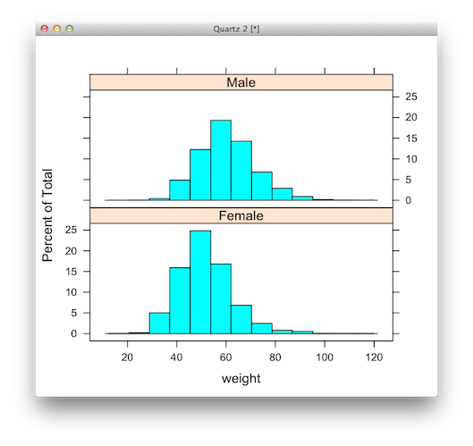
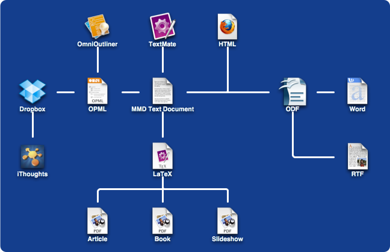
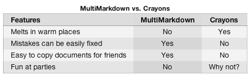
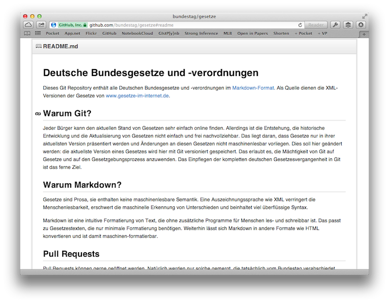

An Introduction to Markdown
===========================

---

Markdown
========

Markdown is a simple *markup* language that allows plain text to be converted into HTML.

The advantages of using Markdown over HTML (and LaTeX):

- its a **human-readable** format 
- allows writers to focus on content rather than formatting and layout
- easier to learn and use

See [The Markdown Tutorial](http://slekx.com) for more.

Presenter Notes
===============

---

# Why Markdown?

For example, instead of writing:

    
In order to create valid 
    <a href="http://en.wikipedia.org/wiki/HTML">HTML</a>, you 
    need properly coded syntax that can be cumbersome for 
    &#8220;non-programmers&#8221; to write. Sometimes, you
    just want to easily make certain words <strong>bold
    </strong>, and certain words <em>italicized</em> without
    having to remember the syntax. Additionally, for example,
    creating lists:

    <ul>
    <li>should be easy</li>
    <li>should not involve programming</li>
    </ul>

In order to create valid [HTML], you need properly
coded syntax that can be cumbersome for 
"non-programmers" to write. Sometimes, you just want
to easily make certain words **bold**, and certain 
words *italicized* without having to remember the 
syntax. Additionally, for example, creating lists:

* should be easy
* should not involve programming

[HTML]: http://en.wikipedia.org/wiki/HTML
---

# Why Markdown?

... the same output can be obtained using this:

    In order to create valid [HTML], you need properly
    coded syntax that can be cumbersome for 
    "non-programmers" to write. Sometimes, you just want
    to easily make certain words **bold**, and certain 
    words *italicized* without having to remember the 
    syntax. Additionally, for example, creating lists:

    * should be easy
    * should not involve programming

    [HTML]: http://en.wikipedia.org/wiki/HTML

In order to create valid [HTML], you need properly
coded syntax that can be cumbersome for 
"non-programmers" to write. Sometimes, you just want
to easily make certain words **bold**, and certain 
words *italicized* without having to remember the 
syntax. Additionally, for example, creating lists:

* should be easy
* should not involve programming

[HTML]: http://en.wikipedia.org/wiki/HTML
---

# Header Elements #

A header element is tranformed into '`<h1>, <h2>,...,<h6>`' tags in 
HTML. There are two ways to make a header in HTML:

## Atx Style Headers ##
The first method is by using a `#` (pound sign) before the text of the 
header. The number of `#` characters that you use denotes the level of 
the header tag. So, `#` translates to `<h1>`, `##` translates to 
`<h2>` and so on, up to `<h6>`.  The following is an `<h3>` header.

    ### This is important information ###

### This is important information ###

Presenter Notes
===============

You may enclose the header by the same 
number of `#` signs. This is not required, but it does make your plain 
text easier to read.

---

# Header Elements #

A header element is tranformed into '`<h1>, <h2>,...,<h6>`' tags in 
HTML. There are two ways to make a header in HTML:

Setext Style Headers
====================
The second method is by 'underlining' the text of the header with `-` 
(minus sign) or `=` (equal sign) characters. The `=` translates to 
`<h1>`, while `-` translates to `<h2>`. Higher lever header tags are 
not supported. The following is an example of an `<h1>` header.

    This info is more important that the last info.
    ===============================================

This info is more important that the last info.
===============================================

Presenter Notes
===============

Note that you don't have to underline the entire title, one `-` or `=` 
will suffice. However, underlining all of it makes your plain text 
more readable.

---

# Paragraphs

Paragraphs, denoted by '&lt;p&gt;' tags in HTML, are a very natural 
entity in Markdown syntax. To create a paragraph, simply leave a blank 
line after the text that you want to mark as a paragraph

    THIS IS PART OF MY FIRST PARAGRAPH. Lorem ipsum dolor sit amet, 
    consectetur adipiscing elit. Pellentesque sed arcu est. 

    THIS IS PART OF MY SECOND PARAGRAPH. Lorem ipsum dolor sit amet,
    consectetur adipiscing elit. Pellentesque sed arcu est. 

THIS IS PART OF MY FIRST PARAGRAPH. Lorem ipsum dolor sit amet, 
consectetur adipiscing elit. Pellentesque sed arcu est. 

THIS IS PART OF MY SECOND PARAGRAPH. Lorem ipsum dolor sit amet,
consectetur adipiscing elit. Pellentesque sed arcu est. 

---

# Line Breaks

To insert an HTML break tag, you need 
to end a line with TWO spaces, then press return. For example,

    This line ends with two spaces.  
    This should be on the second line.

    This line does not end with two spaces.
    This should still be on the same line.

This line ends with two spaces.  
This should be on the second line.

This line does not end with two spaces.
This should still be on the same line.

---

# Emphasis #
Markdown uses `*` (asterisk) and `_` (underscore) characters as 
indicators of emphasis. 

    *italic*, _italic_  
    **bold**, __bold__
    ***bold-italic***, ___bold-italic___

*italic*, _italic_  
**bold**, __bold__  
***bold-italic***, ___bold-italic___

Presenter Notes
===============

you must make sure 
that the opening and closing character are the same (no mixing and 
matching `*` and `_` in the same span of text).

---

# Lists #
Markdown supports both unordered and ordered lists. Unordered lists can use `*`, `-`, or 
`+` to define a list. This is an unordered list:  

    * Apples
    * Bananas
    * Oranges

* Apples
* Bananas
* Oranges

---

# Enumerated Lists #

Ordered lists are numbered lists in plain text:

    1. Bryan Ferry
    2. Brian Eno
    3. Andy Mackay
    4. Paul Thompson
    5. Phil Manzanera

1. Bryan Ferry
2. Brian Eno
3. Andy Mackay
4. Paul Thompson
5. Phil Manzanera

Presenter Notes
===============

The actual numbers that you use are inconsequential. As long as you 
start the list with a '1', the resulting HTML will be an ordered list.

---

## Paragraphs in List Items ##
Lists items can also contain paragraphs ('&lt;p&gt;' tags). To make a 
list item into a paragraph, add a blank line between each item. 

    + __James T. Kirk__ was the Captain. He was played by William Shatner. 
    Kirk was the Commanding Officer and Chief of Starfleet Operations.

        If I knew anything more about Captain Kirk, I would write about it 
    in this second paragraph. 
        
    + **Spock** was a Commander. He was played by Leonard Nimoy. Spock was 
      Executive Officer, Science Officer, Commanding Officer, and 
      Ambassador.

        Note that I used 'hanging indents' to align the text of the previous 
        paragraph, as well as this paragraph. 

    + **Leonard "Bones" McCoy** was a Commander and later an Admiral. He was 
      played by DeForest Kelley. Bones was the Chief Medical Officer. 

---

## Paragraphs in List Items ##

+ __James T. Kirk__ was the Captain. He was played by William Shatner. 
Kirk was the Commanding Officer and Chief of Starfleet Operations.

    If I knew anything more about Captain Kirk, I would write about it 
in this second paragraph. 
    
+ **Spock** was a Commander. He was played by Leonard Nimoy. Spock was 
  Executive Officer, Science Officer, Commanding Officer, and 
  Ambassador.

    Note that I used 'hanging indents' to align the text of the previous 
    paragraph, as well as this paragraph. 

+ **Leonard "Bones" McCoy** was a Commander and later an Admiral. He was 
  played by DeForest Kelley. Bones was the Chief Medical Officer. 

---

## Nested Lists ##

List items can be placed inside of other list 
items by adding at least one space before a nested list item (more spaces make it look pretty as plain text).

    * Things that don't hurt people
        + Ponies
        + Bayes formula
        + Candy
    * Things that might hurt people
        + Swordfish
        + p-values
        + Candy from strangers

---

## Nested Lists ##

List items can be placed inside of other list 
items by adding at least one space before a nested list item (more spaces make it look pretty as plain text).

* Things that don't hurt people
    + Ponies
    + Bayes formula
    + Candy
* Things that might hurt people
    + Swordfish
    + p-values
    + Candy from strangers
---

# Code #

There are two ways to include code snippets in Markdown:

1. **As inline code**
2. As a code block

## Inline code ##

Inline code appears on the same line as the surrounding text, but 
formatted as 'code' (that usually means a monospace font of some 
sort). Inline code is surrounded by \` \` (backticks). 

    Including the `dependencies=TRUE` flag also installs any other 
    packages that the target package requires to run on your machine.

Including the `dependencies=TRUE` flag also installs any other packages
that the target package requires to run on your machine.

---

# Code #

There are two ways to include code snippets in Markdown:

1. As inline code
2. **As a code block**

## Code Block ##

The other way to include code in Markdown is as a whole code block.  To include 
a code block, simply indent the code by at least 4 spaces, or one tab. 

    if (age < 1) {
        age_class <- "infant"
    } else if (age < 13) {
        age_class <- "child"
    } else if (age < 18) {
            age_class <- "adolescent"
    } else age_class <- "adult"

---

# Links #
There are two types of links in Markdown:

1. **Inline links**
2. Reference links.

## Inline Links ##
Markdown inline links are equivalent to HTML `<a href='foo.com'>` 
links, they just have a different syntax. 

    [Biostatistics home page](http://biostat.mc.vanderbilt.edu "Visit Biostat!")

[Biostatistics home page](http://biostat.mc.vanderbilt.edu "Visit Biostat!")

Presenter Notes
===============

1. **Link** Text - The text that will appear on the HTML page.
2. **url** - The url of the link.
3. **Title** - The text that will appear when the user hovers over the link (optional)

---

# Links #
There are two types of links in Markdown:

1. Inline links
2. **Reference links**

## Reference Links ##

Markdown lets you define links by *referencing* 
the url of the link instead of hardcoding it into every occurrence of 
a link. Reference links make it easy to update urls 
when they change. 

    You should read [John Cook's blog post][underflow] on avoiding
     overflow and underflow errors.

    [underflow]: http://bit.ly/T8tSpF 
    "Avoiding Overflow, Underflow, and Loss of Precision"

You should read [John Cook's blog post][underflow] on avoiding overflow and underflow errors.

[underflow]: http://bit.ly/T8tSpF 
"Avoiding Overflow, Underflow, and Loss of Precision"

Presenter Notes
===============

Here `underflow` is the local name of the reference.
One thing to remember about reference links is that the reference id 
is **not** case-sensitive. So, don't try to define two links that only 
differ by a capital letter (that's bad practice anyway).

---

# Block Quotes #

Block quotes are denoted by a `>` (greater than) character 
before each line of the block quote.

    > Sometimes a simple model will outperform a more complex model . . . 
    > Nevertheless, I believe that deliberately limiting the complexity 
    > of the model is not fruitful when the problem is evidently complex. 

> Sometimes a simple model will outperform a more complex model . . .
> Nevertheless, I believe that deliberately limiting the complexity 
> of the model is not fruitful when the problem is evidently complex.

---

# Images #

Images look an awful lot like Markdown links, they just have an extra 
`!` (exclamation mark) in front of them. 

    

Presenter Notes
===============

You can also use reference urls for images. 

---

# What About Math? Tables? Citations?

Markdown's underlying philosophy is one of simplicity.

> *Markdown is not a replacement for HTML, or even close to it.* 
> *Its syntax is very small, corresponding only to a very small* 
> *subset of HTML tags.* 

> *The overriding design goal for Markdown’s formatting syntax is to *
> *make it as readable as possible. The idea is that a Markdown-*
> *formatted document should be publishable as-is, as plain text, *
> *without looking like it’s been marked up with tags or formatting *
> *instructions.*

As a result, some content that one would expect in a scientific document is not supported directly by Markdown. There exist a several 3rd party tools to extend Markdown's functionality

- MathJax
- MultiMarkdown
- Pandoc

---

# MathJax

MathJax is an open source JavaScript display engine for mathematics that works in all modern browsers.

MathJax allows easy integration of LaTeX (and MathML) equations into HTML and Markdown documents.

### Example

\\[f(x|\mu,\lambda,\nu) = \frac{\Gamma(\frac{\nu +
        1}{2})}{\Gamma(\frac{\nu}{2})}
        \left(\frac{\lambda}{\pi\nu}\right)^{\frac{1}{2}}
        \left[1+\frac{\lambda(x-\mu)^2}{\nu}\right]^{-\frac{\nu+1}{2}}\\]

<i>The non-central t-distribution, rendered in MathJax</i>

---

Using MathJax
==============

To use MathJax, you must do two things:

- Put mathematics into your documents so that MathJax can display it
- Link MathJax into documents that are to include mathematics

You can insert LaTeX equations into Markdown documents in the same way as a LaTeX document:

    Recall that the 95% confidence interval for the mean of
    normally-distributed data satisfies:

    \\[Pr(\bar{X} - t_{0.025, n-1} S/\sqrt{n} < \mu < 
    \bar{X} - t_{0.025, n-1} S/\sqrt{n}) = 0.95\\]

Recall that the 95% confidence interval for the mean of
normally-distributed data satisfies:

\\[Pr(\bar{X} - t_{0.025, n-1} S/\sqrt{n} < \mu < \bar{X} - t_{0.025, n-1} S/\sqrt{n}) = 0.95\\]

Presenter Notes
===============

---

# Getting MathJax

Your documents can access the MathJax engine via:

- MathJax Content Delivery Network (CDN): `cdn.mathjax.org`
- A server-installed copy of MathJax
- A locally-installed copy of MathJax

Linking to MathJax is simply a matter of adding some JavaScript to your document. The following can be cut-and-pasted:

    !html
    <!-- Mathjax -->
    
     

Presenter Notes
===============

A local install is the only approach that does not require a network connection

---

## MultiMarkdown

MultiMarkdown is a superset of the Markdown syntax.

It adds multiple syntax features:

- tables
- footnotes
- citations
- math support
- image captions
- image attributes
- definition lists
- document metadata

---

## MultiMarkdown

MultiMarkdown adds multiple output formats.

Presenter Notes
===============

Plain markdown typically only becomes html.

---

Using MultiMarkdown
===================

MultiMarkdown is run from the command line, using the `multimarkdown` executable. By default, it generates html to standard output:

    multimarkdown file.txt > file.html

Other output formats can be specified using the `-t` flag:

    multimarkdown -t latex file.txt > file.tex

MultiMarkdown provides several convenience functions for common conversions:

    mmd file.txt
    mmd2tex file.txt
    mmd2opml file.txt
    mmd2odf file.txt

Presenter Notes
===============

---

Metadata
========

MMD optionally allows users to specify document metadata that can be used to control processing of certain document formats.

    latex input:        mmd-article-header  
    Title:              Introduction to R  
    Affiliation:        Bios301       
    Author:             Christopher J. Fonnesbeck
    Date:               Fall 2012
    latex mode:         memoir  
    xhtml header:       
    latex input:        mmd-article-begin-doc  
    latex footer:       mmd-memoir-footer 

The metadata must be placed at the top of the document in *key: value* format, as shown above. It is particularly useful when the target format is pdf via LaTeX.

Presenter Notes
===============

---

Image and Link Attributes
=========================

MMD allows for the customization of images and links without having to drop back to html.

Specifying image size:

    [histogram]: images/histogram.png "Weight by age" width=40px 
    height=400px

Putting a border around a link:

    [Bios301 link]:  http://bit.ly/bios301 class=external
                  style="border: solid black 1px;"

Presenter Notes
===============

---

Tables
======

MMD allows you to turn this:

    [MultiMarkdown vs. Crayons]  
    | Features                          | MultiMarkdown |  Crayons |  
    ----------------------------------- | :-----------: | :------: |  
    Melts in warm places                |       No      |    Yes   |  
    Mistakes can be easily fixed        |      Yes      |    No    |  
    Easy to copy documents for friends  |      Yes      |    No    |  
    Fun at parties                      |       No      | Why not? |  

... into this:

Presenter Notes
===============

It is optional whether you have |’s at the beginning and end of lines.
You can use normal Markdown markup within the table cells.
To set alignment, you can use a colon to designate left or right alignment, or a colon at each end to designate center alignment

---

Citations
=========

To use citations in MultiMarkdown, you use a syntax much like that for anchors:

    For a good intro to R programming, see the Bios 301 textbook 
    [Chapters 1-3][#Matloff:2011].
     
And following is the description of the reference to be used in the bibliography.

     [#Matloff:2011]: Norman Matloff. *The Art of R Programming: 
     A Tour of Statistical Software Design*.  No Starch Press, 2011.

Which appears as:

For a good intro to R programming, see the Bios 301 textbook <a class="citation" href="#fn:1" title="Jump to citation">[Chapters 1&#8211;3, 1]Matloff:2011</a>.

<ol>
<li id="fn:1" class="citation">Matloff:2011
Norman Matloff. <em>The Art of R Programming: A Tour of Statistical Software Design</em>. No Starch Press, 2011.

</li>
</ol>

Presenter Notes
===============

---

Bundestag and Markdown
======================

The German Bundestag hosts a repository of all Germany’s rules and regulations on GitHub, all in Markdown.

Presenter Notes
===============

---

# Exercise

To get some practice using Markdown, complete the Markdown tutorial (`markdown_tutorial.md`) located in the *exercises* folder on the course GitHub repository.

Try building the `r_basics.mmd` file located in the *notes* folder.

<!-- Mathjax -->

