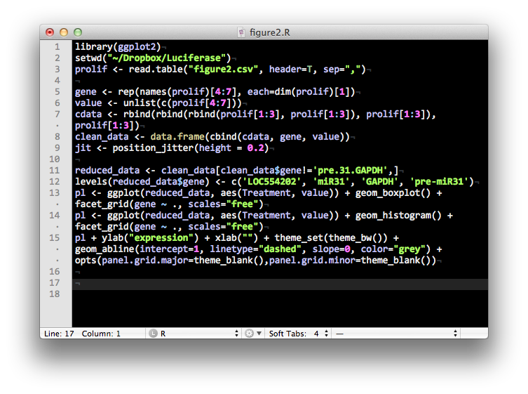

# R: The Basics

---

## Running R

Upon starting the R  console, you will see a console displaying several lines of
information:

    R version 3.0.1 (2013-05-16) -- "Good Sport"
    Copyright (C) 2013 The R Foundation for Statistical Computing
    Platform: x86_64-apple-darwin12.4.0 (64-bit)

    R is free software and comes with ABSOLUTELY NO WARRANTY.
    You are welcome to redistribute it under certain conditions.
    Type 'license()' or 'licence()' for distribution details.

      Natural language support but running in an English locale

    R is a collaborative project with many contributors.
    Type 'contributors()' for more information and
    'citation()' on how to cite R or R packages in publications.

    Type 'demo()' for some demos, 'help()' for on-line help, or
    'help.start()' for an HTML browser interface to help.
    Type 'q()' to quit R.

    >

### Presenter Notes

This includes information on your the version of the software, your
platform, licensing, and a few handy commands to get you started. It
also shows you how to quit the current R session `q()` and where your
current workspace is located on your computer's file system.

---

## The Command Prompt

After starting R, you are presented with a command prompt:

    !r
    >

It is at this command prompt that the user may interact with R, by
typing expressions, then hitting return to have the expression
evaluated. For example, you may simply use R as a calculator:

    !r
    > 10 + 4
    [1] 14

Expressions may be passed one-at-a-time to the prompt, or collectively
in the form of a *script*. Scripts can be composed in any plain text
editor. Consecutive expressions can be entered on the same line, if
separated by semicolons:

    !r
    > 2+3; 5*7; 3-7
    [1] 5
    [1] 35
    [1] -4

---

## Getting help

If you need help regarding any function, simply call its help file by
typing a question mark (?) followed by the name of the function:

    !r
    > ?sd

    sd                    package:stats                    R Documentation

    Standard Deviation

    Description:

         This function computes the standard deviation of the values in
         ‘x’.  If ‘na.rm’ is ‘TRUE’ then missing values are removed before
         computation proceeds.  If ‘x’ is a matrix or a data frame, a
         vector of the standard deviation of the columns is returned.

    Usage:

         sd(x, na.rm = FALSE)
    :

Additionally, you can pull up the entire help system in a browser by
typing:

    !r
    > help.start()

---

## Packages

Non-core R functionality is distributed in the form of discrete
*packages*. This allows third parties to extend R, which allows users to
access newer methods than are typically available in the base R
application.

`sessionInfo()` reports which packages are currently loaded into your R session:

    !r
    > sessionInfo()
    R version 2.13.0 (2011-04-13)
    Platform: x86_64-apple-darwin9.8.0/x86_64 (64-bit)

    locale:
    [1] C/en_US.UTF-8/C/C/C/C

    attached base packages:
    [1] stats     graphics  grDevices utils     datasets  methods   base

    loaded via a namespace (and not attached):
    [1] tools_2.13.0

---

## Packages

There are three classes of package:

- **base**: pre-installed, loaded automatically
- **recommended**: pre-installed, loaded manually
- **other**: must be downloaded, installed, loaded

To see the packages that are currently installed (but not necessarily loaded):

    !r
    > installed.packages()
                 Package
    bitops       "bitops"
    brew         "brew"
    coda         "coda"
    colorspace   "colorspace"
    devtools     "devtools"
    dichromat    "dichromat"
    digest       "digest"
    evaluate     "evaluate"
    filehash     "filehash"
    formatR      "formatR"
    ggplot2      "ggplot2"

### Presenter Notes

This modularity makes R efficient relative to many commercial packages.
Loading only packages that are relevant to your current work saves
space, time and memory.

---

## Installing packages

The largest source of third-party packages is through an online repository called the
[Comprehensive R Archive Network](http://cran.r-project.org/). A convenient method for
installing a single package is to use the `install.packages` command from the R console:

    !r
    > install.packages("ggplot2", dependencies=TRUE)

Including the `dependencies=TRUE` flag also installs any other packages
that the target package requires to run on your machine.

Many packages are now developed on GitHub. The `devtools` package contains a function for installing directly from GitHub:

    !r
    > install.packages("devtools")
    > library(devtools)
    > install_github("ggplot2")

### Presenter Notes

packages on CRAN have been vetted for appropriate format and documentation, and
tend to contain the most up-to-date versions across all of its servers.
can use GUI installer as well

---

## Loading Packages

Packages are loaded using the `library` function.

    !r
    > library(ggplot2)
    Loading required package: reshape
    Loading required package: plyr

    Attaching package: 'reshape'

    The following object(s) are masked from 'package:plyr':

        rename, round_any

    Loading required package: grid
    Loading required package: proto

The function reports *dependencies*, warnings, or error messages, if any

---

## Frames and environments

R uses abstractions called *frames* and *environments* as hierarchical levels of
organization within the R system.

* **frame**: a device that *binds* objects in R to their names ("catalog")
* **environment**: a frame + a reference to another environment ("namespace")

When you start an R session, a global environment is created, called `.GlobalEnv`.

    !r
    > search()
    [1] ".GlobalEnv"        "package:stats"     "package:graphics"
    [4] "package:grDevices" "package:utils"     "package:datasets"
    [7] "package:methods"   "Autoloads"         "package:base"

When you call a function, R creates a new environment, enclosed in the current
environment. Objects created inside the function are not available in the enclosing
environment; objects available in the enclosing environment are available to the function running within it.

### Presenter Notes

.GlobalEnv is  the  default  container for  any  objects, including other environments, that are created during the session.

---

## Editing and running scripts

It is more efficient to perform statistical analyses in R by generating a *script* that
runs a sequence of commands in succession.

---

## Editing and running scripts

To run the script, it should be saved to the current working directory that is being used by R.

    !r
    > getwd()
    [1] "/Users/fonnescj"

R scripts retain the  *.r* (or *.R*) suffix at the end of the filename. To run any script, pass the filename to R's `source` function:

    !r
    > source("binomial.r")

Using scripts makes modifying and re-running your code much easier and allows you to
share, distribute and backup your work.

---

## Assignment

Variables are
given values using the assignment operator (`<-`), which looks like an
arrow pointing from the value to the variable name. In recent versions
of R, the equals sign can also be used, but this is discouraged by some.

Remember there is no space between the `<` and the `-`!

    !r
    > x <- 5
    > x < - 5
    [1] FALSE

The latter expression tests whether `x` is less than -5.

The outcome of an assignment operation can be shown by enclosing the
expression in parentheses:

    !r
    > (x <- 5)
    [1] 5

---

## Built-in functions

Most commonly-used mathematical functions are available in the base R
package:

    !r
    > log(10)
    [1] 2.302585
    > exp(1)
    [1] 2.718282
    > log10(6)
    [1] 0.7781513
    > log(9,3)
    [1] 2
    > 1e3
    [1] 1000

The trigonometric functions in R measure angles in radians:

    !r
    > pi
    [1] 3.141593
    > sin(pi/2)
    [1] 1
    > cos(pi/2)
    [1] 6.123032e-017

Standard operator precedence is used.

    > (1 + 1/100)^100
    [1] 2.704814

---

## Operators

R uses standard arithmetic operator symbols, including `+ - */%% ^`.

Modulo and integer division is performed to separate the integer and
remainder portions of a division operation.

    !r
    > 19 %/% 3
    [1] 6
    > 19 %% 3
    [1] 1

Similarly, relational operators are standard:

    !r
    > 5 < 6
    [1] TRUE
    > 5 >= 6
    [1] FALSE
    > 5 != 6
    [1] TRUE
    > 5 == 6
    [1] FALSE

R also allows for logical operators, including NOT (`!`), OR (`|`) and
AND (`&`).