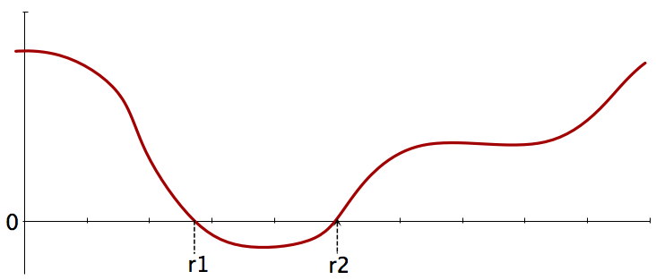
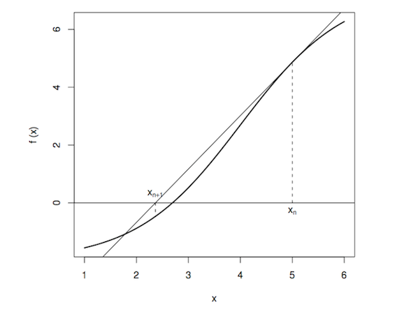

## Control Structures

See Chapter 7 of *Matloff*

* **Conditions**: Use `if` or `switch` statements to control execution conditional on data.
* **Iteration**: Use `for()`, `while()` and `repeat()` to do similar things a certain number of times, or while conditions hold, or until conditions are met.
* **Vectorizing**: Explicit iteration is often unclear, slow, and needlessly detailed; avoid it by working with vectors of values.

---

## Conditional Statements

Conditionals specify which calculation to execute, based on conditions:

###Examples:###

$$|x| = \left\{
  \begin{array}{rl}
    x & \text{if } x \ge 0 \\
    -x & \text{if } x < 0
  \end{array}
\right.
$$

$$\phi(x) = \left\{
  \begin{array}{rl}
    x^2 & \text{if } |x| \le 1 \\
    2|x|-1 & \text{if } |x| > 0
  \end{array}
\right.
$$

assign:

- group="child" if age<13
- group="adolescent" if age<18
- group="adult" otherwise

---

## `if` statement

```{r}
x <- -10
if (x >= 0) {
    x
} else {
    -x
}
```

The condition in if needs to give one TRUE or FALSE value else clause is optional

*What if x is a numeric vector?*

---

## What is TRUE?

Any valid *numerical* value except 0 counts as TRUE (0 is FALSE).

Most non-numerical values raise exceptions:

```{r}
if(1) {"Truth!"} else {"Falsehood!"}
if(-1) {"Truth!"} else {"Falsehood!"}
if(0) {"Truth!"} else {"Falsehood!"}
if("TRUE") {"Truth!"} else {"Falsehood!"}
tryCatch(if("TRUTH") {"Truth!"} else {"Falsehood!"}, error=function(e) e)
tryCatch(if("c") {"Truth!"} else {"Falsehood!"}, error=function(e) e)
tryCatch(if(NULL) {"Truth!"} else {"Falsehood!"}, error=function(e) e)
tryCatch(if(NA) {"Truth!"} else {"Falsehood!"}, error=function(e) e)
tryCatch(if(NaN) {"Truth!"} else {"Falsehood!"}, error=function(e) e)
```

---

## `else if`

When there are more than two conditions, they can be specified using `else if`:

```{r}
age <- 10
if (age < 2) {
    group <- 'infant'
} else if (age < 12) {
    group <- 'child'
} else if (age < 18) {
    group <- 'adolescent'
} else {
    group <- 'adult'
}
group
```

## Presenter Notes

Be sure `}` and `else` are on the same line when using interactively

---

## Nested `if` statements

Conditionals can nest arbitrarily deeply:

```{r}
if (x^2 < 1) {
    x^2
} else {
    if (x >= 0) {
        x
    } else {
        -x
    }
}
```

---

## `switch` statement

There can be an arbitrary number of alternatives for an `if` statement, but the syntax becomes awkward for a large number of conditions.

`switch` is more efficient for a large number of possible outcomes:

```{r}
centre <- function(x, type) {
   switch(type,
          mean = mean(x),
          median = median(x),
          trimmed = mean(x, trim = .1))
 }
```

This results in the appropriate measure of central tendency when requested:

```{r}
x <- rnorm(10)
centre(x, "mean")
centre(x, "median")
centre(x, "trimmed")
```

---

## `for` loops

Often, a programming task requires that we iterate over a set of values, applying the same (or similar) action several times in a row. If the number of calculations is known *a priori*, we can apply a `for` loop:

```{r}
x <- c(5,12,13)
for (n in x) print(n^2)
```

Because `x` is a vector, it is *iterable*. Starting at the first element, `n` takes on the next value in `x` at every iteration, ending when there are no more elements available. Another example, using indices:

```{r}
n <- 10
logs <- vector(length=n)
for (i in 1:n) {
  logs[i] <- log(i)
}
logs
```

Discuss `1:n`, `seq(...)`, `seq(n)`, `seq.int(n)`, `seq_len(n)`, `seq_along(logs)`

---

## Combining Control Structures

Control structures can be combined. For example, when a decision is made at every iteration of a loop, depending on the current value:

```{r}
x <- c(-5,7,-8,0)
y <- rep(NULL, length(x))
for (i in 1:length(x)) {
    if (x[i] >= 0) {
        y[i] <- x[i]
    } else {
        y[i] <- -x[i]
    }
}
y
```

---

## Conditional Iteration: `while`

In some cases, we do not know how many iterations will be required in order to achieve a result. The `while` statement executes until its argument evaluates to `FALSE`:

```{r}
i <- 0
while(i < 2) i <- i + rnorm(1)
i
```

Loop is executed forever if the condition is always `TRUE`!

All loops can be broken, with `break`:

```{r}
i <- 0
while(TRUE) {
  i <- i+1
  if (i > 10) break
}
```

Loops can also be forced to advance the looping index with `next`.

---

## Exercise

Change the following `for` loop into a `while` loop:

```{r}
x <- 0
for (i in 1:10) {
    x <- x + log(i)
}
x
```

---

## Unconditional Iteration: `repeat`

`repeat` iterates endlessly, unless broken:

    !r
    repeat {
        print("I am trapped in an endless loop!!")
    }

More useful implementation:

```{r}
x <- 0
repeat {
    x <- x + log(i)
    if (x > 20) break
}
x
```

---

## Vectorization

Though iteration (looping) is a fundamental and useful programming tool, in R we often want to *avoid* iteration and perform operations on data structures as a whole.

For example, in some languages, vector addition proceeds analogous to:

```{r}
a <- rnorm(15)
b <- rnorm(15)
c <- numeric(length(a))
for (i in seq_along(a)) {
    c[i] <- a[i] + b[i]
}
c
```

But in R, as we have seen, we can add the entire vector rather than operating element-wise:

```{r}
c <- a + b
c
```

---

## Vectorization

There are several advantages to vectorized operations:

* Clear: the syntax is about *what* we are doing.
* Abstract: the syntax hides the implementation.
* Concise: one line!
* Fast: looping in R can be slow. Vectorized functions take advantage of faster low-level code.

---

## Vectorized Calculations

Many of R's built-in functions are already vectorized:

```{r}
x <- rnorm(5, 0, 25)
abs(x)
log(x)
```

Conditional statements can avoid embedding `if` statements in loops:

```{r}
ifelse(x < 0, -x, x)
ifelse(x^2 > 1, abs(x), x^2)
```

Generate sequences:

```{r}
rep(1,10)
seq(10,20,by=2)
```

---

## Arrays with Repeated Structure

We can generate combinations of values from vectors, using `expand.grid`:

```{r}
expand.grid(intervention=c("control", "treatment"), gender=c("M","F"))
```

Matrices can be generated from vectors with `outer`:

```{r}
outer(c(1,3,5),c(2,3,7),'*')
```

We can repeat the same action repeatedly using `replicate`:

```{r}
mean(replicate(1000, sd(rnorm(1000))))
```

---

## Programming with Control Structures:

### Root-finding

As a motivating example for implementing loops and `if` statements, we will consider a common computational task in computational statistics: ***root-finding***.

Consider a function $f:\mathbf{R} \Rightarrow \mathbf{R}$. The *root* is a solution to $f(x)=0$.



---

## Fixed-point Iteration

One method for finding roots computationally is *fixed-point iteration*. For some function $g:\mathbf{R} \Rightarrow \mathbf{R}$, a fixed point is:

$$a \in \mathbf{R}: g(a) = a$$

So, if we define our function $f$ as:

$$f(x) = c(g(x)-x)$$

then we can find the root of $f$ when we find the fixed point of $g$. Conversely:

$$g(x) = cf(x) + x$$

---

## Iterative Method

In order to find a fixed point, we will generate a sequence of "guesses" $x_0, x_1, x_2, \ldots$ that (hopefully) converges to $a: g(a)=a$.

The method begins with an initial guess $x_0$, from which we generate $x_1 = g(x_0)$, then $x_2 = g(x_1)$, etc.

In general, this is a 1st-order recurrence equation:

$$x_{n+1} = g(x_{n})$$

We can show that $x_n \rightarrow a$ is a fixed point of $g$.

$$a = \lim_{n \rightarrow \infty} x_{n+1} = \lim_{n \rightarrow \infty} g(x_n)$$
$$ = g(\lim_{n \rightarrow \infty} x_n) = a$$

therefore, $a$ is a fixed point of $g$.

---

## Convergence

Sadly for us, ${x_n}_{n=0}^{\infty}$ does not always converge.

### Example

$$g_1(x) = x^{1.5}, \, g_2(x) = x^{0.75}$$

both $g_1, g_2$ have fixed points at 1 (by inspection), but $g_1$ diverges.

In general,

* the algorithm converges if $|g'(a)<1|$, and diverges otherwise.
* the initial value should be in the "neighborhood" of $x_0$ to guarantee convergence.

In practice, we may *converge* to $a$ without reaching it. We want to stop when $x_n$ is "close enough":

$$ |x_n - x_{n-1}| \le \epsilon$$

---

## Example

### Find the root of $f(x) = \log(x) - \exp(-x)$

How do we define $g$?

1. Put one term on both sides of the equation, and exponentiate:

    $g_1: x = \exp(\exp(-x))$

2. Subtract $x$ from both sides:

    $g_2: x = x - \log(x) + \exp(-x)$

3. Add $x$ to both sides:

    $g_3: x = x + \log(x) - \exp(-x)$

---

## R Code

How do we implement this in R?

* `while` loop
* conditional statement

Before plunging into programming, its a good idea to write *pseudocode* to outline the algorithm that you are about to implement.

    1. choose initial value
    2. specify stopping condition
    3. loop until stopping condition met:
        - calculate new value based on current value
        - set new value to current value
    4. return result

---

## Problems with Fixed-point Iteration?

1. There are many ways of expressing $g(x)$, each having different convergence properties.
2. The algorithm is relatively **slow**.
    * the error is divided by a constant factor at each iteration

---

## Newton-Raphson

Suppose $f$ is differentiable, with continuous $f'$ and root $a$. Starting with an initial guess $x_0$, we can draw a straight line through $(x_0, f(x_0))$ that has slope $f'(x_0)$:

$$f'(x_0) = \frac{f(x_0) - y}{x_0 - x}$$



---

## Newton-Raphson

The tangent line crosses the x-axis at some point $x_1$, which is (we hope) a better approximation to $a$.

$$f'(x_0) = \frac{f(x_0)-0}{x_0 - x_1}$$

$$\Rightarrow x_1 = x_0 - \frac{f(x_0)}{f'(x_0)}$$

Hence, our next guess $x_2$ becomes:

$$x_2 = x_1 - \frac{f(x_1)}{f'(x_1)}$$

Generally:

$$x_{n+1} = x_n - \frac{f(x_n)}{f'(x_n)}$$

---

## Convergence of Newton-Raphson

The Newton-Raphson algorithm converges quickly if:

* $f'(a) \ne 0$
* $f"$ is finite and continuous at $a$
* algorithm is initialized suitably close to $a$

If $x_n \rightarrow a$:

$$\begin{aligned}a &= \lim_{n  \rightarrow \infty} x_{n+1} = \lim_{n  \rightarrow \infty} \left[
x_n - \frac{f(x_n)}{f'(x_n)}\right] \cr
&= \lim_{n  \rightarrow \infty} x_n - \frac{f(\lim x_n)}{f'(\lim x_n)} = a - \frac{f(a)}{f'(a)} \cr
&\Rightarrow f(a) = 0\end{aligned}$$

---

## Convergence of Newton-Raphson

We stop when $f(x_n)$ is sufficiently close to zero:

$$|f(x_n)| \le \epsilon$$

If sequence is converging to $a$, then for $x$ near $a$, we have:

$$f(x) \approx f'(a)(x-a)$$

$$\Rightarrow |x-a| \le \frac{\epsilon}{f'(a)}$$

---

## Pseudocode

1. Specify functions $f(x)$, $f'(x)$
2. Specify tolerance for convergence
3. Initialize x
4. Loop until convergence:
    * calculate $f(x_i)$ and $f'(x_i)$
    * calculate new value $x_{i+1}$
5. Return result

## Presenter Notes

Convergence checking, maximum iterations

---

## Exercise

### Implement the Newton-Raphson algorithm in R

Find root for $f(x) = x^3 + x^2 - 3x - 3$.  $f'(x) = 3x^2 + 2x - 3$.

### Generate a vector of the first 25 prime numbers
