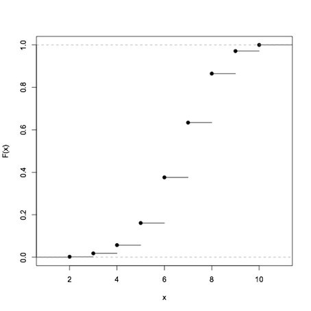
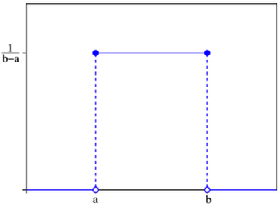

Random Variables
================

---

Discrete Random Variables
=========================

$$X = \{0,1\}$$

$$Y = \{\ldots,-2,-1,0,1,2,\ldots\}$$

**Probability Mass Function**: 

For discrete $X$,

$$Pr(X=x) = f(x|\theta)$$

---

Cumulative Mass Function
========================

$$Pr(X \le x) = F(x) = \sum\_{t=-\infty}^x f(t|\theta)$$

---

Continuous Random Variables
===========================

$$X \in [0,1]$$

$$Y \in (-\infty, \infty)$$

**Probability Density Function**: 

For continuous $X$,

$$Pr(x \le X \le x + dx) = f(x|\theta)dx \, \text{ as } \, dx \rightarrow 0$$

---

Cumulative Distribution Function
================================

$$Pr(X \le x) = F(x) = \int\_{-\infty}^x f(t|\theta)dt$$

---

Summary Statistics
==================

### Expected Value

For discrete X, $E(X) = \sum\_{i=1}^n x\_i f(x\_i)$

For continuous X, $E(X) = \int\_x x f(x) \, dx$

**Example**

$$X = \left\\{\begin{array}{l} \text{2 with probability 1/2} \cr \text{7 with probability 1/2} \end{array}\right.$$

$$E(X) = (0.5)(2) + (0.5)(7) = 4.5$$

### Variance

$$\begin{align}\text{Var}(X) &= E[(X-\mu)^2] \cr
&= E[X^2] - E[X]^2\end{align}$$

Presenter Notes
===============

Also called the first moment

---

Expected Value of Functions
===========================

For an arbitrary function, for example, the logarithm:

$$E(\log(X)) = \int\_x \log(x)f(x|\theta)\, dx$$

Affine transformation:

$$E(aX+b) = aE(X) + b$$

$$\text{Var}(aX+b) = a^2\text{Var}(X)$$

---

Probability Distributions
=========================

---

Bernoulli
=========

The Bernoulli distribution describes the outcomes of binary events:

$$Pr(X=x)=p^x(1-p)^{1-x}$$

* $X=\{0,1\}$
* $p \in (0,1)$

$$\begin{align}E(X) &= (1)(p) + (0)(1-p) = p \cr
\text{Var}(X) &= E[(X-p)^2] = (1-p)^2p + (0-p)^2(1-p) \cr
&= p(1-p)\end{align}$$

---

Binomial
========

The binomial distribution models the sum of $n$ Bernoulli trials:

$$Pr(X=x)={n \choose x}p^x(1-p)^{n-x}$$

* $X=\{0,1,2,\ldots,n\}$
* $p \in (0,1)$

$$\begin{align}E(X) &= np \cr
\text{Var}(X) &= np(1-p)\end{align}$$

Presenter Notes
===============

Model for bounded counts

---

Poisson
=======

The Poisson distribution models unbounded counts:

$$Pr(X=x)=\frac{e^{-\lambda}\lambda^x}{x!}$$

* $X=\{0,1,2,\ldots\}$
* $\lambda > 0$

$$E(X) = \text{Var}(X) = \lambda$$

---

Geometric
=========

A geometric random variable describes the number of trials before a "success" is observed in repeated trials:

$$Pr(X=x) = (1-p)^{x-1}p$$

* $X=\{1,2,\ldots\}$
* $p \in (0,1)$

$$\begin{align}E(X) &= \frac{1-p}{p} \cr
\text{Var}(X) &= \frac{1-p}{p^2} \end{align}$$

---

Uniform
=======

A uniform distribution describes equal probability among all outcomes:

$$f(x) = \left\\{ \begin{array}{cl}
\frac{1}{b-a} & \text{for } \, a \le x \le b \cr
0 & \text{otherwise}\end{array}\right.$$

---

Normal
======

$$f(x) = \frac{1}{\sqrt{2\pi\sigma^2}}\exp\left[-\frac{(x-\mu)^2}{2\sigma^2}\right]$$

* $X \in \mathbf{R}$
* $\mu \in \mathbf{R}$
* $\sigma>0$

$$\begin{align}E(X) &= \mu \cr
\text{Var}(X) &= \sigma^2 \end{align}$$

---

Log-normal
==========

A log-normal distribution is a continuous probability distribution of a random variable whose logarithm is normally distributed

$$f(x) = \frac{1}{x\sqrt{2\pi\sigma^2}}\exp\left[-\frac{(\log(x)-\mu)^2}{2\sigma^2}\right]$$

* $\mu \in \mathbf{R}$
* $x, \sigma>0$

$$\begin{align}E(X) &= e^{\mu + \sigma^2/2} \cr
\text{Var}(X) &= (e^{\sigma^2}-1)e^{2\mu + \sigma^2} \end{align}$$

---

Gamma
=====

The gamma distribution is a 2-parameter, positive, continuous distribution:

$$f(x) = \frac{e^{-x/\beta}x^{\alpha-1}}{\beta^{\alpha}\Gamma(\alpha)}$$

* $x,\alpha,\beta > 0$

$$\begin{align}E(X) &= \alpha\beta \cr
\text{Var}(X) &= \alpha\beta^2 \end{align}$$

---

Exponential
===========

The exponential distribution is often used to describe the waiting time between independent random events (Poisson):

$$f(x) = Gamma(\alpha=1, \beta)$$

---

Chi-squared
===========

Though the Chi-squared distribution is a special form of the gamma distribution, it is the distribution of the sum of the squares of $\nu$ standard normal random variates:

$$f(x) = Gamma(\alpha=\nu/2, \beta=1/2)$$

---

Beta
====

The beta distribution describes a random variable on the $[0,1]$ interval, such as a probability:

$$f(x) = \frac{\Gamma(\alpha+\beta)}{\Gamma(\alpha)\Gamma(\beta)}x^{\alpha-1}(1-x)^{\beta-1}$$

* $x \in [0,1]$
* $\alpha, \beta > 0$

$$\begin{align}E(X) &= \frac{\alpha}{\alpha+\beta} \cr
\text{Var}(X) &= \frac{\alpha\beta}{(\alpha + \beta)^2(\alpha + \beta + 1)} \end{align}$$

<!---->
