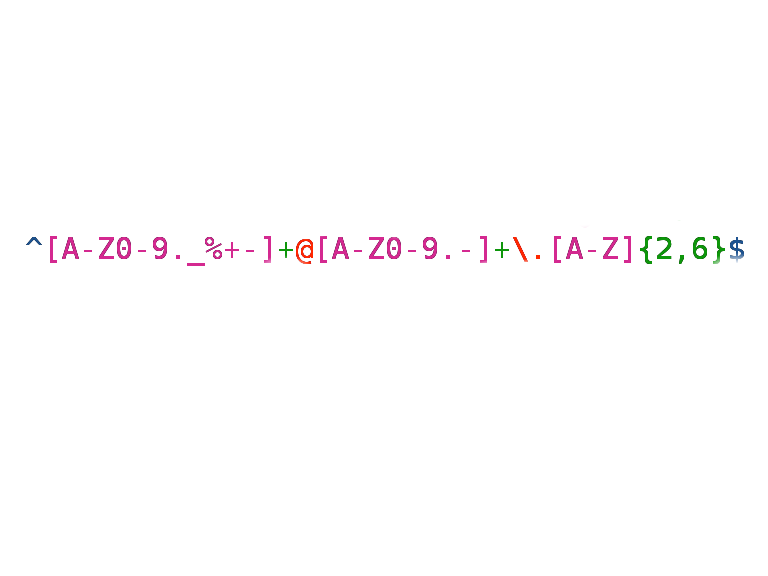
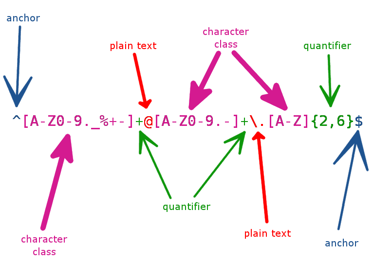
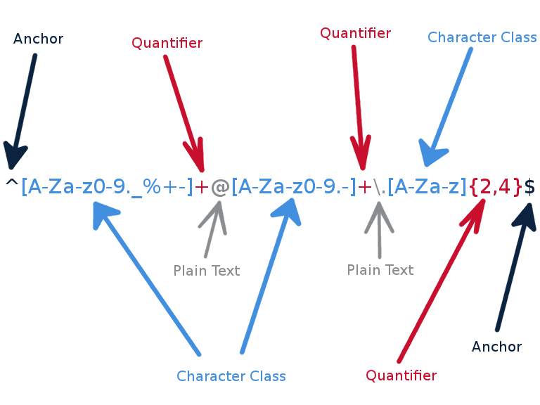

## String Manipulation

When importing, cleaning or manipulating data, character strings are reasonably common.

R includes a range of string-manipulation utilities, including an implementation of **regular expressions**.

---

## `nchar`

The call `nchar(x)` finds the length of a string x.

```{r}
nchar("Markov chain Monte Carlo")
```

---

## `paste`

`paste` concatenates several strings, returning the result in one long string.

```{r}
paste("Markov", "chain", "Monte", "Carlo")
paste("Markov", "chain", "Monte", "Carlo", sep="-")
paste("Markov", "chain", "Monte", "Carlo", sep=".")
```

The optional argument sep can be used to put something other than a space between the pieces being spliced together.

---

## `sprintf`

The call `sprintf` assembles a string from parts in a formatted manner.

```{r}
i <- 8
(s <- sprintf("the square of %d is %d", i, i^2))
```

There are a variety of format options:

```{r}
sprintf("%.3f", pi)
sprintf("%1.0f", pi)
sprintf("%-10f", pi)
sprintf("%E", pi)
sprintf("%+f", pi)
```

---

## `substr`

The call `substr(x,start,stop)` returns the substring in the given character position range `start`:`stop` in the given string `x`.

```{r}
substr("biostatistics", 4, 7)
```

It can also be used to substitute characters:

```{r}
x <- "The Titans could win this weekend."
substr(x, 12, 16) <- "won't"
x
```

---

## `strsplit`

The call `strsplit` splits a string into a list of substrings based on another string (a delimiter):

```{r}
strsplit("6-16-2011",split="-")
strsplit("Markov chain Monte Carlo", " ")
```

---

## What are Regular Expressions?

### Regular expressions are a way to describe patterns in text.

This is widely used in statistical computation for:

* Finding things
* Replacing things
* Extracting data

Regular expressions express patterns in character values which can then be used to extract parts of strings or to modify those strings.

---

## Regular expressions



---

## Regular Expressions

There are 3 main regular expression standards:

* POSIX Basic Regular Expressions
* POSIX Extended Regular Expressions (R uses this by default)
* Perl-based Regular Expressions (R has support for this as well)

R supports ERE by default, but it also has support for Perl-based RE (`perl=TRUE`).

A good reference: http://en.wikipedia.org/wiki/Regular_expression#Syntax

## Presenter Notes

1. There is a caveat when using regular expressions in R, but that will appear later on in this talk.
1. If you use regular expressions in a language and find that it doesn't behave as you expect, it may be because the language doesn't support certain features.

---

## The simplest regular expression

The function `grep` can be used to find matches in a character vector. It returns the indices of matching strings:

```{r}
grep("test", c("foo", "bar", "test"))
grep("test", c("foo", "bar", "test"), value=TRUE)
```

* "test" is a perfectly valid regular expression
* Works just like CTRL+F in your browser

## Presenter Notes

How do you describe more complex patterns?

---

## Metacharacters

How do we find more complex patterns?

Characters with special meaning in regular expressions are called **metacharacters**.

There are eleven metacharacters:

    [ \^$.|?*+()

Non-metacharacters are called *literals*.

## Presenter Notes

We add "meta", which means "about", because we're describing information about other characters.

---

## Wildcard Metacharacter

Dot (.) is a *wildcard* that matches any character:

```{r}
grep("foo.bar", c("fooxbar", "foo bar", "foobar", "foo12bar"))
```

Here, "foo.bar" is the regular expression. If we want to match two spaces:

```{r}
grep("foo..bar", c("fooxbar", "foo bar", "foobar", "foo12bar"))
```

Or, more generally:

```{r}
grep("foo.+bar", c("fooxbar", "foo bar", "foobar", "foo12bar"))
grep("bar+", c("bar", "barr", "barrrrrrrr", "ba"))
```

The + metacharacter means: *one or more times*

---

## Escaping Metacharacters

In order to search for a character that is a metacharacter, it must be *escaped* using a backslash:

```{r}
grep("\\.", c("fooxbar", "foo bar", "foobar", "foo.bar"))
```

Why are there two backslashes?

---

## Quantifiers

The + metacharacter is a *quantifier*, metacharacters that describe how many times the preceding element is to be repeated.

To match zero or more times, we use the asterix:

```{r}
grep("foo.*bar", c("fooxbar", "foo bar", "foobar", "foo12bar"))
grep("bar*", c("bar", "barr", "barrrr", "ba"))
```

Both "foobar" and "ba" match now, because we're matching zero or more times instead of one or more times.

---

## Quantifiers

The question mark searches for exactly zero or one occurrence of the preceding character:

```{r}
grep("abc?def", c("abdef", "abcdef", "abccdef"))
```

If we would like to match exactly *n* times, we enclose the number in curly braces:

```{r}
grep("10{6}", c("1000", "1000000"))
```

Even more generally, to match at least *n* times, but not more than *m* times:

```{r}
grep("10{2,4}1", c("101", "1001", "10001", "100001", "1000001"))
```

## Presenter Notes

n or m may be blank!

---

## Anchors

Quantifiers can return unexpected results on their own:

```{r}
grep("10{3}", c("100", "1000", "10000"))
```

The third string matches because this regular expression is "floating". It matches *anywhere* in the string.

**Anchors** can help to localize the regular expression search.

---

## Anchors

Anchors specify string *positions*, rather than strings themselves.

A dollar sign (`$`) metacharacter anchors the regular expression to the end of the string.

```{r}
grep("10{3}$", c("100", "1000", "10000"))
```

---

## Anchors

The caret (`^`) "anchors" the regular expression to the beginning of the string.

```{r}
grep("10{3}", c("1000", "abc1000"))
grep("^10{3}", c("1000", "abc1000"))
```

Anchors can be combined to provide more control over localizing the regular expression:

```{r}
grep("^10{3}$", c("abc1000", "1000", "10000"))
```

---

## Anchor Symbols

The anchor symbols include:

* `^` : beginning of the string
* `$` : end of the string
* `\<` : beginning of a word
* `\>` : end of a word
* `\b` : edge of a word
* `\B` : NOT at an edge of a word

---

## Email regex



## Presenter Notes

1 Text-version: `^[A-Z0-9._%+-]+@[A-Z0-9.-]+\.[A-Z]{2,4}$`

---

## Example: Extracting Variable Names

In our HAART dataset, perhaps we would like to extract the variable names that begin with "init". Using `grep`, this is easy:

```{r}
haart <- read.csv(file.path('..','datasets','haart.csv'))
grep('^init', names(haart), value=TRUE)
```

This expression can be used directly to index the variables themselves:

```{r}
head(haart[,grep('^init', names(haart), value=TRUE)])
```

---

## Character Classes

A **character class** matches anything inside a set of square brackets for one character position once and only once.

Specify the characters in square brackets:

```{r}
grep("ab[cdef]", c("abc", "abd", "abe", "abf", "abg"))
```

Similarly, the dash (-) metacharacter can be used to specify a range of characters:

```{r}
grep("ab[c-f]", c("abc", "abd", "abe", "abf", "abg"))
grep("ab[c-fC-F]", c("abc", "abC", "abf", "abF", "abg"))
grep("ab[c-fC-F123]", c("abc", "abF", "ab1", "ab2"))
```

The order of the characters inside a character class does not matter.

Typing a caret after the opening square bracket will negate the character class.

---

## Exercise

Check the character vector for a valid date format (YYYY-MM-DD):

```{r}
electionDay <- c('2020-11-03', '2016-11-08', '12-11-06', '2008-11-4', '04-11-02')
```

---

## Example: Finding Files

A common use of regular expressions is to find text corresponding to particular filenames. Here is one that looks for JPEG files, which are typically given a `.jpg` extension:

    ^[a-zA-Z]+\\.jpg$

* caret anchors to the start of a line
* character class looks for one or more letters, any case
* escaped period looks for the separator
* dollar sign anchors to the end of a line

---

## Metacharacters and Character Classes

Some metacharacters mean different things depending on *context*. For example, inside of brackets, most metacharacters lose their powers.

Only `^- \]` are special inside character classes.

```{r}
grep("[.+*]", c(".", "+", "*", "x"))
grep("[a-c-]", c("a", "b", "c", "-"))
```

* To include a literal ] place it *first* in the list
* To include a literal ^ place it *anywhere but first*
* To include a literal - place it *first or last*

---

## POSIX Character Classes

POSIX Extended Regular Expressions define a set of character classes that denote certain common ranges.

* [:alnum:] : any alphanumeric character 0 to 9 or A to Z or a to z.
* [:word:] : alphanumeric characters plus `_`
* [:alpha:] : any alpha character A to Z or a to z.
* [:digit:] : only the digits 0 to 9
* [:blank:] : space and tab characters only.
* [:graph:] : exclude whitespace (SPACE, TAB).
* [:lower:] : any alpha character a to z.
* [:print:] : any visible characters and the space character
* [:punct:] : any punctuation characters.
* [:upper:] : any alpha character A to Z.

---

## POSIX Character Classes

For example,

```{r}
grep("[[:alpha:]]", c("----x----","--------","5456655"))
grep("[[:blank:]]", c("foo","bar","foo bar","foobar"))
grep("^[[:alpha:].]+@[[:alpha:].]+$",
    c("chris.fonnesbeck@vanderbilt.edu", "@fonnesbeck", "fonnesbeck_chris@yahoo.com"))
```

---

## Perl Character Classes

* `\w` : match any character in the range 0-9, A-Z or a-z and `_`
* `\W` : match any character NOT in the range 0-9, A-Z and a-z or `_`
* `\d` : match any character in the range 0-9
* `\D` : match any character NOT in the range 0-9
* `\s` : match any whitespace characters (space, tab, etc.)
* `\S` : match any character NOT whitespace
* `\b` : word boundaries, match any character(s) at the beginning and/or end of a word
* `\B` : not word boundary, match any character(s) NOT at the beginning and/or end of a word

---

## `regexpr` and `gregexpr`

Sometimes we want more details regarding the matches than is provided by `grep`. `regexpr` and `gregexpr` pinpoint and possibly extract those parts of a string that were matched by a regular expression.

The output from these functions is a vector of starting positions of the regular expressions which were found.

```{r}
tst <- c('one x7 two b1','three c5 four b9', 'five six seven','a8 eight nine')
wh <- regexpr('[a-z][0-9]', tst)
wh
```

The `match.length` attribute is associated with the vector of starting positions to provide information about exactly which characters were involved in the match.

* `regexpr` only provides information about the first match in its input strings
* `gregexpr` returns information about *all* matches found

## Presenter Notes

if no match occurred, a value of -1 is returned.

---

## `regexpr` and `gregexpr`

`gregexpr` returns a list.

```{r}
(wh1 = gregexpr('[a-z][0-9]',tst))
```

---

## `regexpr` and `gregexpr`

We can use `substring` to extract the characters corresponding to the expression match:

```{r}
res <- substring(tst, wh, wh + attr(wh,'match.length') - 1)
res
```

Or, in the case of `gregexpr`:

```{r}
res1 <- list()
for(i in 1:length(wh1)) {
    res1[[i]] <- substring(tst[i], wh1[[i]], wh1[[i]] + attr(wh1[[i]],'match.length')-1)
}
res1
```

---

## `regexpr` and `gregexpr`

Another possibility for processing the output is to use `mapply`.

This involves turning the `substring` call into a function:

```{r}
getexpr <- function(str, greg) substring(str, greg, greg + attr(greg,'match.length') - 1)
```

Now `mapply` can be called with the two vectors of interest:

```{r}
mapply(getexpr, tst, wh1)
```

---

## Email Regular Expression


---

## Email Regular Expression



## Presenter Notes

Complete with Titans colors!
`^[A-Za-z0-9._%+-]+@[A-Za-z0-9.-]+\.[A-Za-z]{2,4}$`

---

## Full Email Validation Regexp

    (?:(?:\r\n)?[ \t])*(?:(?:(?:[^()<>@,;:\\".\[\] \000-\031]+(?:(?:(?:\r\n)?[ \t] )+|\Z|(?=[\["()<>@,;:\\".\[\]]))|"(?:[^\"\r\\]|\\.|(?:(?:\r\n)?[ \t]))*"(?:(?: \r\n)?[ \t])*)(?:\.(?:(?:\r\n)?[ \t])*(?:[^()<>@,;:\\".\[\] \000-\031]+(?:(?:( ?:\r\n)?[ \t])+|\Z|(?=[\["()<>@,;:\\".\[\]]))|"(?:[^\"\r\\]|\\.|(?:(?:\r\n)?[ \t]))*"(?:(?:\r\n)?[ \t])*))*@(?:(?:\r\n)?[ \t])*(?:[^()<>@,;:\\".\[\] \000-\0 31]+(?:(?:(?:\r\n)?[ \t])+|\Z|(?=[\["()<>@,;:\\".\[\]]))|\[([^\[\]\r\\]|\\.)*\ ](?:(?:\r\n)?[ \t])*)(?:\.(?:(?:\r\n)?[ \t])*(?:[^()<>@,;:\\".\[\] \000-\031]+ (?:(?:(?:\r\n)?[ \t])+|\Z|(?=[\["()<>@,;:\\".\[\]]))|\[([^\[\]\r\\]|\\.)*\](?: (?:\r\n)?[ \t])*))*|(?:[^()<>@,;:\\".\[\] \000-\031]+(?:(?:(?:\r\n)?[ \t])+|\Z |(?=[\["()<>@,;:\\".\[\]]))|"(?:[^\"\r\\]|\\.|(?:(?:\r\n)?[ \t]))*"(?:(?:\r\n) ?[ \t])*)*\<(?:(?:\r\n)?[ \t])*(?:@(?:[^()<>@,;:\\".\[\] \000-\031]+(?:(?:(?:\ r\n)?[ \t])+|\Z|(?=[\["()<>@,;:\\".\[\]]))|\[([^\[\]\r\\]|\\.)*\](?:(?:\r\n)?[1\t])*)(?:\.(?:(?:\r\n)?[ \t])*(?:[^()<>@,;:\\".\[\] \000-\031]+(?:(?:(?:\r\n) ?[ \t])+|\Z|(?=[\["()<>@,;:\\".\[\]]))|\[([^\[\]\r\\]|\\.)*\](?:(?:\r\n)?[ \t] )*))*(?:,@(?:(?:\r\n)?[ \t])*(?:[^()<>@,;:\\".\[\] \000-\031]+(?:(?:(?:\r\n)?[ \t])+|\Z|(?=[\["()<>@,;:\\".\[\]]))|\[([^\[\]\r\\]|\\.)*\](?:(?:\r\n)?[ \t])*)(?:\.(?:(?:\r\n)?[ \t])*(?:[^()<>@,;:\\".\[\] \000-\031]+(?:(?:(?:\r\n)?[ \t] )+|\Z|(?=[\["()<>@,;:\\".\[\]]))|\[([^\[\]\r\\]|\\.)*\](?:(?:\r\n)?[ \t])*))*) *:(?:(?:\r\n)?[ \t])*)?(?:[^()<>@,;:\\".\[\] \000-\031]+(?:(?:(?:\r\n)?[ \t])+|\Z|(?=[\["()<>@,;:\\".\[\]]))|"(?:[^\"\r\\]|\\.|(?:(?:\r\n)?[ \t]))*"(?:(?:\r \n)?[ \t])*)(?:\.(?:(?:\r\n)?[ \t])*(?:[^()<>@,;:\\".\[\] \000-\031]+(?:(?:(?: \r\n)?[ \t])+|\Z|(?=[\["()<>@,;:\\".\[\]]))|"(?:[^\"\r\\]|\\.|(?:(?:\r\n)?[ \t ]))*"(?:(?:\r\n)?[ \t])*))*@(?:(?:\r\n)?[ \t])*(?:[^()<>@,;:\\".\[\] \000-\031 ]+(?:(?:(?:\r\n)?[ \t])+|\Z|(?=[\["()<>@,;:\\".\[\]]))|\[([^\[\]\r\\]|\\.)*\]( ?:(?:\r\n)?[ \t])*)(?:\.(?:(?:\r\n)?[ \t])*(?:[^()<>@,;:\\".\[\] \000-\031]+(?:(?:(?:\r\n)?[ \t])+|\Z|(?=[\["()<>@,;:\\".\[\]]))|\[([^\[\]\r\\]|\\.)*\](?:(? :\r\n)?[ \t])*))*\>(?:(?:\r\n)?[ \t])*)|(?:[^()<>@,;:\\".\[\] \000-\031]+(?:(? :(?:\r\n)?[ \t])+|\Z|(?=[\["()<>@,;:\\".\[\]]))|"(?:[^\"\r\\]|\\.|(?:(?:\r\n)? [ \t]))*"(?:(?:\r\n)?[ \t])*)*:(?:(?:\r\n)?[ \t])*(?:(?:(?:[^()<>@,;:\\".\[\] \000-\031]+(?:(?:(?:\r\n)?[ \t])+|\Z|(?=[\["()<>@,;:\\".\[\]]))|"(?:[^\"\r\\]| \\.|(?:(?:\r\n)?[ \t]))*"(?:(?:\r\n)?[ \t])*)(?:\.(?:(?:\r\n)?[ \t])*(?:[^()<> @,;:\\".\[\] \000-\031]+(?:(?:(?:\r\n)?[ \t])+|\Z|(?=[\["()<>@,;:\\".\[\]]))|" (?:[^\"\r\\]|\\.|(?:(?:\r\n)?[ \t]))*"(?:(?:\r\n)?[ \t])*))*@(?:(?:\r\n)?[ \t] )*(?:[^()<>@,;:\\".\[\] \000-\031]+(?:(?:(?:\r\n)?[ \t])+|\Z|(?=[\["()<>@,;:\\ ".\[\]]))|\[([^\[\]\r\\]|\\.)*\](?:(?:\r\n)?[ \t])*)(?:\.(?:(?:\r\n)?[ \t])*(? :[^()<>@,;:\\".\[\] \000-\031]+(?:(?:(?:\r\n)?[ \t])+|\Z|(?=[\["()<>@,;:\\".\[ \]]))|\[([^\[\]\r\\]|\\.)*\](?:(?:\r\n)?[ \t])*))*|(?:[^()<>@,;:\\".\[\] \000- \031]+(?:(?:(?:\r\n)?[\t])+|\Z|(?=[\["()<>@,;:\\".\[\]]))|"(?:[^\"\r\\]|\\.|(?:(?:\r\n)?[ \t]))*"(?:(?:\r\n)?[ \t])*)*\<(?:(?:\r\n)?[ \t])*(?:@(?:[^()<>@,; :\\".\[\]\000-\031]+(?:(?:(?:\r\n)?[ \t])+|\Z|(?=[\["()<>@,;:\\".\[\]]))|\[([ ^\[\]\r\\]|\\.)*\](?:(?:\r\n)?[ \t])*)(?:\.(?:(?:\r\n)?[ \t])*(?:[^()<>@,;:\\" .\[\]\000-\031]+(?:(?:(?:\r\n)?[ \t])+|\Z|(?=[\["()<>@,;:\\".\[\]]))|\[([^\[\ ]\r\\]|\\.)*\](?:(?:\r\n)?[ \t])*))*(?:,@(?:(?:\r\n)?[ \t])*(?:[^()<>@,;:\\".\ [\] \000-\031]+(?:(?:(?:\r\n)?[ \t])+|\Z|(?=[\["()<>@,;:\\".\[\]]))|\[([^\[\]\ r\\]|\\.)*\](?:(?:\r\n)?[ \t])*)(?:\.(?:(?:\r\n)?[ \t])*(?:[^()<>@,;:\\".\[\] \000-\031]+(?:(?:(?:\r\n)?[ \t])+|\Z|(?=[\["()<>@,;:\\".\[\]]))|\[([^\[\]\r\\] |\\.)*\](?:(?:\r\n)?[ \t])*))*)*:(?:(?:\r\n)?[ \t])*)?(?:[^()<>@,;:\\".\[\] \0 00-\031]+(?:(?:(?:\r\n)?[ \t])+|\Z|(?=[\["()<>@,;:\\".\[\]]))|"(?:[^\"\r\\]|\\ .|(?:(?:\r\n)?[ \t]))*"(?:(?:\r\n)?[ \t])*)(?:\.(?:(?:\r\n)?[ \t])*(?:[^()<>@, ;:\\".\[\] \000-\031]+(?:(?:(?:\r\n)?[ \t])+|\Z|(?=[\["()<>@,;:\\".\[\]]))|"(? :[^\"\r\\]|\\.|(?:(?:\r\n)?[ \t]))*"(?:(?:\r\n)?[ \t])*))*@(?:(?:\r\n)?[ \t])*(?:[^()<>@,;:\\".\[\] \000-\031]+(?:(?:(?:\r\n)?[ \t])+|\Z|(?=[\["()<>@,;:\\". \[\]]))|\[([^\[\]\r\\]|\\.)*\](?:(?:\r\n)?[ \t])*)(?:\.(?:(?:\r\n)?[ \t])*(?:[ ^()<>@,;:\\".\[\] \000-\031]+(?:(?:(?:\r\n)?[ \t])+|\Z|(?=[\["()<>@,;:\\".\[\] ]))|\[([^\[\]\r\\]|\\.)*\](?:(?:\r\n)?[ \t])*))*\>(?:(?:\r\n)?[ \t])*)(?:,\s*( ?:(?:[^()<>@,;:\\".\[\] \000-\031]+(?:(?:(?:\r\n)?[ \t])+|\Z|(?=[\["()<>@,;:\\ ".\[\]]))|"(?:[^\"\r\\]|\\.|(?:(?:\r\n)?[ \t]))*"(?:(?:\r\n)?[ \t])*)(?:\.(?:( ?:\r\n)?[ \t])*(?:[^()<>@,;:\\".\[\] \000-\031]+(?:(?:(?:\r\n)?[ \t])+|\Z|(?=[ \["()<>@,;:\\".\[\]]))|"(?:[^\"\r\\]|\\.|(?:(?:\r\n)?[ \t]))*"(?:(?:\r\n)?[ \t ])*))*@(?:(?:\r\n)?[ \t])*(?:[^()<>@,;:\\".\[\] \000-\031]+(?:(?:(?:\r\n)?[ \t ])+|\Z|(?=[\["()<>@,;:\\".\[\]]))|\[([^\[\]\r\\]|\\.)*\](?:(?:\r\n)?[ \t])*)(?:\.(?:(?:\r\n)?[ \t])*(?:[^()<>@,;:\\".\[\] \000-\031]+(?:(?:(?:\r\n)?[ \t])+| \Z|(?=[\["()<>@,;:\\".\[\]]))|\[([^\[\]\r\\]|\\.)*\](?:(?:\r\n)?[ \t])*))*|(?:[^()<>@,;:\\".\[\] \000-\031]+(?:(?:(?:\r\n)?[ \t])+|\Z|(?=[\["()<>@,;:\\".\[\ ]]))|"(?:[^\"\r\\]|\\.|(?:(?:\r\n)?[ \t]))*"(?:(?:\r\n)?[ \t])*)*\<(?:(?:\r\n) ?[ \t])*(?:@(?:[^()<>@,;:\\".\[\] \000-\031]+(?:(?:(?:\r\n)?[ \t])+|\Z|(?=[\[" ()<>@,;:\\".\[\]]))|\[([^\[\]\r\\]|\\.)*\](?:(?:\r\n)?[ \t])*)(?:\.(?:(?:\r\n) ?[ \t])*(?:[^()<>@,;:\\".\[\] \000-\031]+(?:(?:(?:\r\n)?[ \t])+|\Z|(?=[\["()<> @,;:\\".\[\]]))|\[([^\[\]\r\\]|\\.)*\](?:(?:\r\n)?[ \t])*))*(?:,@(?:(?:\r\n)?[ \t])*(?:[^()<>@,;:\\".\[\] \000-\031]+(?:(?:(?:\r\n)?[ \t])+|\Z|(?=[\["()<>@, ;:\\".\[\]]))|\[([^\[\]\r\\]|\\.)*\](?:(?:\r\n)?[ \t])*)(?:\.(?:(?:\r\n)?[ \t] )*(?:[^()<>@,;:\\".\[\] \000-\031]+(?:(?:(?:\r\n)?[ \t])+|\Z|(?=[\["()<>@,;:\\ ".\[\]]))|\[([^\[\]\r\\]|\\.)*\](?:(?:\r\n)?[ \t])*))*)*:(?:(?:\r\n)?[ \t])*)?(?:[^()<>@,;:\\".\[\] \000-\031]+(?:(?:(?:\r\n)?[ \t])+|\Z|(?=[\["()<>@,;:\\". \[\]]))|"(?:[^\"\r\\]|\\.|(?:(?:\r\n)?[ \t]))*"(?:(?:\r\n)?[ \t])*)(?:\.(?:(?: \r\n)?[\t])*(?:[^()<>@,;:\\".\[\] \000-\031]+(?:(?:(?:\r\n)?[ \t])+|\Z|(?=[\[ "()<>@,;:\\".\[\]]))|"(?:[^\"\r\\]|\\.|(?:(?:\r\n)?[ \t]))*"(?:(?:\r\n)?[ \t]) *))*@(?:(?:\r\n)?[ \t])*(?:[^()<>@,;:\\".\[\] \000-\031]+(?:(?:(?:\r\n)?[ \t]) +|\Z|(?=[\["()<>@,;:\\".\[\]]))|\[([^\[\]\r\\]|\\.)*\](?:(?:\r\n)?[ \t])*)(?:\ .(?:(?:\r\n)?[ \t])*(?:[^()<>@,;:\\".\[\] \000-\031]+(?:(?:(?:\r\n)?[ \t])+|\Z |(?=[\["()<>@,;:\\".\[\]]))|\[([^\[\]\r\\]|\\.)*\](?:(?:\r\n)?[ \t])*))*\>(?:( ?:\r\n)?[ \t])*))*)?;\s*)

**6343 characters!**

---

## Substituting Text

Search-and-replace operations are carried out using `sub` and `gsub`.

* `sub` replaces only the first occurrence of a pattern
* `gsub` replaces all occurrences

Example: replace lower-case with upper-case:

```{r}
text <- c("arm","leg","head", "foot","hand", "hindleg", "elbow")
gsub("h","H",text)
sub("o","O",text)
```

More generally, to replace the first character of every string with upper-case 'O' we use the wildcard with an anchor:

```{r}
gsub("^.","O",text)
```

---

## Substitution with Placeholders

The replacement argument for `sub` can utilize placeholders, such as `\\1` or `\\2` for as many placeholders are created in the pattern.  To create a placeholder, surround a section of the pattern with parantheses.

```{r}
set.seed(11)
(x <- rnorm(5))
gsub("^[^.]*[.]([0-9]{2})([0-9]).*$", "\\2 \\1/100", x)
```

--

## Exercise

Set all dates to a valid format, YYYY-MM-DD, then change the format to MM/DD/YYYY:

```{r}
electionDay
```

---

## Svetlana's Tutorial

Svetlana Eden wrote an excellent tutorial (2007):

[http://bit.ly/svetlana_regexp](Introduction to String Matching and Modification in R Using Regular Expressions)
