# Plotting

---

## Plotting Packages in R

The key built-in graphics packages for R include:

* `graphics`: main component of base graphics: `plot`, `hist`, etc.
* `lattice`: produces multi-panel Trellis graphics. Independent of base graphics.
* `grDevices`: graphics devices for various platforms.

Each plotting device (or backend) is specific to whichever platform R is running
on: `quartz` for Mac OS X, `X11` for Linux and `windows` for Windows.

We will cover one third-party graphics package, `ggplot2`, in a later lecture.

---

## Planning

In order to plot your data or statistical output efficiently, you need to consider:

* where is it going (screen or file)?
* quantity of data:
    + how many observations?
    + how many variables?
* does it need to be color or greyscale?
* does it need to be resizeable?

---

## Base graphics vs. Lattice graphics

A given plot may be constructed using base graphics or lattice graphics, but not both.

Base graphics are constructed stepwise, through a series of function calls.

Lattice graphics are created with a single function call, containing all information to construct the graph (even multi-panel plotting).

---

## Basic Plotting in R

Calling the `plot` function with the predictor and response variables as an
argument:

    > plot(haart$weight, haart$hemoglobin)

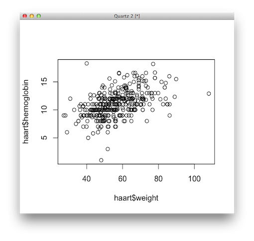

## Presenter Notes

Lots of default arguments that should be set manually.
Notice here that some values of hemoglobin appear to have been rounded
to the nearest integer.

---

## Scatterplot

We can make aesthetic improvements to the plot by adding axis labels:

    > plot(haart$weight, haart$hemoglobin, xlab="Weight", ylab="Hemoglobin")

---

## Plot Type

We can entirely change the type of plot by specifying the `type`
argument, which allows for a variety of arguments:

* `p`: points (the default)
* `l`: lines
* `b`: both, with gaps in the lines for the points
* `c`: the lines part alone of `b`, which is useful if you want to
  combine lines with other kinds of symbols
* `o`: both lines and points ‘overplotted’, that is, without gaps in
  the lines
* `h`: vertical lines, giving a ‘histogram’ like plot; `s`: a step
  function, going across then up
* `S`: a step function, going up then across
* `n`: no plotting

---

## Axis Limits

Though `plot` usually does a reasonable job of setting the boundaries of
the plot, you can manually change these using `xlim` and `ylim`:

    > plot(haart$weight, haart$hemoglobin, xlab="Weight", ylab="Hemoglobin",
    xlim=c(40,80), ylim=c(5, 15))

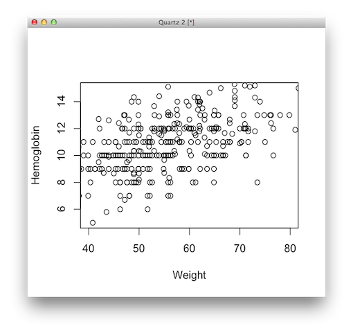

---

## Adding Color

    > plot(haart$weight, haart$hemoglobin, xlab="Weight", ylab="Hemoglobin",
    col='red')

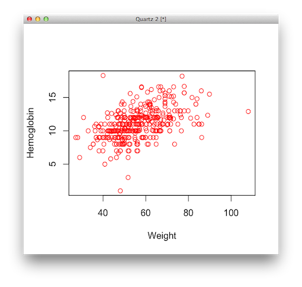

---

## R Colors

    !r
    > colors()
      [1] "white"                "aliceblue"            "antiquewhite"         "antiquewhite1"
      [5] "antiquewhite2"        "antiquewhite3"        "antiquewhite4"        "aquamarine"
      [9] "aquamarine1"          "aquamarine2"          "aquamarine3"          "aquamarine4"
     [13] "azure"                "azure1"               "azure2"               "azure3"
     [17] "azure4"               "beige"                "bisque"               "bisque1"
     [21] "bisque2"              "bisque3"              "bisque4"              "black"
     [25] "blanchedalmond"       "blue"                 "blue1"                "blue2"
     [29] "blue3"                "blue4"                "blueviolet"           "brown"
     [33] "brown1"               "brown2"               "brown3"               "brown4"
     [37] "burlywood"            "burlywood1"           "burlywood2"           "burlywood3"
     [41] "burlywood4"           "cadetblue"            "cadetblue1"           "cadetblue2"
     [45] "cadetblue3"           "cadetblue4"           "chartreuse"           "chartreuse1"
     [49] "chartreuse2"          "chartreuse3"          "chartreuse4"          "chocolate"
     [53] "chocolate1"           "chocolate2"           "chocolate3"           "chocolate4"
     [57] "coral"                "coral1"               "coral2"               "coral3"
     [61] "coral4"               "cornflowerblue"       "cornsilk"             "cornsilk1"
     [65] "cornsilk2"            "cornsilk3"            "cornsilk4"            "cyan"
     [69] "cyan1"                "cyan2"                "cyan3"                "cyan4"
     [73] "darkblue"             "darkcyan"             "darkgoldenrod"        "darkgoldenrod1"
     [77] "darkgoldenrod2"       "darkgoldenrod3"       "darkgoldenrod4"       "darkgray"
     [81] "darkgreen"            "darkgrey"             "darkkhaki"            "darkmagenta"
     [85] "darkolivegreen"       "darkolivegreen1"      "darkolivegreen2"      "darkolivegreen3"
     [89] "darkolivegreen4"      "darkorange"           "darkorange1"          "darkorange2"
     [93] "darkorange3"          "darkorange4"          "darkorchid"           "darkorchid1"
     ...

---

## Manipulating Plot Symbols

Users can manipulate point shapes with `pch`:

    > plot(haart$weight, haart$hemoglobin, xlab="Weight", ylab="Hemoglobin",
    pch=3)

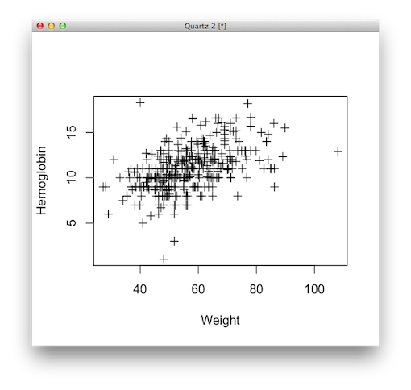

---

## Plot Symbols

    !r
    > example(points)

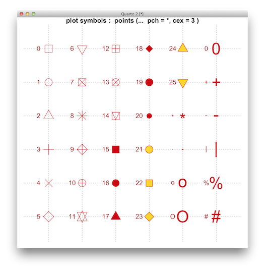

---

## Manipulating Line Styles

Users can manipulate line styles and widths with `lty` and `lwd`, respectively:

    > plot(haart$weight, haart$hemoglobin, xlab="Weight", ylab="Hemoglobin",
    type='l', lty=2, lwd=2)

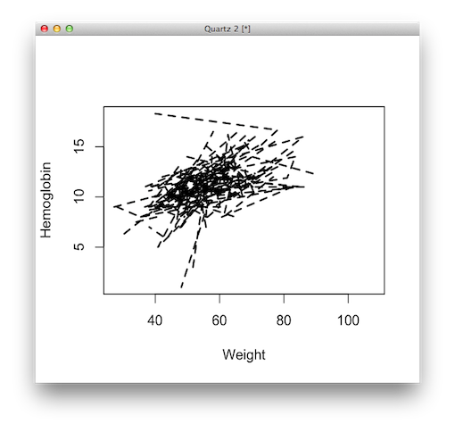

---

## Line Styles

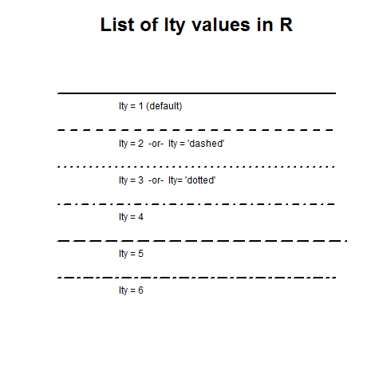

---

## Plotting Parameters

Parameters for the plotting device can be set using the `par` function.

* `mfrow=c(a,b)`: creates a matrix of plots (a rows and b columns)
  on the same page.
* `mar=c(bottom, left, top, right)`: creates margins around
  individual plots, in character widths units
* `oma=c(bottom, left, top, right)`: creates margins around matrix
  of plots, in character width units
* `las=1`: rotates y-axis labels to be horizontal
* `pty="s"`: forces plots to be square (contrast with `pty = "m"`)
* `new=TRUE`: plots subsequent figures over the previous one, rather
  than on a new set of axes
* `bg`="yellow": set background color to yellow
* `cex=x`: magnifies symbols by a factor of `x`
* `bty="n"`: removes box drawn around plots; a number of other
    options are available

---

## Accessing Plotting Parameters

    !r
    > par("lty")
    [1] "solid"
    > par("lwd")
    [1] 1
    > par("col")
    [1] "black"
    > par("cex")
    [1] 1
    > par("mar")
    [1] 5.1 4.1 4.1 2.1

---

## Plotting Margins

    !r
    > par(mar=c(1,1,1,1))

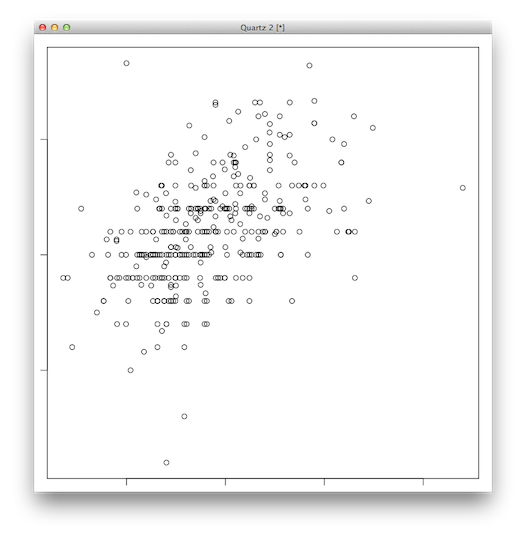

---

## Backend Options

`par` accepts multiple arguments, so several options can be set at once.
Additionally, `par` returns a list of the current parameters, which can
be saved to be restored after we are finished with our custom
parameters:

    !r
    >> par()
    $xlog
    [1] FALSE

    $ylog
    [1] FALSE

    $adj
    [1] 0.5
    > old_pars <- par(mfrow=c(2,3), bty="7", mar=c(4,4,1,1))
    > plot(<some_plot>)
    > par(old_pars)

---

## Building Plots

Plots may be augmented after they are drawn. This allows desired custom plots to
be built up in several steps, interactively.

First, create an "empty" scatterplot that sets up the dimensions of the space,
but does not plot anything.

    !r
    > some_pars <- par(las=1, mar=c(4,4,3,2))
    > plot(haart$weight, haart$hemoglobin, xlab="", ylab="",
    + axes=FALSE, type="n")

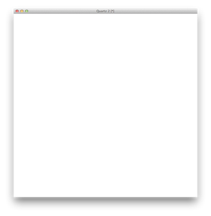

---

## Building Plots

Add the points of the scatterplot, using different colors for males and females:

    !r
    > points(haart$weight[haart$male==1], haart$hemoglobin[haart$male==1],
        col="darkseagreen4")
    > points(haart$weight[haart$male==0], haart$hemoglobin[haart$male==0],
        col="red")

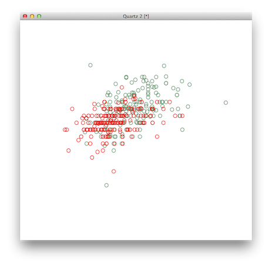

---

## Building Plots

A more efficient way to add the points of the scatterplot, using different colors and symbols for different combinations of groups:

    > points(haart$weight, haart$hemoglobin, col=ifelse(haart$male==1,
    + "darkseagreen4", "red"), pch=ifelse(haart$aids==1, 1, 3))

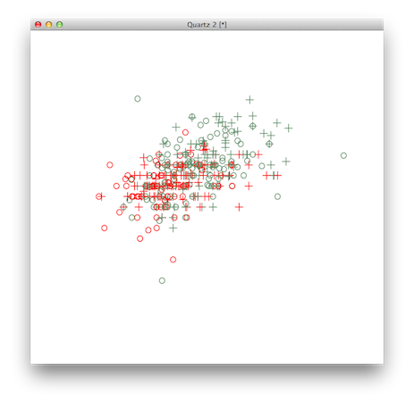

---

## Building Plots

Now axes can be added, with any desired options:

    > axis(1, lwd=2)
    > axis(2, lwd=2)

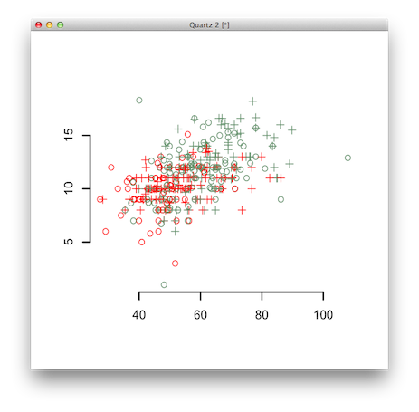

---

## Building Plots

Now axis labels, in the desired orientation:

    > mtext("Weight", side=1, line=3)
    > mtext("Hemoglobin", side=2, line=3)

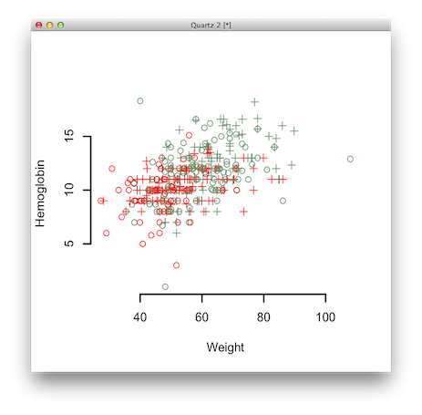

---

## Building Plots

A legend to decipher the color and shape of the points:

    > legend(x=75, y=7,
    +  c("Male, AIDS", "Female, AIDS", "Male, no AIDS", "Female, no AIDS"),
    +  col=c("darkseagreen4", "red", "darkseagreen4", "red"),
    +  pch=c(1,1,3,3), bty="n")

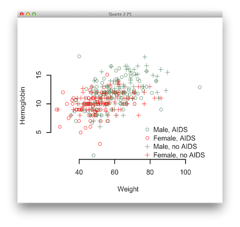

---

## Graphics Devices

Rather than writing plots to the screen, as we have done, it is
straightforward to instead write them directly to a file, where they can
be imported into other documents, or posted online.

There are over a dozen graphics devices to which plots may be rendered. Important ones include:

* `quartz`: Native Mac OS X device.
* `X11`: Default UNIX/Linux device.
* `pdf`: Best for use with LaTeX.
* `png`: Lossless compressed format; best for use with HTML or Markdown.
* `jpeg`: Lossy compressed format; only use for images.

`dev.off` shuts down the specified device, and makes the next open device  current.

    !r
    > pdf(file="sample_plot.pdf", width=4, height=3)
    > plot(haart$weight, haart$hemoglobin, xlab="Weight", ylab="Hemoglobin")
    > dev.off()

If we create another plot before closing the file, it will add another page to
the pdf file. This can be overridden with `onefile=FALSE`.

---

## Multiple Plots

Using the `mfrow` parameter, we can create multiple plots on the same canvas.

    !r
    > par(mfrow=c(1,2))
    > plot(haart$weight, haart$hemoglobin, xlab="Weight", ylab="Hemoglobin")
    > plot(haart$weight, haart$cd4baseline, xlab="Weight", ylab="CD4 Baseline")

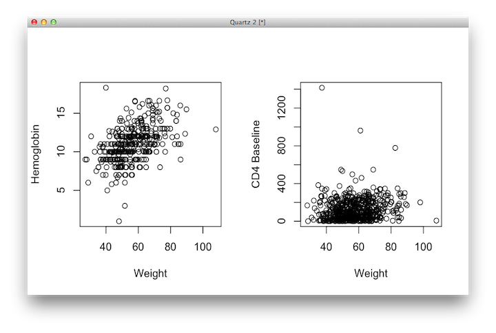

---

## Trellis Plots

Trellis plots display multiple variables as a series of
plots, each of which is two dimensional and conditions on particular values of
the third variable. Trellis plots are provided by the recommended R package `lattice`.

    !r
    > densityplot(~ weight | male, data=haart)

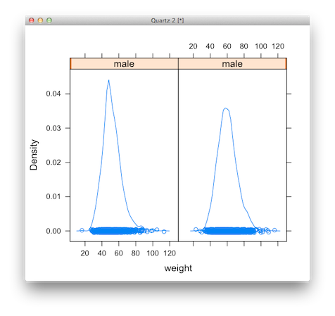

## Presenter Notes

Often we wish to express more than two dimensions of data
simultaneously. While 3-dimensional plots are often available, they tend
not to be very effective, as humans are generally not good at
interpreting them.

---

## Trellis Plots

The labeling of the panels is wrong, because by default it uses the name of the
variable as the label, with a dark orange bar indicating the value of the
variable.

    !r
    > haart$male_factor <- factor(haart$male)
    > levels(haart$male_factor) <- c("Female", "Male")
    > densityplot(~ weight | male_factor, data=haart)

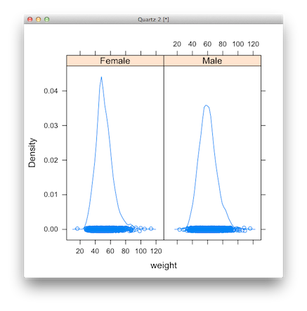

---

## Formulae

The `formula` class is a structure that represents a relationship between sets of variables in R. Formulae are denoted by the tilde (`~`) operator:

    !r
    > y ~ x1 + x2
    y ~ x1 + x2
    > form <- y ~ x1 + x2
    > class(form)
    [1] "formula"
    > y ~ x1 | x2 # conditioning
    y ~ x1 | x2
    > y ~ x1 * x2 # interaction
    y ~ x1 * x2
    > y ~ sin(x1) + x2^2
    y ~ sin(x1) + x2^2

Formulae are used throughout R to specify models, and in `lattice` to express conditioning statements.

In `lattice`, conditioning variables are *factors*.

If no data frame is passed to the function with the formula, the function looks in its enclosing environment.

---

## `lattice` Notation

Our example `densityplot` used a formula to express the appropriate quantities for plotting:

    !r
    densityplot(~ weight | male_factor, data=haart)

Here, there is no response variable (left side of tilde), but we indicate that we
would like to plot the distribution of weight, conditioning on the variable
`male_factor`.

Note that you can specify the data frame as an additional `data`
argument, so that you do not have to index individual variables.

---

## Lattice Plotting

Base graphics plot functions as side effects, directly to the graphics device. Lattice graphics functions return objects of type `trellis`:

    !r
    > dp <- densityplot(~ weight | male_factor, data=haart)
    > class(dp)
    [1] "trellis"
    > str(dp)
    List of 45
     $ formula          :Class 'formula' length 2 ~weight | male_factor
      .. ..- attr(*, ".Environment")=<environment: R_GlobalEnv>
     $ as.table         : logi FALSE
     $ aspect.fill      : logi TRUE
     $ legend           : NULL
     $ panel            : chr "panel.densityplot"
     $ page             : NULL
     $ layout           : NULL
     $ skip             : logi FALSE
     $ strip            : chr "strip.default"
     $ strip.left       : logi FALSE
     $ xscale.components:function (lim, packet.number = 0, packet.list = NULL, top = TRUE, ...)
     $ yscale.components:function (lim, packet.number = 0, packet.list = NULL, right = TRUE, ...)
     ...

There is a `print` method that plots the object to a graphics device.

---

## Box-and-Whisker Plot

We can display the same data as a box-and-whisker plot,
using the `bwplot` function, with similar syntax:

    > bwplot(~ weight | male_factor, data=haart)

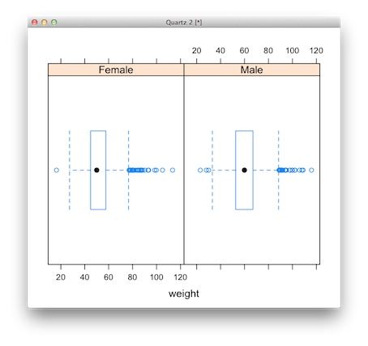

## Presenter Notes

Notice, however, that this is not an optimal layout of the panels; they
are compressed horizontally and it is not easy to compare them
side-by-side.

---

## Box-and-Whisker Plot

It would be better displayed row-wise rather than
column-wise. We can change this using the `layout` optional argument:

    > bwplot(~ weight | male_factor, data=haart, layout=c(1,2))

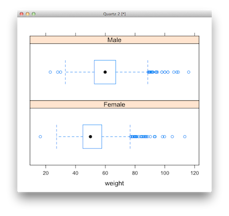

---

## `histogram`

It can be easier to visualize the difference between the two distributions with
a histogram:

    > histogram(~ weight | male_factor, data=haart, layout=c(1,2))

---

## `xyplot`

We can also create paneled scatterplots of the relationship between two
variables of interest, conditioned on a third, using `xyplot`:

    > xyplot(hemoglobin ~ weight | male_factor, data=haart)

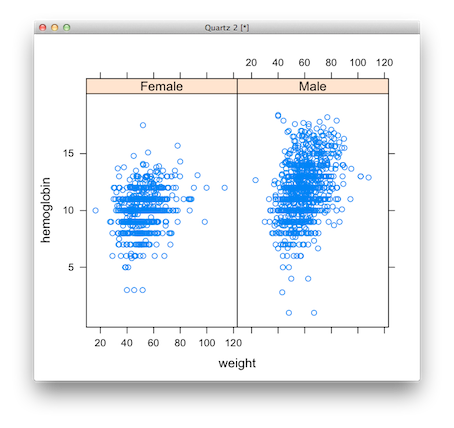

---

## Panel Functions

Suppose we want to add a linear regression line through each panel's scatterplot.
This requires using a `panel` function, which controls the appearance of the
plot in each panel.

We can write a function to generate a scatterplot of
points, and an associated regression line, using another function,
`abline`, and use this function as an argument to panel:

    > regline <- function(x,y,...) {
    + panel.xyplot(x,y,...)
    + panel.lmline(x, y)
    + }
    > xyplot(hemoglobin ~ weight | male_factor, data=haart, panel=regline)

The `lmline` function generates a least-squares regression line between `x` and `y`, conditioned on each gender.

Now, `xyplot` runs the `regline` function for each panel of the plot,
passing the appropriate subset of data in each case.

---

## Customizing Lattice Panels

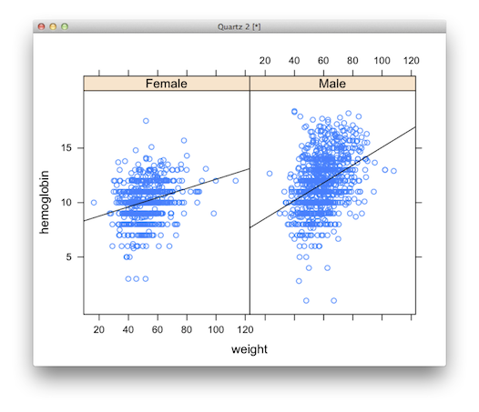

---

## Conditioning on Continuous Variables

We may wish to condition on continuous variables, but it does not make sense to have a panel for each value of a variable that is not a factor. One alternative is to *bin* the continuous variable into discrete categories for different ranges of that variable.

For example, if we are interested in visualizing how the distribution of `weight` varies as a function of `hemoglobin` in the HAART dataset, we can discretize `hemoglobin` into a factor variable:

    !r
    > hb_cut <- equal.count(haart$hemoglobin, 4)
    > summary(hb_cut)

    Intervals:
             min      max count
    1  0.9833333 10.31667   746
    2  8.9833333 11.81667   771
    3 10.3166667 13.01667   758
    4 11.8833333 18.31667   746

    Overlap between adjacent intervals:
    [1] 687 660 674

---

## Conditioning on Continuous Variables

    !r
    > histogram(~weight|hb_cut, data=haart)

---

## Conditioning on Continuous Variables

It can be easier to see trends if we optimize the layout:

    !r
    > histogram(~weight|hb_cut, data=haart, layout=c(1,4))

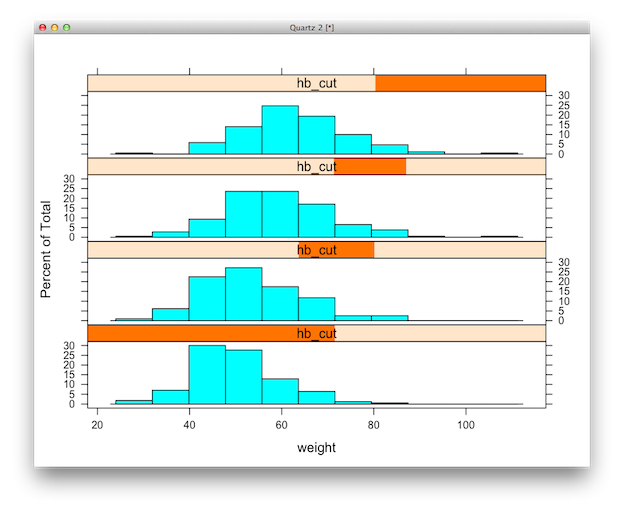

---

## Plotting Interactions

We can condition on two or more variables simultaneously by creating an interaction term as the conditioning variable:

    !r
    > age_cut <- equal.count(haart$age, 4)
    > xyplot(hemoglobin ~ weight | age_cut * male_factor, data=haart)

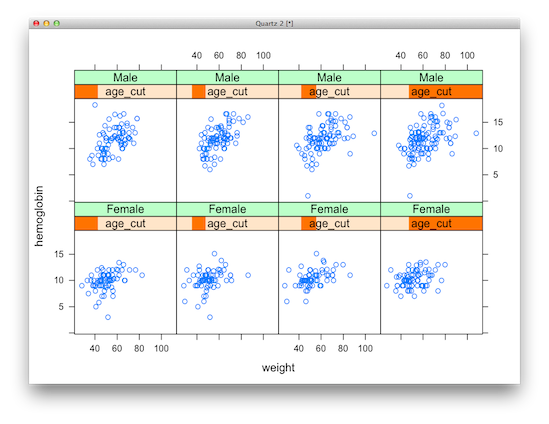

## Presenter Notes

Demonstrate adding panel function for regression line

---

## Pairwise Scatterplot

The `splom` function generates a scatterplot matrix of a subset of a data frame:

    !r
    > splom(~haart[c("age", "weight", "cd4baseline", "hemoglobin", "male_factor")])

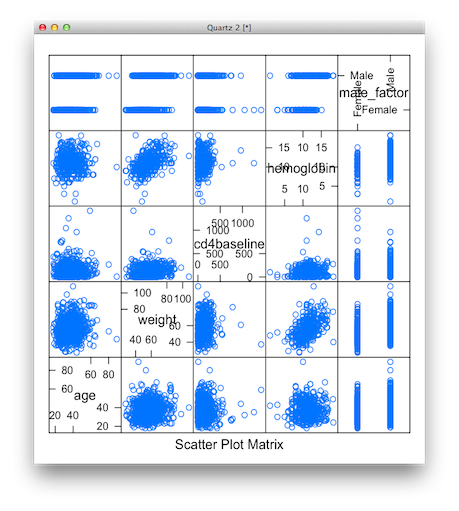

---

## Typesetting Math in R Graphics

R allows for the annotation of plots using LaTeX-like math expressions. Generally, any functions that produce axis labels, titles, legends or text annotation will accept math symbols as arguments.

Text containing math should be wrapped in the `expression` function.

    !r
    > x <- seq(-4, 4, len = 101)
    > y <- sin(x)
    > plot(x, y, type = "l", xaxt = "n",
    +   main = expression(paste(plain(sin) * phi)),
    +   ylab = expression("sin" * phi),
    +   xlab = expression(paste("Phase Angle ", phi)))
    > axis(1, at = c(-pi, -pi/2, 0, pi/2, pi),
    +   labels = expression(-pi, -pi/2, 0, pi/2, pi))
    > text(-1,1,substitute(bar(x)==k, list(k=mean(x))))
    > text(-1,0.8,substitute(bar(y)==k, list(k=mean(y))))

---

## Typesetting Math in R Graphics

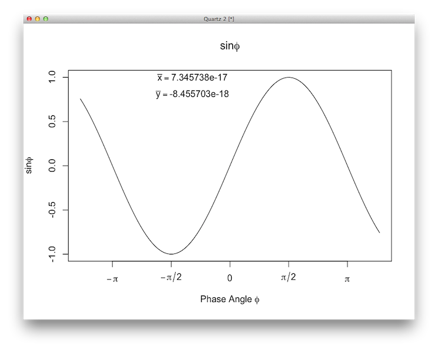

---

## Exercise: Nashville precipitation

Load the `nashville_precip.txt` data from the `datasets` directory, and create a plot of the total annual precipitation in Nashville. Augment your plot as follows:

* Create an x-axis with labels every 5 years
* Add a horizontal dotted line for the grand mean
* Add a label (and arrow?) for the average line
* Add meaningful labels to the axes

