# `ggplot2`

---

## Why Another Plotting Package?

Often we do not just want to draw pictures, but understand our data better. Plots in base and lattice are not necessarily based on the structure of the data, but on arbitrary conventions.

`ggplot2` is based on an *underlying theory* about data visualization.

---

## The Grammar of Graphics

`ggplot2` is an R implementation of a graphical grammar, based on "The Grammar of Graphics" by Leland Wilkinson. This grammar helps us describe the components of a graphic.

Having a grammar allows users to specify what they want, rather than worrying about implementation details.

---

## Components of a Graphic

The grammar defines a plot as the combination of:

* A default **dataset**
* A set of **mappings** from variables to aesthetics.
* One or more **layers**, each composed of:
    + a geometric object
    + a statistical transformation
    + a position adjustment
    + additional dataset (optional)
    + additional aesthetic mappings (optional)
* One **scale** for each aesthetic mapping.
* A **coordinate system**.
* The **faceting** specification (if necessary).

These components are independent!

---

## Getting `ggplot2`

`ggplot2` is available on the CRAN:

    !r
    install.packages("ggplot2")
    library(ggplot2)

There is a set of dependencies, each of which should get installed alongside `ggplot2`.

---

## Very Low Birthweight Infants

Data on 671 infants with very low (<1600 grams) birth weight from 1981-87 were collected at Duke University Medical Center.

Of interest is the relationship between the outcome intra-ventricular hemorrhage and the predictors birth weight, gestational age, presence of pneumothorax, mode of delivery, single vs. multiple birth, and whether the birth occurred at Duke or at another hospital with later transfer to Duke.

    !r
    > library(RCurl)
    > url <- getURL("https://raw.github.com/fonnesbeck/Bios366/master/data/vlbw.csv")
    > vlbw <- read.csv(text=url, row.names=1)
    > ls()
    [1] "jpeg" "pdf"  "png"  "vlbw"
    > head(vlbw, 3)
       birth   exit hospstay    lowph pltct  race  bwt gest        inout twn lol magsulf meth toc
    1 81.511 81.604       34       NA   100 white 1250   35 born at Duke   0  NA      NA    0   0
    2 81.514 81.539        9 7.250000   244 white 1370   32 born at Duke   0  NA      NA    1   0
    3 81.552 81.552       -2 7.059998   114 black  620   23 born at Duke   0  NA      NA    0   1
       delivery apg1 vent pneumo pda cld  pvh  ivh  ipe     year    sex dead
    1 abdominal    8    0      0   0   0 <NA> <NA> <NA> 81.51196 female    0
    2 abdominal    7    0      0   0   0 <NA> <NA> <NA> 81.51471 female    0
    3   vaginal    1    1      0   0  NA <NA> <NA> <NA> 81.55304 female    1

Metadata available at http://bit.ly/vlbw_data

---

## Basic Scatterplot

`qplot` is the basic `ggplot2` plotting function, designed to be familiar if you're used to `plot` from the base package. It is a convenient wrapper for creating a number of different types of plots using a consistent calling scheme.

    !r
    > qplot(gest, bwt, data=vlbw)

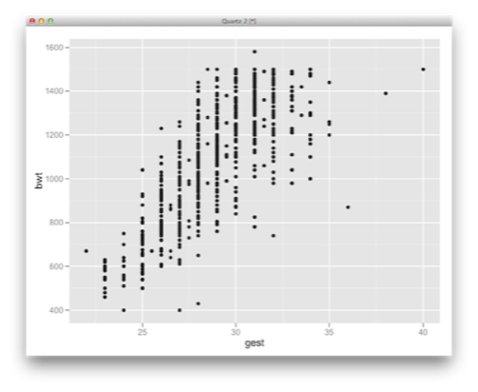

---

## Histogram

    !r
    > qplot(bwt, data=vlbw, geom='histogram', binwidth=25)

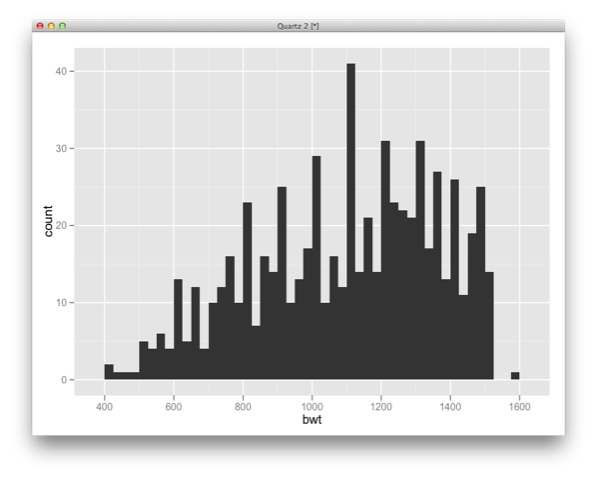

---

## Density Plot

    !r
    > qplot(bwt, data=vlbw, geom='density')

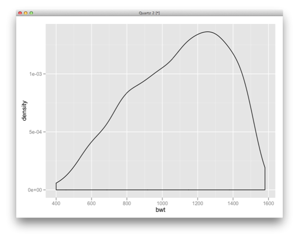

---

## Combining Geoms

Part of the power of `ggplot2` is the ability to easily visualize data in multiple ways:

    !r
    > qplot(sex, bwt, data=vlbw, geom=c('jitter','boxplot'))

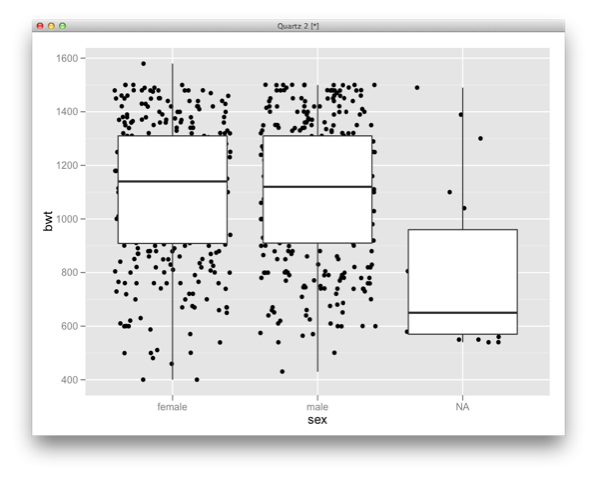

---

## Data

All `ggplot2` functions require a data frame as the means for including data.

This restriction makes the interface with your data consistent across functions.

---

## Aesthetics

Aesthetic attributes of plots include color, shape and size.

    !r
    > qplot(gest, bwt, color=ivh, data=vlbw)

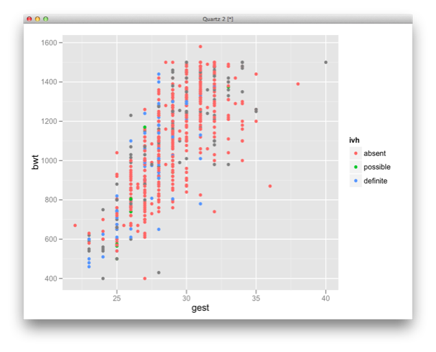

## Presenter Notes

Notice that the legend is automatically created

---

## Aesthetics

    !r
    > qplot(gest, bwt, size=lol, data=vlbw)

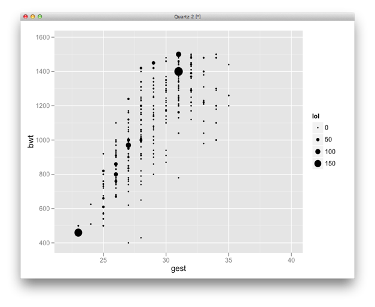

---

## Aesthetics

`qplot` makes sensible default choices for each aesthetic and data type:

### Color

* **discrete**: rainbow of colors
* **continuous**: blue gradient

### Size

* **discrete**: discrete step size
* **continuous**: linear mapping between value and radius

### Shape

* **discrete**: different shapes
* **continuous**: incompatible

---

## Aesthetics

    !r
    > qplot(gest, bwt, color=pltct, data=vlbw)

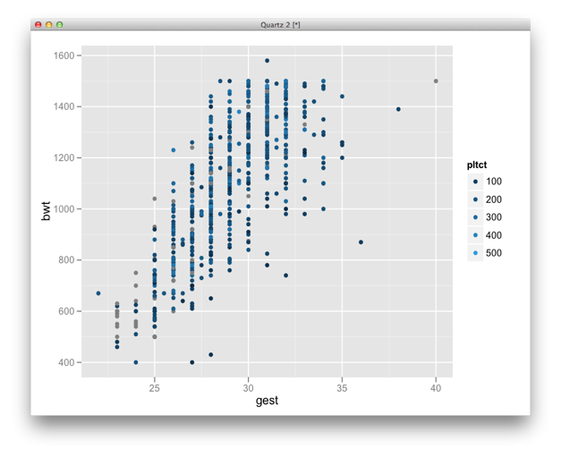

## Presenter Notes

Notice that missing values are grey.

---

## Faceting

`ggplot2` can generate multi-panel plots, similar to `lattice`, that allows different subsets of the data to be visualized.

    !r
    > qplot(gest, bwt, data=vlbw, facets=race ~ .)

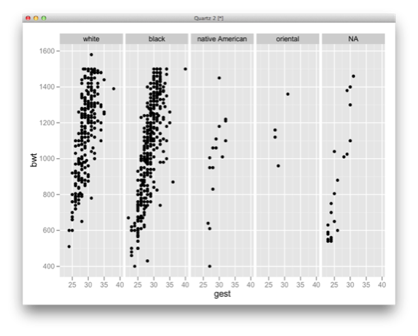

## Presenter Notes

Useful for exploring conditional relationships. Useful for large data.

---

## Faceting

    !r
    > qplot(gest, bwt, data=vlbw, facets=. ~ race)

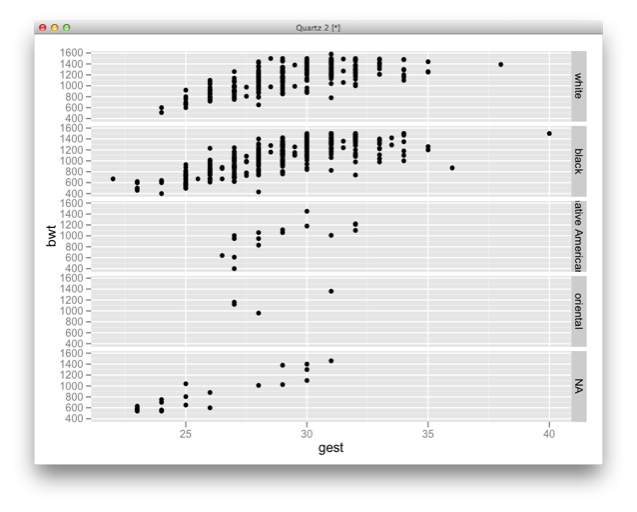

---

## Faceting

    !r
    > qplot(gest, bwt, data=vlbw, facets=~ apg1)

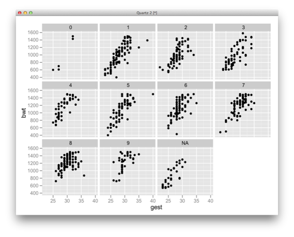

## Presenter Notes

The test is generally done at one and five minutes after birth, and may be repeated later if the score is and remains low. Scores 7 and above are generally normal, 4 to 6 fairly low, and 3 and below are generally regarded as critically low.

---

## Faceting

    !r
    > qplot(gest, bwt, data=vlbw[!is.na(vlbw$sex) & !is.na(vlbw$race),],
        facets=race~sex)

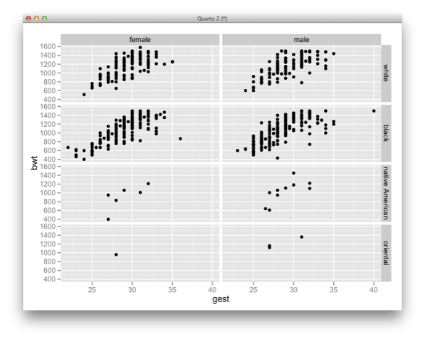

---

## Adding Aesthetic Mappings

`qplot` allows aesthetic mappings to be added to a plot using the `+` operator:

    !r
    qplot(gest, bwt, data=vlbw) + facet_grid(race ~ .)
    p <- qplot(gest, bwt, data=vlbw)
    p <- p + facet_wrap(~ apg1, scales='free')

`facet_grid` generates a 2-dimensional grid of rows vs columns

`facet_wrap` generates a 1-dimensional *ribbon* of plots that is wrapped

`scales` argument specifies if the scales of the subplot are unified (`fixed`) or independent (`free`)

---

## What's wrong with this plot?

---

## Dealing with Overstrike

    !r
    > qplot(gest, bwt, data=vlbw, geom="jitter")

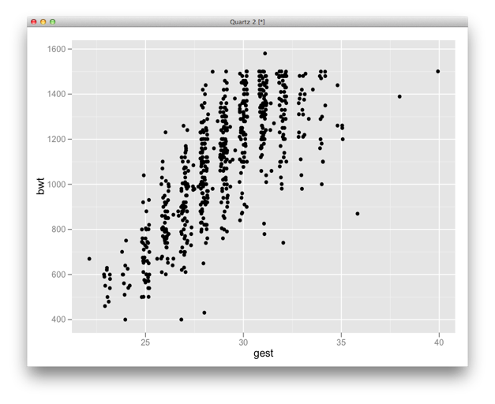

---

## Dealing with Overstrike

The `alpha` argument controls the transparency of lines and symbols.

    !r
    > qplot(gest, bwt, data=vlbw, alpha = I(1/5))

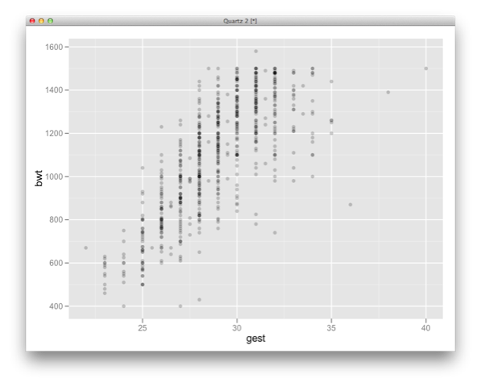

---

## Dealing with Overstrike

A **violin plot** is a density plot rotated about an axis:

    !r
    > qplot(sex, bwt, data=vlbw, geom=c('violin'))

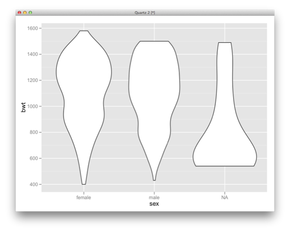

---

## Dealing with Overstrike

    !r
    > qplot(bwt, gest, data=vlbw, geom='hex')

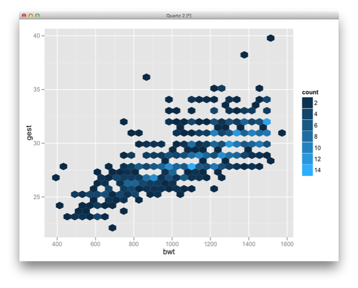

Hexagonal binning requires the `hexbin` package to be installed.

---

## Building a Plot with `ggplot`

`qplot` is just a convenience function that allows novice users to generate generic plots in a manner similar to that of base graphics. `qplot` allows for only a single dataset and a single set of aesthetic mappings.

To build a graphic ourselves, we use `ggplot`. It creates a plot object based on data and an aesthetic mapping.

    !r
    > p <- ggplot(vlbw, aes(x=gest, y=bwt))

The function `aes` sets up the aesthetic mapping of variable names to attributes.

However, the plot object `p` cannot be *displayed* until we add a layer.

---

## Building a Plot

Let's re-create the simple scatterplot of gestational age and birthweight that we saw with `qplot`:

    !r
    > p <- p + geom_point()

There is an entire suite of `geom_` functions for adding layers to an existing plot object:

* `geom_abline`:	Line specified by slope and intercept.
* `geom_bar`:	Bars, rectangles with bases on x-axis
* `geom_boxplot`:	Box and whiskers plot.
* `geom_contour`:	Display contours of a 3d surface in 2d.
* `geom_density`:	Display a smooth density estimate.
* `geom_hex`:	Hexagon binning.
* many, many more

---

## Plot Object

Calling `summary` shows information about the plot object, including each layer.

    !r
    > summary(p)
    data: birth, exit, hospstay, lowph, pltct, race, bwt, gest, inout, twn, lol, magsulf,
      meth, toc, delivery, apg1, vent, pneumo, pda, cld, pvh, ivh, ipe, year, sex, dead
      [671x26]
    mapping:  x = gest, y = bwt
    faceting: facet_null()
    -----------------------------------
    geom_point: na.rm = FALSE
    stat_identity:
    position_identity: (width = NULL, height = NULL)

Plot objects can be saved to disk, reloaded and exported:

    !r
     > save(p, file = "plot.rdata")
     > load("plot.rdata")
     > ggsave("plot.png", width = 5, height = 5)

---

## Building a Plot

We can add additional layers, such as a smoothed mean:

    !r
    > p + geom_smooth(method = "lm")

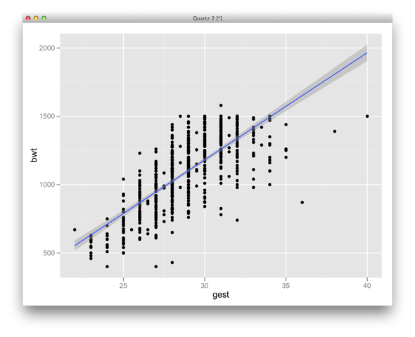

---

## Building a Plot

    !r
    > p + geom_smooth(method = "loess", color="steelblue", alpha=0.5)

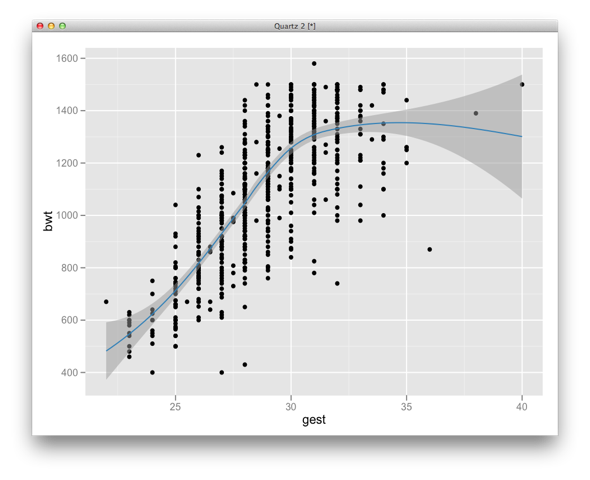

---

## Aesthetic Mappings

The default mappings in `p` can be extended:

    !r
    > p + geom_point(aes(color=sex))

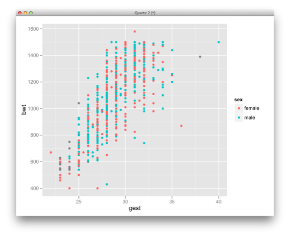

---

## Aesthetic Mappings

The default mappings can also be overridden by additional layers:

    !r
    > p + geom_point(aes(y=pltct), color="darkblue")
        + ylab("Platelet count") + xlab("Gestational age")

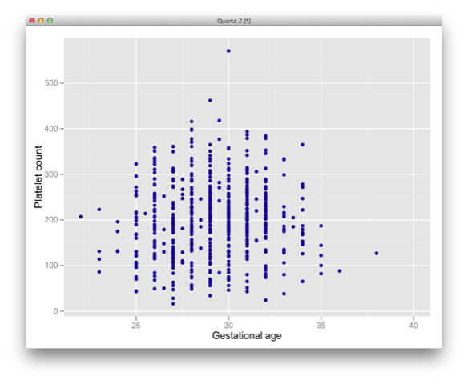

## Presenter Notes

Note that `color` has been set to a value, rather than mapped to a variable

---

## Setting vs. Mapping

Aesthetics can either be *mapped* to a variable or *set* to a value.

**Mapping**

    !r
    > p + geom_point(aes(color=sex))

**Setting**

    !r
    > p + geom_point(color="darkblue")

So, what happens if you do this?

    !r
    > p + geom_point(aes(color="darkblue"))

---

## Geoms and Stats

All layers can be defined as by a combination of a geometric object and a statistical transformation:

**Scatterplot**

* geom: point
* stat: identity

**Histogram**

* geom: bar
* stat: bin

**Smooth**

* geom: line, ribbon
* stat: smoother (e.g. `lm`, `loess`)

---

## Geoms and Stats

By combining geoms and stats, you can easily create new types of graphs.

    !r
    > g <- ggplot(vlbw, aes(bwt))
    > g + stat_bin(aes(ymax=..count..), binwidth=50, geom='area')

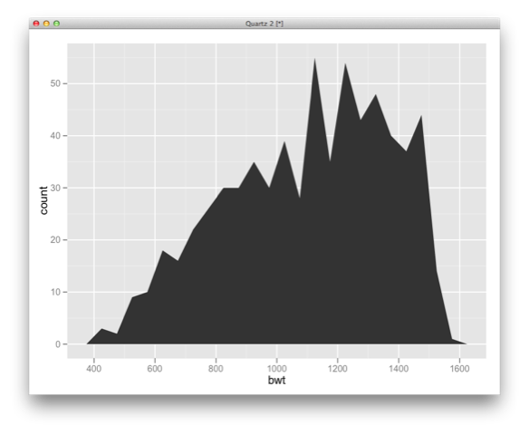

## Presenter Notes

`..count..` calculates the counts and lets you plot them on the y-axis

---

## Geoms and Stats

    !r
    > g + stat_bin(aes(size=..density..), binwidth=50, geom='point')

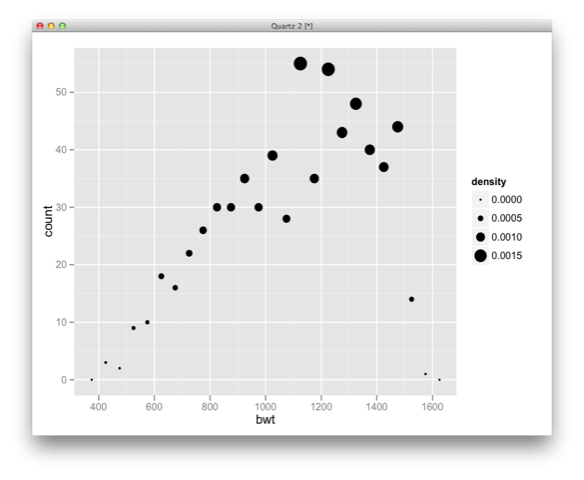

---

## Geoms and Stats

    !r
    > g <- ggplot(vlbw, aes(x=bwt, y=pltct))
    > g + stat_density2d(aes(fill=..density..), binwidth=50, geom='tile',
        contour=F) + scale_fill_gradient(low = "blue", high = "red")

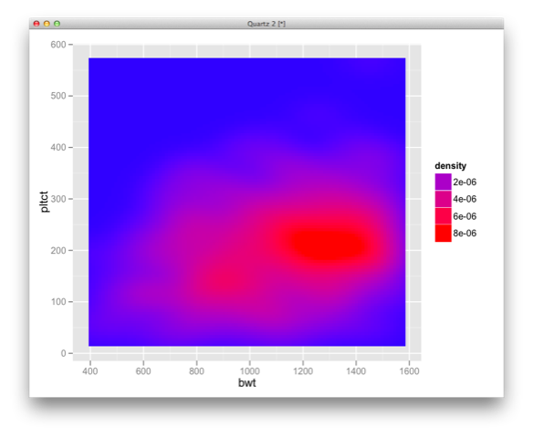

---

## Hands-on

Try re-creating the following plot:

## Presenter Notes

data: vlbw
mapping: aes(x=lowph, y=bwt, color=inout)
layers: points
scales: x&y position, discrete color
faceting: delivery

        ggplot(vlbw[!is.na(vlbw$delivery),], aes(x=lowph, y=bwt))
        + geom_point(aes(color=inout)) + facet_grid(delivery~.)

---

## Displaying Uncertainty

A set of `ggplot2` geoms are useful for displaying the uncertainty in your data. They can characterize the extent or spread of the data, optionally with some measure of central tendency included.

**Continuous Data**

* `geom_ribbon`
* `geom_smooth(stat="identity")`

**Discrete Data**

* `geom_errorbar`
* `geom_crossbar`
* `geom_linerange`
* `geom_pointrange`

The `stat_summary` function provides a means for summarizing response data, conditional on values of predictor variables.

---

## Displaying Uncertainty

    !r
    > ggplot(vlbw, aes(apg1, bwt)) + geom_point() +
        stat_summary(fun.data = "mean_sdl", geom=c("errorbar"), color="red")

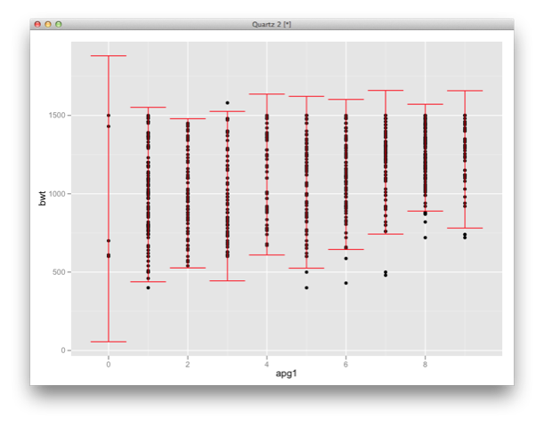

---

## Displaying Uncertainty

There are a number of convenience functions from the `Hmsic` package that provide data summaries that can be used with `stat_summary`:

* `mean_cl_normal`: standard errors from normal approximation
* `mean_cl_boot`: standard errors from bootstrap
* `mean_sdl`: multiple of standard deviation
* `median_hilow`: outer quantiles with equal tail areas

Or, you may write custom functions to provide what you need:

    !r
    iqr <- function(x, ...) {
      qs <- quantile(as.numeric(x), c(0.25, 0.75), na.rm = T)
      names(qs) <- c("ymin", "ymax")
      qs
    }

---

## Displaying Uncertainty

    !r
    > ggplot(vlbw, aes(apg1, bwt)) + geom_point() +
        stat_summary(fun.data = "mean_sdl", geom=c("smooth"))

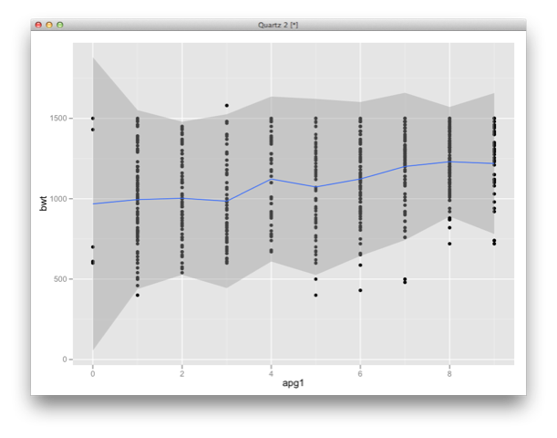

---

## Displaying Uncertainty

    !r
    > ggplot(vlbw, aes(apg1, bwt)) + geom_point() +
        stat_summary(fun.data = "iqr", geom=c("ribbon"), alpha=0.4)

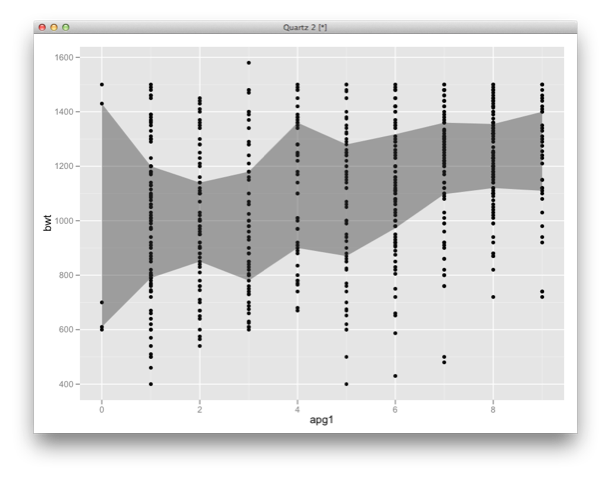

---

## Displaying Uncertainty

    !r
    > ggplot(vlbw, aes(factor(apg1), bwt)) + geom_jitter(alpha=0.5) +
        stat_summary(fun.data = "median_hilow", geom="crossbar")

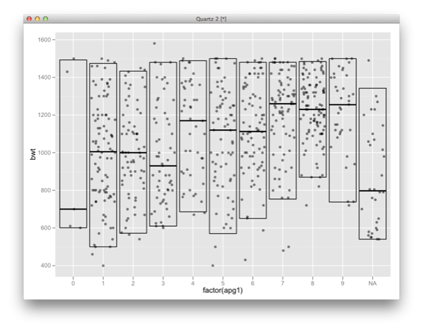

---

## Themes

Themes give you a more control over elements such as the appearance of the plot, background colors, and fonts.

    !r
    > qplot(bwt, pltct, data=vlbw) + theme_bw()

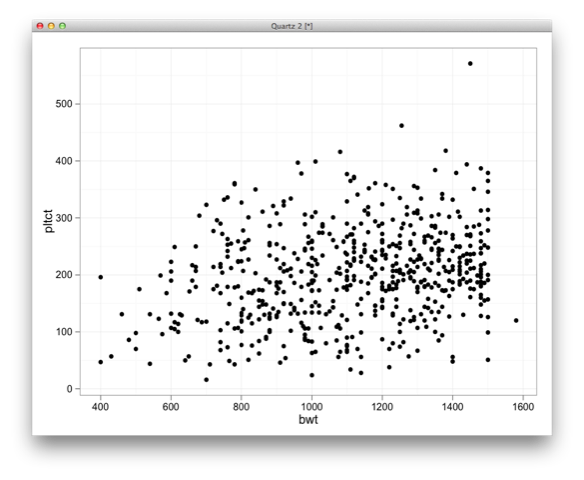

---

## Themes

To apply a theme globally:

    !r
    > theme_set(theme_bw())

Calling a theme directly reveals its options:

    !r
    > theme_grey()
    $axis.line
    theme_blank()

    $axis.text.x
    theme_text(family = base_family, colour = "grey50", size = base_size *
        0.8, vjust = 1, lineheight = 0.9)

    $axis.text.y
    theme_text(family = base_family, colour = "grey50", size = base_size *
        0.8, hjust = 1, lineheight = 0.9)

    $axis.ticks
    theme_segment(colour = "grey50")

    $axis.title.x
    theme_text(family = base_family, size = base_size, vjust = 0.5)

    $axis.title.y
    theme_text(family = base_family, size = base_size, vjust = 0.5,
        angle = 90)

    $axis.ticks.length
    [1] 0.15cm

    $axis.ticks.margin
    [1] 0.1cm

---

## Theme Options

The `opts` function allows you to modify theme settings for a single plot.

    !r
    > qplot(bwt, pltct, data=vlbw) + opts(title="Platelet count as function of birth weight",
        axis.title.x=theme_text(face = "bold", colour="red"),
        axis.title.y=theme_text(size = 20, angle = 0))

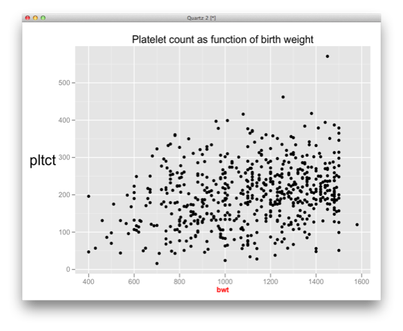

---

## Theme Options

You can also use the `opts` function to remove theme attributes:

    !r
    > qplot(bwt, pltct, data=vlbw) + opts(axis.text.x = theme_blank(),
        axis.text.y = theme_blank(), axis.title.x = theme_blank(),
        axis.title.y = theme_blank())

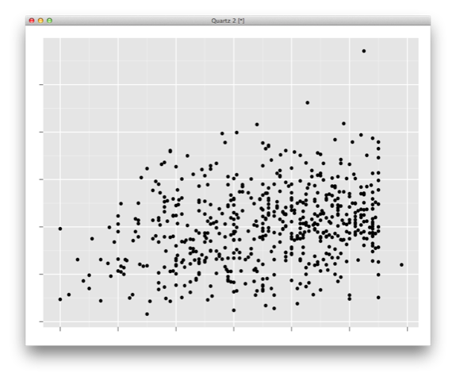

---

## Example: Mapping

`ggplot2` provides tools to integrate maps from the `maps` package.

    !r
    library(maps)
    data(us.cities)

    tn_cities <- subset(us.cities, country.etc=="TN")
    tn_map <- ggplot(tn_cities, aes(long, lat))
    tn_map <- tn_map + borders("county", "tennessee", colour="grey70")

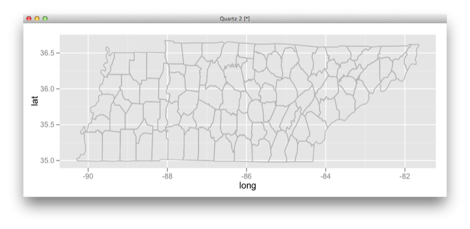

---

## Example: Mapping

    !r
    tn_map + geom_point(aes(size=pop), colour="black", alpha=0.5) + theme_bw()
    + coord_map("orthographic") + scale_x_continuous("") + scale_y_continuous("")

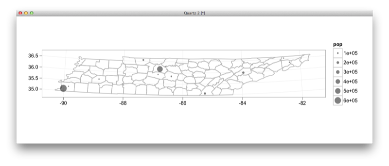

---

## Color Spaces

The commonest color space is **RGB**.

* defines color as mixture of red, green and blue.
* Matches the physics of eye, but hard to directly perceive these components.

---

## HCL Color Space

**HCL** is defined on three alternate axes:

* hue, chroma and luminance

---

## HCL Color Space

Constant hue of 260 (blue), allowing chroma and luminance to vary.

---

## Default Color Scales

Discrete

* evenly spaced hues of equal chroma and luminance
* no color appears more important than any other

Continuous

* evenly spaced hues between two colors

Alternate color scales are available in `RColorBrewer` package.

---

## Default Color Scales

---

## Default Color Scales

    !r
    > g <- ggplot(vlbw, aes(x=bwt, y=pltct))
    > g + stat_density2d(aes(fill=..density..), binwidth=50, geom='tile', contour=F) +
        scale_fill_gradientn(colours=topo.colors(7))

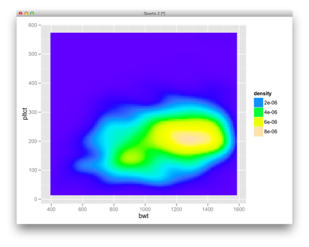

---

## RColorBrewer

    !r
    > library(RColorBrewer)
    > display.brewer.all()

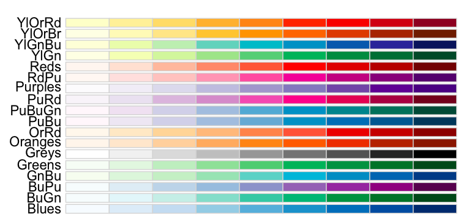

## Presenter Notes

The packages provides palettes for drawing nice maps shaded according to a variable.

---

## RColorBrewer

    !r
    > g + stat_density2d(aes(fill=..density..), binwidth=50, geom='tile', contour=F) +
        scale_fill_gradientn(colours=brewer.pal(7,"Greens"))

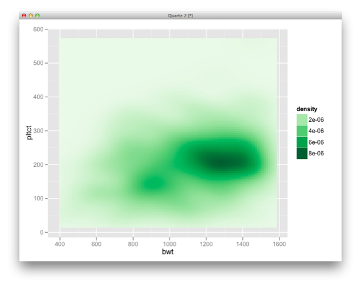

---

## `ggplot2` Book

